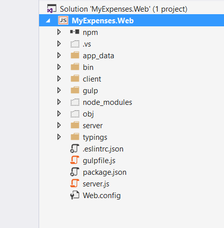
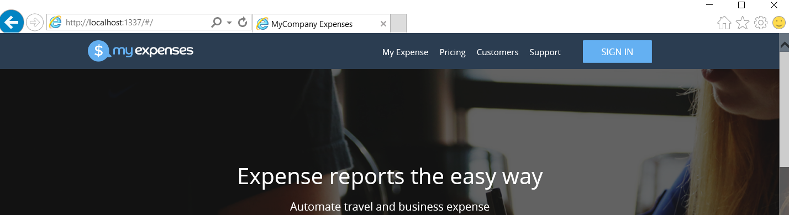
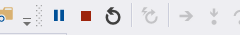

<page title="Using Visual Studio"/>

Using Visual Studio
====

1. You will find the project to use in C:\a. Go to that path an open the project doing double click over the file "MyExpenses.Web".

    

2. A new instance of Visual Studio 2015 Community Edition will be opened. It is a free edition of Visual Studio. Before using it, you will need to introduce your Microsoft account credentials. 

3. Once the project is loaded, in the right panel you should see the "Solution Explorer", where all the files contained in the project appear.

    

4. Press right click over the "MyExpenses.Web" project (not the solution) and ensure that is marked as "Startup Project". You will see that "MyExpenses.Web" are in bold text:  

    

5. Now Visual Studio knows what project should launch. Finally, you can launch the project pressing "F5" or click on the top bar, in the "play" button near to "Internet Explorer". That means that the project will be launched using Internet Explorer.

    

6. As is a NodeJS application, a console will be launched too. This is the Node console and you will get information about the web status.

    

    

7. To finish the exeution, you can close the console launched in the last step or you can do it using Visual Studio, click on the "Stop" button on the top bar:

    

8. As you have seen in the console during this test, a lot of errors appears in the command prompt. This is because you need to configure the SQL connection string. Please continue with the next page to see how you can update that setting.