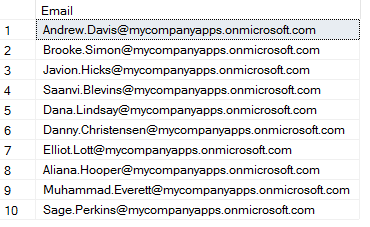
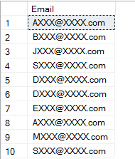

<page title="Masking the Email field"/>

MASKING THE EMAIL FIELD
====

The first step we’ll take is securing the Email field using Dynamic Data Masking

1. Connect to your MyExpenses database using SQL Server Management Studio or SQL Server Data Tools, once using the administrative login.  

    The default SQL credentials are: experience1/P2ssw0rd

2. Execute the following SQL statement

    ```sql
    ALTER TABLE [Expense].[Employee]
    ALTER COLUMN Email ADD MASKED WITH (FUNCTION = 'email()');
    ```

    This will modify the Employee table to include DDM in the Email column, using the default filter for an email. Let’s see if you can spot the difference.

3. Execute the following SQL statement to select the Email field for all the users, when logged in as an administrator

    ```sql
    SELECT Email FROM [Expense].[Employee];
    ```

4. Check the results and see how, even after applying the mask, the email is not encrypted.

    

    This is because you’re logged in as an administrator, and they are considered privileged users. Let’s try it with a read-only user

5. Connect to the MyExpenses again, using SQL Server Management Studio or SQL Server Data Tools. This time however, use the read only login that you created in the previous step. 

    The SQL credentials are: itemployee/P2ssw0rd

6. Check the results again, and see how the email is encrypted. You can only see the first letter of the email, and the email format (XXXXX@XXXXX.com) is kept.

    
