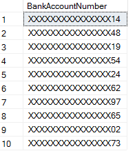

<page title="Masking the BankAccountNumber field"/>

MASKING THE BANKACCOUNTNUMBER FIELD
====

The second step we’ll take is securing the BankAccountNumber field using Dynamic Data Masking

1. Connect to your MyExpenses database using SQL Server Management Studio or SQL Server Data Tools, using the administrative login. 

    The default SQL credentials are: experience1/P2ssw0rd

2. Execute the following SQL statement 

    ```sql
    ALTER TABLE [Expense].[Employee]
    ALTER COLUMN BankAccountNumber ADD MASKED WITH (FUNCTION = 'partial(0,"XXXXXXXXXXXXXXX",2)');
    ```

    This will modify the Employee table to include DDM in the BankAccountNumber column, using a custom partial filter that will show only the last two digits of the account number and keep the usual format. To the eyes of the user, it’ll look like we’ve just replaced all digits besides the last two with the letter X. Let’s see if we can spot the difference.

3. Execute the following SQL statement to select the Email field for all the users, when logged in as an administrator

    ```sql
    SELECT BankAccountNumber FROM [Expense].[Employee];
    ```

4. Check the results and see how, even after applying the mask, the account number is not encrypted.

    

    As you saw with the email masking, this is because you’re logged in as an administrator, and they are considered privileged users. Let’s try it with the read-only IT user

5. Connect to the MyExpenses again, using SQL Server Management Studio or SQL Server Data Tools. This time however, use the read only login that you created in the previous step. 

    The SQL credentials are: itemployee/P2ssw0rd

6. Check the results again, and see how the account number is encrypted. You can only see the last two digits of the account number, and all other digits are replaced by the letter X.

    
