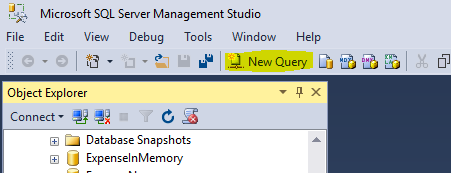
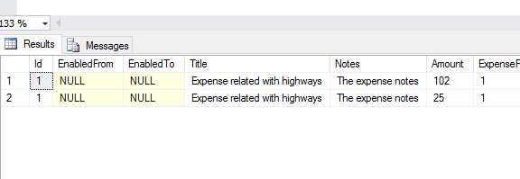

<page title="FOR SYSTEM_TIME Clause"/>

FOR SYSTEM_TIME CLAUSE
====

Once you have your temporal data, you need a syntax to be able to navigate through different dates and times. For that purpose, SQL Server 2016 has a new clause named FOR SYSTEM_TIME. This clause has five temporal-specific sub-clauses to query data across the current and history tables. These are:

- **FOR SYSTEM_TIME AS OF &lt;date_time>**
Returns a table with a rows containing the values that were actual (current) at the specified point in time in the past.  

- **FOR SYSTEM_TIME FROM &lt;start_date_time> TO &lt;end_date_time>**
Returns a table with the values for all row versions that were active within the specified time range. Boundary date times are not included.  

- **FOR SYSTEM_TIME BETWEEN &lt;start_date_time> AND  &lt;end_date_time>**
Same that FROM TO but boundary is included.  

- **FOR SYSTEM_TIME CONTAINED IN (&lt;start_date_time>, &lt;end_date_time>)**
Returns a table with the values for all row versions that were opened and closed within the specified time range defined by the two datetime values for the CONTAINED IN argument.  

- **FOR SYSTEM_TIME ALL**
Returns all rows (currents and history tables elements).  

Using FOR SYSTEM_TIME ALL we can see the change history of any row. Let's try it with the expense with id=1

 1. Open a new query 

    
 
 2. Write the following T-SQL sentence, which will show us all the changes in time.

    ```sql
    SELECT *
    FROM Expense.Expense FOR SYSTEM_TIME ALL
    WHERE Id=1
    ```

    The result must be like this:

    

    Finally, executing a regular query (without FOR TIME_SYSTEM clause) you can check the current value of Expense with id=1

    ```sql
    SELECT *
    FROM Expense.Expense
    WHERE Id=1
    ```