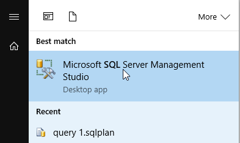
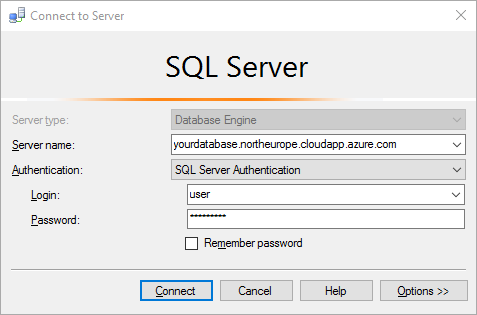
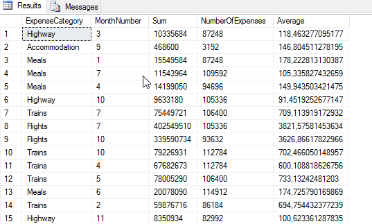
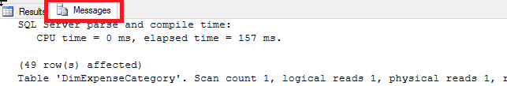
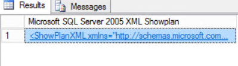
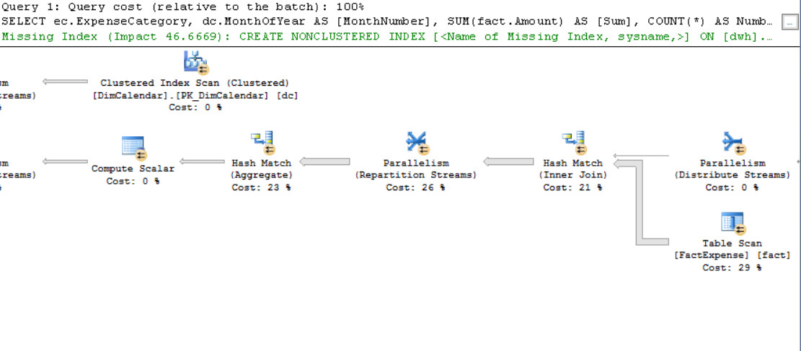
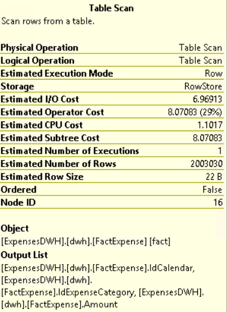

EVALUATING THE CURRENT SITUATION
===

In MyExpenses we have a Data Warehouse that we use with the aim of generating some important reports in SQL Server Reporting Services (SSRS). Our Data Warehouse contains two facts tables, Expenses and Purchases, as well as all the required dimension tables.

As time goes by, a lot of transactions and movements have been stored in the data warehouse fact tables. That makes it slower every day, generating a performance problem in the associated reports. Let's see what is happening when you execute a query:

1. First, open SQL Server Management Studio and connect to the database with the administrative login. 

    

    The default SQL credentials are: experience1/P2ssw0rd@Dev

     

2. Once connected, right click on the ExpensesDWH database and click *New query*.

     

    We are going to enable *Statistics* on the table. By doing this, you will be able to retrieve important statistics such as the number of reads made on the different tables and the time it took to process them. With this information you'll be able to see the benefits of using a ColumnStore Index. Copy and paste the following SQL statement and execute it:

    ```sql
    SET STATISTICS IO ON
    SET STATISTICS TIME ON
    ```

3. In order to have the same initial conditions for all the queries, and avoid things like cache hits, we are going to clean the buffer information. To do it, execute this SQL statement:

    ```sql
    DBCC DROPCLEANBUFFERS
    ```

4. After that, we're going to measure the performance of one of the queries that back our reports, to see how we could improve it. Execute the following query:

    ```sql
    SELECT ec.ExpenseCategory, dc.MonthOfYear AS [MonthNumber], SUM(fact.Amount) AS [Sum], COUNT(*) AS NumberOfExpenses, AVG(fact.Amount) AS Average
    FROM [dwh].[FactExpense] fact
    INNER JOIN [dwh].[DimCalendar] dc ON fact.IdCalendar = dc.IdCalendar
    INNER JOIN [dwh].[DimExpenseCategory] ec ON fact.IdExpenseCategory = ec.IdExpenseCategory
    GROUP BY ec.ExpenseCategory, dc.MonthOfYear
    ```

    Once executed you will see a similar result as the shown in the image below.

     

    As you can see the information shown is the same you can see on the reports: category of the expense, total amount reported, average amount per expense... By clicking on the “Message” tab you will find the statistics information.

     

    Let's explain the results that we've obtained:

    First of all, we see the *parse and compile time*. This is the time spent analyzing the SQL statement for syntax errors, breaking it into its component parts and producing the internal execution tree, plus the time spent compiling the execution. 

    ```
    SQL Server parse and compile time: 
     CPU time = 0 ms, elapsed time = 157 ms.
    ```

    Then we see detailed information about the tables used by the query, as well as how many reads are necessary to perform the query. Considering this information, we can see easily that this query has performed quite a lot of index scans, many logical reads (cache reads), a few physical read (disk read) and a huge number of read-ahead-reads.

    ```
    (49 row(s) affected)
    Table 'DimExpenseCategory'. Scan count 1, logical reads 1, physical reads 1, read-ahead reads 0, lob logical reads 0, lob physical reads 0, lob read-ahead reads 0.
    Table 'FactExpense'. Scan count 1827, logical reads 34993, physical reads 7, read-ahead reads 21048, lob logical reads 0, lob physical reads 0, lob read-ahead reads 0.
    Table 'DimCalendar'. Scan count 5, logical reads 58, physical reads 1, read-ahead reads 12, lob logical reads 0, lob physical reads 0, lob read-ahead reads 0.
    Table 'Workfile'. Scan count 0, logical reads 0, physical reads 0, read-ahead reads 0, lob logical reads 0, lob physical reads 0, lob read-ahead reads 0.
    Table 'Worktable'. Scan count 0, logical reads 0, physical reads 0, read-ahead reads 0, lob logical reads 0, lob physical reads 0, lob read-ahead reads 0.
    Table 'Worktable'. Scan count 0, logical reads 0, physical reads 0, read-ahead reads 0, lob logical reads 0, lob physical reads 0, lob read-ahead reads 0.
    ```

 SQL Server also provides you the total execution time, in our case 3549ms (don’t worry if your elapsed time is different, it's perfectly normal)

    ```
    SQL Server Execution Times:
        CPU time = 2859 ms,  elapsed time = 3549 ms.
    ```

 As you can see, a lot of time and I/O resources was spent in order to retrieve the required information. In the *Next* page we will create an in memory table with a clustered column storage index in order to analyze if this helps us solve our problem by increasing the performance.

 5. In addition to the statistics, let's have a look at the execution plan of the query. First, execute the following script to generate the execution plan's XML:

    ```sql
    SET SHOWPLAN_XML ON
    ```
    
    And then execute again the query:

     ```sql
    SELECT ec.ExpenseCategory, dc.MonthOfYear AS [MonthNumber], SUM(fact.Amount) AS [Sum], COUNT(*) AS NumberOfExpenses, AVG(fact.Amount) AS Average
    FROM [dwh].[FactExpense] fact
    INNER JOIN [dwh].[DimCalendar] dc ON fact.IdCalendar = dc.IdCalendar
    INNER JOIN [dwh].[DimExpenseCategory] ec ON fact.IdExpenseCategory = ec.IdExpenseCategory
    GROUP BY ec.ExpenseCategory, dc.MonthOfYear
    ```

    The query will return as a result the execution plan in XML:

    

    Press double click over the link and a new window will be opened with the execution plan:

    

    If you scroll right you will see that most of the cost of the query is on the Hash Operations, Inner Join, some parallelism and the table scan. If you put the mouse over the Table Scan, the popup will show the cost of the I/O operations:

     

    Finally, execute the following script to avoid generating the execution plan every time after the query execution:

     ```sql
    SET SHOWPLAN_XML OFF
    ```