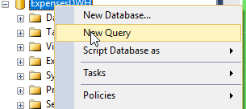
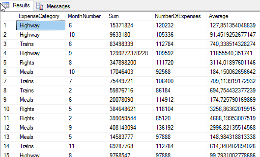
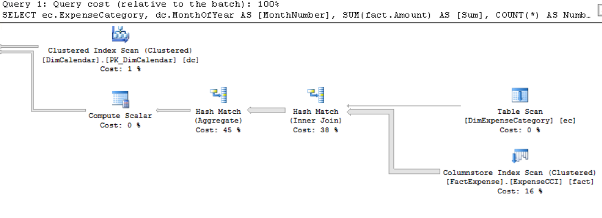

PERFORMANCE IN MEMORY CLUSTERED COLUMNSTORE INDEX
====

Let's analyze how the performance changes with a clustered columnstore index in a memory optimized table. We will (obviously) use the same query we used at the beginning of the lab.

1. Once again, connect to the Database engine and click on *new query*:

    

2. Activate statistics, executing our well-known queries:

    ```sql
    SET STATISTICS IO ON
    SET STATISTICS TIME ON
    ```

3. Clean buffers, so we have a clean slate to measure performance changes

    ```sql
    DBCC DROPCLEANBUFFERS
    ```

4. And execute the report query once again

    ```sql
    SELECT ec.ExpenseCategory, dc.MonthOfYear AS [MonthNumber], SUM(fact.Amount) AS [Sum], COUNT(*) AS NumberOfExpenses, AVG(fact.Amount) AS Average
    FROM [dwh].[FactExpense] fact
    INNER JOIN [dwh].[DimCalendar] dc ON fact.IdCalendar = dc.IdCalendar
    INNER JOIN [dwh].[DimExpenseCategory] ec ON fact.IdExpenseCategory = ec.IdExpenseCategory
    GROUP BY ec.ExpenseCategory, dc.MonthOfYear
    ```

5. The set of results retrieved is the same:

    

6. Let's check if the statistics are different:

    ```
    (49 row(s) affected)
    Table 'DimExpenseCategory'. Scan count 1, logical reads 1, physical reads 1, read-ahead reads 0, lob logical reads 0, lob physical reads 0, lob read-ahead reads 0.
    Table 'FactExpense'. Scan count 4, logical reads 0, physical reads 0, read-ahead reads 0, lob logical reads 0, lob physical reads 0, lob read-ahead reads 0.
    Table 'FactExpense'. Segment reads 6, segment skipped 0.
    Table 'DimCalendar'. Scan count 5, logical reads 58, physical reads 1, read-ahead reads 12, lob logical reads 0, lob physical reads 0, lob read-ahead reads 0.
    Table 'Worktable'. Scan count 0, logical reads 0, physical reads 0, read-ahead reads 0, lob logical reads 0, lob physical reads 0, lob read-ahead reads 0.
    Table 'Worktable'. Scan count 0, logical reads 0, physical reads 0, read-ahead reads 0, lob logical reads 0, lob physical reads 0, lob read-ahead reads 0.

    SQL Server Execution Times:
     CPU time = 345 ms,  elapsed time = 150 ms.
    ```

7. If we compare the before / after execution times:

```sql
--BEFORE
SQL Server Execution Times:
CPU time = 2859 ms,  elapsed time = 3549 ms.

--AFTER
SQL Server Execution Times:
CPU time = 345 ms,  elapsed time = 150 ms.
```

Wait for it...20 times faster! Impressive, isn't it? 

Another thing to take into account is that we have reduced the I/O dramatically. Let's have a detailed look at the statistics.

```sql
--BEFORE
Table 'FactExpense'. Scan count 1827, logical reads 34993, physical reads 7, read-ahead reads 21048, lob logical reads 0, lob physical reads 0, lob read-ahead reads 0.

--AFTER
Table 'FactExpense'. Scan count 4, logical reads 0, physical reads 0, read-ahead reads 0, lob logical reads 0, lob physical reads 0, lob read-ahead reads 0.
Table 'FactExpense'. Segment reads 6, segment skipped 0.
```

8. In addition, let's compare the execution plan of the query against the table with the In-Memory Column Store Index with the one we saw previously. First, execute the following query to generate the execution plan:

    ```sql
    SET SHOWPLAN_XML ON
    ```

    The query will return as a result the exection plan in XML:

    

    Press double click over the link and a new window will be opened with the execution plan:

    

    If you scroll right you will see that there are a few changes when comparing the disk table and the In-Memory Column Store Index table. The first one is that there is no table scan for the FactExpense table: there is only a ColumnStore Index scan. Because of this, the plan won't "complain" about a missing index and there will be no parallelism issues. Now, move the mouse pointer over the ColumnStore Index scan:

    

    There are two important differences here:
    - The Storage type is "ColumnStore" instead of "RowStore".
    - There is no associated I/O cost on the operation. This is because the table is in memory, and there is no need to access to disk to retrieve the data.
     
    The impact is clear: the operation cost for the disk scenario is close to 8.07 (29%). With the In-Memory Column Store Index, is 0.43 (16%).

With Columnstore indexes we can achieve high query performance by combining high-speed in-memory batch mode processing with techniques that reduce I/O requirements. The magic behind this is a combination of different concepts:

 - data compresion: achieve up to 10x greater data compression than rowstore indexes.
 - column elimination: skip reading in columns that are not required for the query results.
 - rowgroup elimination: by using metadata, the the columnstore index is able to skip reading in the rowgroups that do not contain data required for the query result, all without actual IO.

The reduction in the number of I/O operations will allow us to have better results when performing parallel operations.