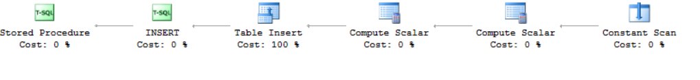

<page title="Web Audit table"/>

WEB AUDIT TABLE
====

In first place, let's execute the web application and navigate through every section.

1. Connect to your database using SQL Server Management Studio or SQL Server Data Tools

    You must be connected to the expenses database on the SQL Server 2016 that has been deployed into a VM, with the administrative login. Check the setup step to get the DNS name of the created VM. For example, the login screen for SQL Server Management is:

     

    The default SQL credentials are: experience1/P2ssw0rd@Dev.

    Once you are connected to the SQL Server, press right button over "Expenses" database and select "New Query"

     

    This will allow you to execute queries to "Expenses" database.

2. The web application uses a stored prodecure named *[Audit].[usp_Audit]* to put the information in the WebAudit table.

3. The whole process takes place in the *server.js* file, from the root of the website application. The following code is the method that gets called just before sending a response to the client:

    ```javascript
    app.on('after',
    (request, response, route, error) => {
        if (error || route === null) {
            // skip
        }
        var user = 'not authenticated';
        var responseContent = response.toString();

        if (request.user != undefined) {
            user = request.user.email;
        }

        if (response._body != undefined) {
            responseContent = JSON.stringify(response._body);
        }

        sequelize.query('EXEC [Audit].[usp_Audit] @Email=?, @Path=?, @RequestContent=?, @Verb=?, @ResponseCode=?, @ResponseContent=?',
            { replacements: [user, request.url, JSON.stringify(request.body), request.method, response.statusCode, responseContent], type: sequelize.QueryTypes.RAW });
        }
    );
    ```

    You can check the invocation of the stored procedure *[Audit].[usp_Audit]* at the bottom of the method.

4. The WebAudit table contains information about the requests and responses made from the website. It will be populated when users start using the website. Since we don't have any data yet, we want to simulate a scenario where we have a high number of concurrent operations against the WebAudit table. Now, go back to the SQL Server Management Studio and execute the following query:
 
    ```sql
    SET STATISTICS TIME OFF;  
	SET NOCOUNT ON; 

	DECLARE @starttime DATETIME2 = sysdatetime();  
	DECLARE @timems INT;  
	DECLARE @i INT = 1;  
	DECLARE @rowcount INT = 100000;  
  
	BEGIN TRAN;  
	  WHILE @i <= @rowcount  
	  BEGIN;  
		EXEC [Audit].usp_Audit
	@Email='Andrew.Davis@holexperiences.onmicrosoft.com',
	@Path='/api/reports?pageSize=10', 
	@RequestContent= NULL,
	@Verb='GET',
	@ResponseCode='200',
	@ResponseContent= '{"PageIndex":0,"PageSize":10,"TotaCount":22,"TotalPages":3,"HasPreviousPage":false,"HasNextPage":true,"Items":[{"SequenceNumber":"ER1-1210","Purpose":"testing 2","SubmissionDate":null,"Status":0,"Total":0,"Points":0,"ChargeInPoints":false,"Description":"asdafsd"},{"SequenceNumber":"ER1-1209","Purpose":"toca","SubmissionDate":null,"Status":0,"Total":0,"Points":0,"ChargeInPoints":false,"Description":"sfasd"},{"SequenceNumber":"ER1-1208","Purpose":"taca","SubmissionDate":null,"Status":0,"Total":0,"Points":0,"ChargeInPoints":false,"Description":"asdasd"},{"SequenceNumber":"ER1-1207","Purpose":"other report","SubmissionDate":null,"Status":0,"Total":0,"Points":0,"ChargeInPoints":false,"Description":"sdasd"},{"SequenceNumber":"ER1-1206","Purpose":"without next","SubmissionDate":null,"Status":0,"Total":0,"Points":0,"ChargeInPoints":false,"Description":"adafsd"},{"SequenceNumber":"ER1-1205","Purpose":"kkkk","SubmissionDate":null,"Status":0,"Total":0,"Points":0,"ChargeInPoints":false,"Description":"bhhjj"},{"SequenceNumber":"ER1-1204","Purpose":"adafda","SubmissionDate":null,"Status":0,"Total":0,"Points":0,"ChargeInPoints":false,"Description":"sdafdas"},{"SequenceNumber":"ER1-1203","Purpose":"other test","SubmissionDate":null,"Status":0,"Total":0,"Points":0,"ChargeInPoints":false,"Description":"asdfasd"},{"SequenceNumber":"ER1-1202","Purpose":"test","SubmissionDate":null,"Status":0,"Total":0,"Points":0,"ChargeInPoints":false,"Description":"adafsdfa"},{"SequenceNumber":"ER1-895","Purpose":"Report for Ignite 1","SubmissionDate":null,"Status":0,"Total":0,"Points":0,"ChargeInPoints":false,"Description":"Report from the Ignite Event"}]}'  
		SET @i += 1;  
	  END;  
	COMMIT;  
  
	SET @timems = datediff(ms, @starttime, sysdatetime());  
	SELECT 'Time:  '  
		+ cast(@timems AS VARCHAR(10)) + ' ms';  
    ```

    The query will invoke the auditory stored procedure 100000 times. The time it takes to complete may vary.

5. Let's take a look at the execution plan for the stored procedure. First, ensure that the execution plan is included

    

    And then execute the stored procedure

    ```sql
    EXEC [Audit].usp_Audit
	@Email='Andrew.Davis@holexperiences.onmicrosoft.com',
	@Path='/api/reports?pageSize=10', 
	@RequestContent= NULL,
	@Verb='GET',
	@ResponseCode='200',
	@ResponseContent= '{"PageIndex":0,"PageSize":10,"TotaCount":22,"TotalPages":3,"HasPreviousPage":false,"HasNextPage":true,"Items":[{"SequenceNumber":"ER1-1210","Purpose":"testing 2","SubmissionDate":null,"Status":0,"Total":0,"Points":0,"ChargeInPoints":false,"Description":"asdafsd"},{"SequenceNumber":"ER1-1209","Purpose":"toca","SubmissionDate":null,"Status":0,"Total":0,"Points":0,"ChargeInPoints":false,"Description":"sfasd"},{"SequenceNumber":"ER1-1208","Purpose":"taca","SubmissionDate":null,"Status":0,"Total":0,"Points":0,"ChargeInPoints":false,"Description":"asdasd"},{"SequenceNumber":"ER1-1207","Purpose":"other report","SubmissionDate":null,"Status":0,"Total":0,"Points":0,"ChargeInPoints":false,"Description":"sdasd"},{"SequenceNumber":"ER1-1206","Purpose":"without next","SubmissionDate":null,"Status":0,"Total":0,"Points":0,"ChargeInPoints":false,"Description":"adafsd"},{"SequenceNumber":"ER1-1205","Purpose":"kkkk","SubmissionDate":null,"Status":0,"Total":0,"Points":0,"ChargeInPoints":false,"Description":"bhhjj"},{"SequenceNumber":"ER1-1204","Purpose":"adafda","SubmissionDate":null,"Status":0,"Total":0,"Points":0,"ChargeInPoints":false,"Description":"sdafdas"},{"SequenceNumber":"ER1-1203","Purpose":"other test","SubmissionDate":null,"Status":0,"Total":0,"Points":0,"ChargeInPoints":false,"Description":"asdfasd"},{"SequenceNumber":"ER1-1202","Purpose":"test","SubmissionDate":null,"Status":0,"Total":0,"Points":0,"ChargeInPoints":false,"Description":"adafsdfa"},{"SequenceNumber":"ER1-895","Purpose":"Report for Ignite 1","SubmissionDate":null,"Status":0,"Total":0,"Points":0,"ChargeInPoints":false,"Description":"Report from the Ignite Event"}]}' 
    ```

 6. As you can see, the execution plan seems normal  
 
    

    If you move the mouse over the "Table Insert" step in the execution plan, a popup will be shown:

    

    Here you can see that even with a small query, there is an associated IO cost because the information must be written to disk.

7. Lastly, execute the following query, to see how the WebAudit table information looks:

    ```sql
        SELECT TOP 1000 [Id]
        ,[Email]
        ,[Path]
        ,[RequestContent]
        ,[Verb]
        ,[ResponseCode]
        ,[ResponseContent]
        ,[Date]
        FROM [Expenses].[Audit].[WebAudit]
        ORDER BY [Id] DESC
    ```

    It will return the latest requests and responses from the website. You can check that there is a lot of information stored in the table about the request, response, user, date,etc.