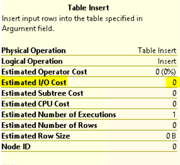

<page title="Checking the performance changes"/>

CHECKING THE PERFORMANCE CHANGES
====

Once the new In-Memory OLTP table is created and the stored procedure has been recreated using the native compilation, it is time to compare the performance.

1. Execute the following query:

    ```sql
    SET STATISTICS TIME OFF;  
	SET NOCOUNT ON; 

	DECLARE @starttime DATETIME2 = sysdatetime();  
	DECLARE @timems INT;  
	DECLARE @i INT = 1;  
	DECLARE @rowcount INT = 100000;  
  
	BEGIN TRAN;  
	  WHILE @i <= @rowcount  
	  BEGIN;  
		EXEC [Audit].usp_Audit
	@Email='Andrew.Davis@holexperiences.onmicrosoft.com',
	@Path='/api/reports?pageSize=10', 
	@RequestContent= NULL,
	@Verb='GET',
	@ResponseCode='200',
	@ResponseContent= '{"PageIndex":0,"PageSize":10,"TotaCount":22,"TotalPages":3,"HasPreviousPage":false,"HasNextPage":true,"Items":[{"SequenceNumber":"ER1-1210","Purpose":"testing 2","SubmissionDate":null,"Status":0,"Total":0,"Points":0,"ChargeInPoints":false,"Description":"asdafsd"},{"SequenceNumber":"ER1-1209","Purpose":"toca","SubmissionDate":null,"Status":0,"Total":0,"Points":0,"ChargeInPoints":false,"Description":"sfasd"},{"SequenceNumber":"ER1-1208","Purpose":"taca","SubmissionDate":null,"Status":0,"Total":0,"Points":0,"ChargeInPoints":false,"Description":"asdasd"},{"SequenceNumber":"ER1-1207","Purpose":"other report","SubmissionDate":null,"Status":0,"Total":0,"Points":0,"ChargeInPoints":false,"Description":"sdasd"},{"SequenceNumber":"ER1-1206","Purpose":"without next","SubmissionDate":null,"Status":0,"Total":0,"Points":0,"ChargeInPoints":false,"Description":"adafsd"},{"SequenceNumber":"ER1-1205","Purpose":"kkkk","SubmissionDate":null,"Status":0,"Total":0,"Points":0,"ChargeInPoints":false,"Description":"bhhjj"},{"SequenceNumber":"ER1-1204","Purpose":"adafda","SubmissionDate":null,"Status":0,"Total":0,"Points":0,"ChargeInPoints":false,"Description":"sdafdas"},{"SequenceNumber":"ER1-1203","Purpose":"other test","SubmissionDate":null,"Status":0,"Total":0,"Points":0,"ChargeInPoints":false,"Description":"asdfasd"},{"SequenceNumber":"ER1-1202","Purpose":"test","SubmissionDate":null,"Status":0,"Total":0,"Points":0,"ChargeInPoints":false,"Description":"adafsdfa"},{"SequenceNumber":"ER1-895","Purpose":"Report for Ignite 1","SubmissionDate":null,"Status":0,"Total":0,"Points":0,"ChargeInPoints":false,"Description":"Report from the Ignite Event"}]}'  
		SET @i += 1;  
	  END;  
	COMMIT;  
  
	SET @timems = datediff(ms, @starttime, sysdatetime());  
	SELECT 'Time:  '  
		+ cast(@timems AS VARCHAR(10)) + ' ms';  
    ```

2. The execution time will be considerably less than the on-disk scenario. But even if the time is important, the concurrency is even more important. As the table is In-Memory, there is no IO to disk when inserting the data. This is a great advantage in our scenario, because it prepares the table to respond easily to high-concurrency requests without having an adverse effect in the performance of other queries.

3. As you did for the table on disk scenario on the first page, let's generate the execution plan for the current stored procedure. Since now the procedure is using native compilation, the following commands should be executed:

	```sql
	SET SHOWPLAN_XML ON  
	GO
	```

4. Now, execute the procedure

	```sql
	EXEC [Audit].usp_Audit
	@Email='Andrew.Davis@holexperiences.onmicrosoft.com',
	@Path='/api/reports?pageSize=10', 
	@RequestContent= NULL,
	@Verb='GET',
	@ResponseCode='200',
	@ResponseContent= '{"PageIndex":0,"PageSize":10,"TotaCount":22,"TotalPages":3,"HasPreviousPage":false,"HasNextPage":true,"Items":[{"SequenceNumber":"ER1-1210","Purpose":"testing 2","SubmissionDate":null,"Status":0,"Total":0,"Points":0,"ChargeInPoints":false,"Description":"asdafsd"},{"SequenceNumber":"ER1-1209","Purpose":"toca","SubmissionDate":null,"Status":0,"Total":0,"Points":0,"ChargeInPoints":false,"Description":"sfasd"},{"SequenceNumber":"ER1-1208","Purpose":"taca","SubmissionDate":null,"Status":0,"Total":0,"Points":0,"ChargeInPoints":false,"Description":"asdasd"},{"SequenceNumber":"ER1-1207","Purpose":"other report","SubmissionDate":null,"Status":0,"Total":0,"Points":0,"ChargeInPoints":false,"Description":"sdasd"},{"SequenceNumber":"ER1-1206","Purpose":"without next","SubmissionDate":null,"Status":0,"Total":0,"Points":0,"ChargeInPoints":false,"Description":"adafsd"},{"SequenceNumber":"ER1-1205","Purpose":"kkkk","SubmissionDate":null,"Status":0,"Total":0,"Points":0,"ChargeInPoints":false,"Description":"bhhjj"},{"SequenceNumber":"ER1-1204","Purpose":"adafda","SubmissionDate":null,"Status":0,"Total":0,"Points":0,"ChargeInPoints":false,"Description":"sdafdas"},{"SequenceNumber":"ER1-1203","Purpose":"other test","SubmissionDate":null,"Status":0,"Total":0,"Points":0,"ChargeInPoints":false,"Description":"asdfasd"},{"SequenceNumber":"ER1-1202","Purpose":"test","SubmissionDate":null,"Status":0,"Total":0,"Points":0,"ChargeInPoints":false,"Description":"adafsdfa"},{"SequenceNumber":"ER1-895","Purpose":"Report for Ignite 1","SubmissionDate":null,"Status":0,"Total":0,"Points":0,"ChargeInPoints":false,"Description":"Report from the Ignite Event"}]}' 
	```

	It will return the following row, which contains the execution plan. Double click on it to open it:

	

5. The execution plan looks pretty similar to the disk version, except that there is no effort in the "Insert" step.

	
	
	If you move the mouse over the "Table Insert" step in the execution plan, a new popup will be shown:
	
	
	
	Note that there is no IO cost. This is because the table is inserting to memory and not to the disk.

6. Finally, execute the following command to disable the plan visibility again:

	```sql
	SET SHOWPLAN_XML OFF  
	GO
	```