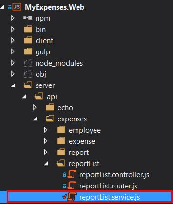
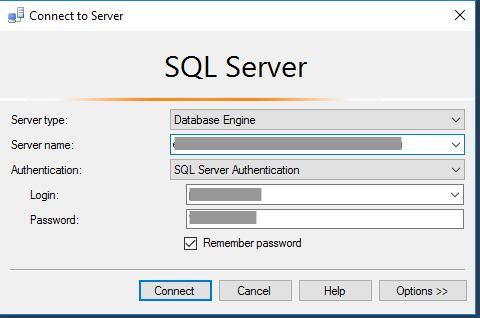
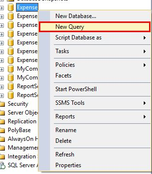
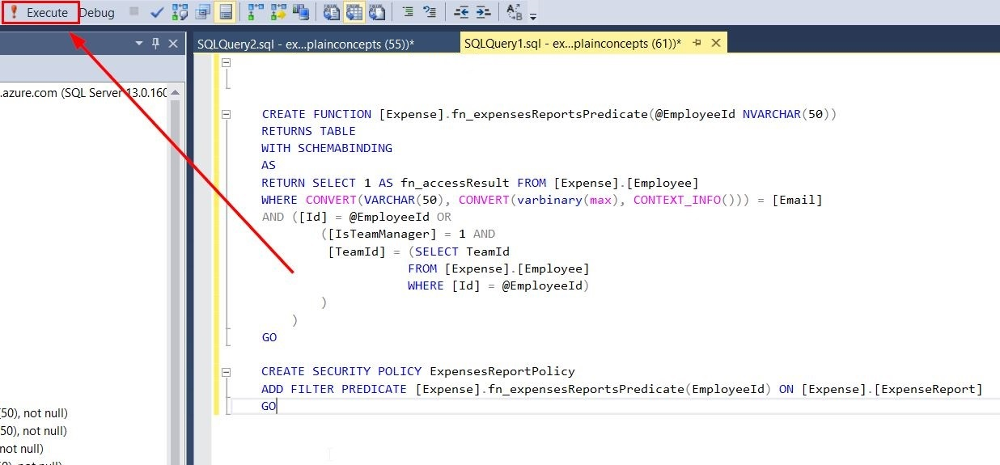

<page title="Row Level Security in the database"/>

ROW LEVEL SECURITY IN THE DATABASE
====

In first place, we need to modify the application so it does not filter expenses reports anymore. Remember this won't be in charge of the application, but the database.

1. Open *reportList.service.js*
 
    
  
2. Scroll down to the `getReports` function. There is an object called `conditions`. Replace that object with the following code:
 
    ```javascript
    var conditions = {
        include: [
            {
                model: Employee,
                include: [Team],
                //where: sequelize.where(sequelize.fn('lower', sequelize.col('Email')), ownerEmail.toLowerCase()),
                required: true
            },
            {
                model: Expense,
                attributes: { exclude: ['receiptPicture'] },
                include: [ExpenseBonus]
            }
        ],
        attributes: ['sequenceNumber', 'purpose', 'submissionDate', 'status', 'reimburseInPoints', 'description', 'createdOn'],
        order: 'createdOn DESC',
        offset: offset, // skip pages
        limit: pageSize // fecth pageSize
    };
    ```

3. Scroll down to the `getReportsSummary` function. There is another object called `conditions`. Replace that object with the following code:

    ```javascript
    var conditions = {
        include: {
            model: Employee,
            //where: { email: ownerEmail },
            attributes: [], // no select needed
            required: true
        },
        attributes: ['Status', [sequelize.fn('COUNT', sequelize.col('status')), 'Count']],
        group: ['status'],
        raw: true
    };
    ```

4. Great, let's try this code before doing anything else. Run the application, login and let's see what the report list looks like:

    

    As you can see we are able to see all the reports created by all the company employees. Let's apply Row-Level Security to the table.

5. Open SQL Server Management Studio.

6. Connect to the SQL Server using SSMS.
 
    

    The credentials are experience1 / P2ssw0rd@Dev

7. Right click on the *Expense* database and click *New query*
  
    

8. Copy and paste the following code.

    ```sql
    CREATE FUNCTION [Expense].fn_expensesReportsPredicate(@EmployeeId int)
    RETURNS TABLE
    WITH SCHEMABINDING
    AS
    RETURN 
    SELECT 1 AS fn_accessResult 
    FROM [Expense].[PermissionMap]
    WHERE CONTEXT_INFO() = [Email]
        AND ([Id] = @EmployeeId
        OR 
                ([IsTeamManager] = 1 AND 
                [TeamId] = (SELECT TeamId 
                            FROM [Expense].[PermissionMap]
                            WHERE [Id] = @EmployeeId)
                )
            )
        GO

    CREATE SECURITY POLICY ExpensesReportPolicy
    ADD FILTER PREDICATE [Expense].fn_expensesReportsPredicate(EmployeeId) ON [Expense].[ExpenseReport]
    GO
    ```

    To apply Row-Level security to a particular table, what we have to do in first place is create a function. This function will be evaluated when the user execute queries against the table, for each row. Let's explain what it does:

    ```sql
   CREATE FUNCTION [Expense].fn_expensesReportsPredicate(@EmployeeId int)
   RETURNS TABLE
   WITH SCHEMABINDING
   AS
   RETURN 
   SELECT 1 AS fn_accessResult 
   FROM [Expense].[PermissionMap]
   WHERE CONTEXT_INFO() = [Email]
    AND ([Id] = @EmployeeId
     OR 
            ([IsTeamManager] = 1 AND 
             [TeamId] = (SELECT TeamId 
                        FROM [Expense].[PermissionMap]
                        WHERE [Id] = @EmployeeId)
            )
        )
    ```

    The function receives one parameter: EmployeeId. For each row in the Report table, the employee ID of the current evaluated row will be passed to the function. 

    First, the function checks that the permissions table contains an employee's email that matches the one stored in the variable `CONTEXT_INFO`. Due to the fact that all the users in the application are using the same login against the database, it is not possible to know which user is querying the database. 
    To solve this, every time a new connection is opened to the database, a session variable called `CONTEXT_INFO` is set with the user's email. This will be done by the server, calling a stored procedure that is in charge of doing so. We'll see how to do so in a moment, but the stored procedure looks like this. Copy this code and execute it:

    ```sql
    CREATE PROCEDURE [Expense].[SetContextInfo]
        @Email NVARCHAR(60)
    AS
    BEGIN
        DECLARE @encodedEmail VARBINARY(128)
        SET @encodedEmail = convert(VARBINARY(128), @Email)
        SET CONTEXT_INFO @encodedEmail
    END
    GO
    ```

    `CONTEXT_INFO` has a binary type, so the procedure gets the parameter and converts it to binary first.

    Then, the function evaluates that an employee with the ID passed as parameter exists. The report will be retrieved if the user querying the database is a team manager, or manager of an employee with the employee ID passed as parameter.

    To summarize: If there is an employee whose email matches the email of the logged user, and his/her ID matches the report's owner ID or is manager of the report's owner, the report will be retrieved.

    Creating just the function is not enough for Row-Level security to work. 

    ```sql
    CREATE SECURITY POLICY ExpensesReportPolicy
    ADD FILTER PREDICATE [Expense].fn_expensesReportsPredicate(EmployeeId) ON [Expense].[ExpenseReport]
    ```
        
    This is the code that applies that function to a table. We want to apply it to the `ExpenseReport` table. As parameter we pass the Employee ID, whose value will be the one from the row we evaluate.

9. Run the script.

    


    

    


    
