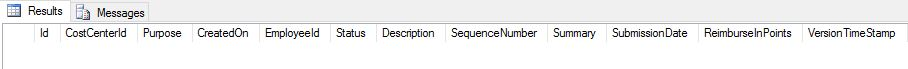
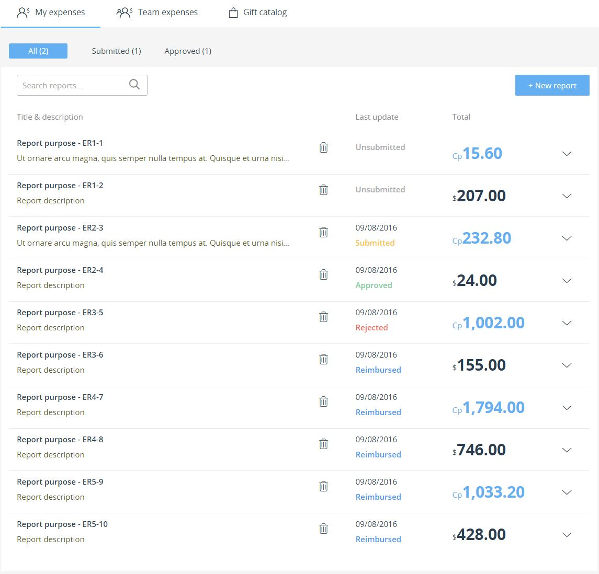
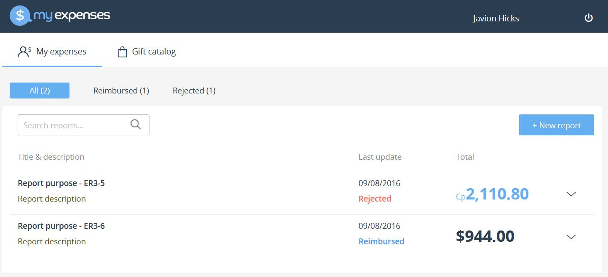
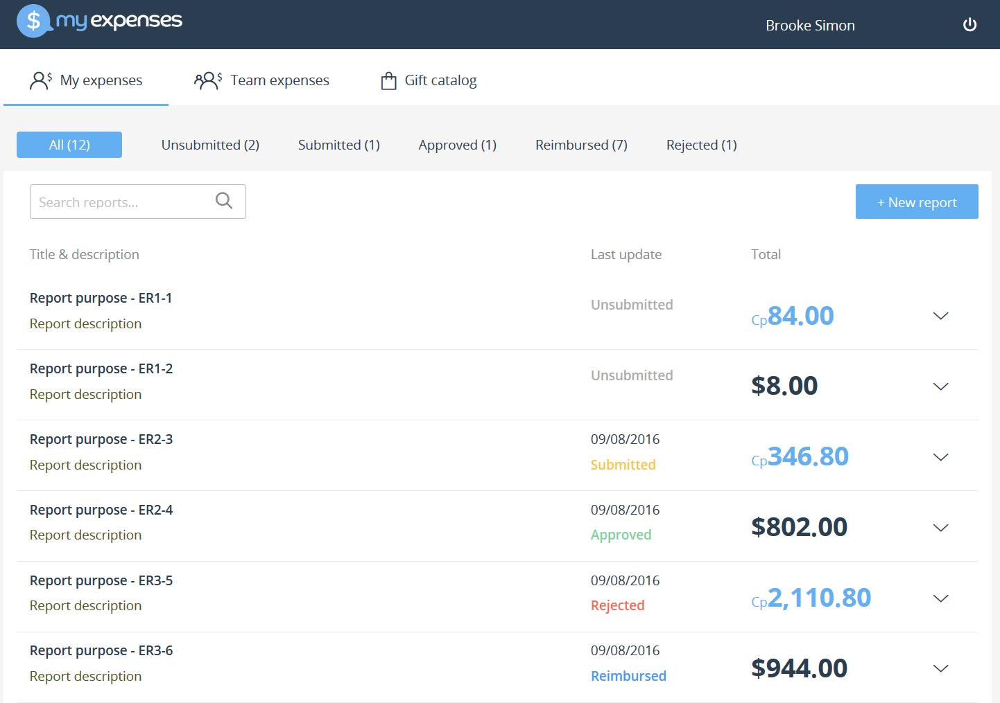
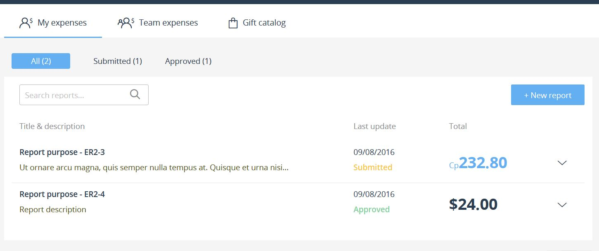

<page title="Row Level Security in the client (I)"/>

ROW LEVEL SECURITY IN THE CLIENT (I)
====

1. Let's check that RLS works as we expect. Copy and paste the following code, and execute it.
 
    ```sql
    USE [Expenses]
    SELECT * FROM [Expense].[ExpenseReport]
    ```

    You should see the following. 

    

    That's it! No results! Why? Remember the `CONTEXT_INFO`? Right now it isn't set, so its value is `NULL`. And because `NULL` isn't a valid user, we get no results. Great! Let's see how the application works. Remember that, when you modified the server code, the results were the following:

    

    This is, employees were seeing all the results. This shouldn't be the case anymore! Let's edit the app to call the stored procedure before anything else so the user is able to see the expense report list.
 
2. Open *reportList.service.js* and scroll down to the `getReports` function. Replace this:

    ```javascript
    return countReports(ownerEmail, status, filter).then(function (c) {
        return ExpenseReport.findAll(conditions).then((reports) => {
            return buildReportList(reports, pageIndex, pageSize, c);
        });
    });   
    ```

    with

    ```javascript
    return sequelize.transaction(function (t) {
        return sequelize.query('EXEC [Expense].[SetContextInfo] @Email=N\'' + ownerEmail + '\'', { transaction: t }).then(function () {
            return countReports(ownerEmail, status, filter, t).then(function (c) {
                conditions.transaction = t;
                return ExpenseReport.findAll(conditions).then((reports) => {
                    return buildReportList(reports, pageIndex, pageSize, c);
                });
            }); 
        });
    });
    ```

3. Scroll down to the `getReportsSummary` function. Replace this: 

    ```javascript
    return ExpenseReport.findAll(conditions).then((summary) => {
        return summary;
    });
    ```

    with 

    ```javascript
    return sequelize.transaction(function (t) {
        return sequelize.query('EXEC [Expense].[SetContextInfo] @Email=N\'' + ownerEmail + '\'', { transaction: t }).then(function () {
            conditions.transaction = t;
            return ExpenseReport.findAll(conditions).then((summary) => {
                return summary;
            });
        });
    });
    ```

4. Scroll down to the `countReports` function. Replace the function header:

    ```javascript
    let countReports = function (ownerEmail, status, filter)
    ```

    with 

    ```javascript
    let countReports = function (ownerEmail, status, filter, t)
    ```

    and, also, include this lines just before the `return ExpenseReport.count(countConditions);` line:

    ```javascript
    if (t) {
        countConditions.transaction = t;
    }
    ```

    The code in both the previous step and this one opens a transaction to ensure that both calls are made within the same connection and in order. That way we are sure that the procedure will be called first, so when the calls to retrieve reports and the summary are made, the `CONTEXT_INFO` variable is properly set, and the Row-Level Security policy works as expected.

5. Run the app again, login as a normal (use Andrew.Davis@holexperiences.onmicrosoft.com, which is not manager) user and go to *My Expenses*.
 
    

    As you can see, we get the Expenses reports just for the logged in employee. And without the need of doing any filtering in the application code!

6. But what happens if you log in as a manager?
 
    

    You get whole report list of all the team employees! This is not wrong, since when we created the function, we specified to retrieve all the reports in case the logged in user is a manager. Now it would be a good idea to apply a filter in the application, but, this time, as a matter of user experience (in 'My Expenses' I should just see those expenses related to me), not due to a possible security issue.

7. Let's edit the code to fix this UX issue. In the `getReports` and `getReportsSummary` methods, in the object `conditions.`, there are some commented lines:

    In getReports

    ```javascript
    var conditions = {
        include: [
            {
                model: Employee,
                include: [Team],
                where: sequelize.where(sequelize.fn('lower', sequelize.col('Email')), ownerEmail.toLowerCase())
            },
            {
                model: Expense,
                attributes: { exclude: ['receiptPicture'] },
                include: [ExpenseBonus]
            }
        ],
        attributes: ['sequenceNumber', 'purpose', 'submissionDate', 'status', 'reimburseInPoints', 'description', 'createdOn'],
        order: [ [sequelize.col('createdOn'), 'DESC']],
        offset: offset, // skip pages
        limit: pageSize // fetch pageSize
    };
    ```

    In getReportsSummary

    ```javascript
    var conditions = {
        include: {
            model: Employee,
            where: { email: ownerEmail },
            attributes: [] // no select needed
        },
        attributes: ['Status', [sequelize.fn('COUNT', sequelize.col('status')), 'Count']],
        group: ['status'],
        raw: true
    };
    ```

8. Run the application again. You should see now the correct results!
 
    

We need to apply the same funcionality to the Team expenses page. It's very similar to what we have been doing until now.