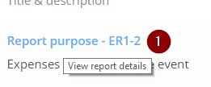
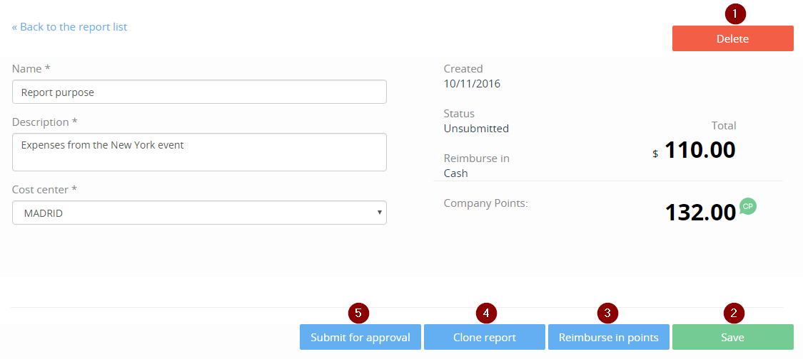
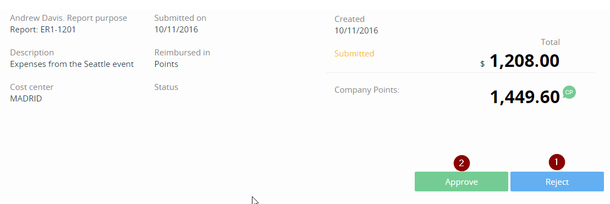

<page title="Row Level Security in the client (III)"/>

ROW LEVEL SECURITY IN THE CLIENT (III)
====

In order to have all the application funcionality properly working as it was before we implemented Row Level Security, we need to make a few more code changes. All we have to do is make sure that the stored procedure is called before making any call to the database, so the database can return reports related to the logged in employee.

If we go to the website now, and want to get the report details, we are going to get an error telling us that such report does not exist:



Let's change that.

1. Open *query.report.js* (the file is inside of server/querys folder) and replace the following code:

    ```javascript
            let deferred = new Promise((resolve, reject) => {
                ExpenseReport.findAll(conditions).then(function (reports) {
                    if (!reports || reports.length === 0)
                        resolve({});
                    else
                        resolve(reports[0]);
                }).catch(function (err) {
                    reject(err);
                });
            });
    ```

    with

    ```javascript
            let deferred = new Promise((resolve, reject) => {
                return sequelize.transaction(function (t) {
                    return sequelize.query('EXEC [Expense].[SetContextInfo] @Email=N\'' + employee.email + '\'', { transaction: t }).then(function () {
                        conditions.transaction = t;
                        return ExpenseReport.findAll(conditions).then(function (reports) {
                            if (!reports || reports.length === 0)
                                resolve({});
                            else
                                resolve(reports[0]);
                        }).catch(function (err) {
                            reject(err);
                        });
                    });
                });
            });
    ```

    Great, now you should be able to get the report details. In the report details screen, there are several functionalities that have to be reviewed as well in order to work properly. 

    

2. Open *report.service.js*  (the file is inside of server/api/expenses/report/services folder). Find the `deleteReport` function, and replace its code with the following:

    ```javascript
    let deleteReport = function (userName, reportCode) {
        return sequelize.transaction(function (t) {
            return sequelize.query('EXEC [Expense].[SetContextInfo] @Email=N\'' + userName + '\'', { transaction: t }).then(function () {
                return ExpenseReport.find({
                    where: { sequenceNumber: reportCode },
                    include: [Employee, { model: Expense, exclude: ['receiptPicture'], include: [SuspiciousExpense, ExpenseBonus] }],
                    transaction: t
                }).then(function (report) {

                    if (!report) {
                        throw new ApplicationError(messages.ReportNotExist);
                    }

                    if (report.Employee.email.toLowerCase() != userName.toLowerCase()) {
                        throw new ApplicationError(messages.NotAuhtorized, 401);
                    }

                    if (status.UnSubmittedForApproval != report.status &&
                        status.SubmittedForApproval != report.status) {
                        throw new ApplicationError(messages.CantModifyReport);
                    }

                    return deleteExpensesOfReport(report, t).then(function () {
                        return report.destroy({ transaction: t });
                    });

                });
            })
        });
    };
    ```

    Nice! If you try to delete a report now, it will work without any problem.

3. In the same file, find the `updateReport` function. Replace this code:

    ```javascript
            return report.update({
                purpose: upReport.purpose,
                costCenterId: upReport.costCenterId,
                description: upReport.description
            }, { fields: ['purpose', 'description', 'costCenterId'] });
    ```

    with this one

    ```javascript
            return sequelize.transaction(function (t) {
                return sequelize.query('EXEC [Expense].[SetContextInfo] @Email=N\'' + report.Employee.email + '\'', { transaction: t }).then(function () {
                    return report.update({
                        purpose: upReport.purpose,
                        costCenterId: upReport.costCenterId,
                        description: upReport.description
                    }, { fields: ['purpose', 'description', 'costCenterId'] });

                });
            });
    ```

    Try to edit a report and save it, it should work perfectly

4. The employee should be able to change the reimbursement method. Find the `reimburseInPoints` function and replace its code with the following one:

    ```javascript
        let reimburseInPoints = function (userName, reportCode) {
            return sequelize.transaction(function (t) {
                return sequelize.query('EXEC [Expense].[SetContextInfo] @Email=N\'' + userName + '\'', { transaction: t }).then(function () {
                    return ExpenseReport.find({
                        where: { sequenceNumber: reportCode },
                        include: [Employee],
                        transaction: t
                    }).then(function (report) {

                        if (!report) {
                            throw new ApplicationError(messages.ReportNotExist);
                        }

                        if (report.Employee.email.toLowerCase() != userName.toLowerCase()) {
                            throw new ApplicationError(messages.NotAuhtorized, 401);
                        }

                        report.inPoints();

                        return report.save();

                    });
                });
            });
        };
    ```

    Find the `reiumburseInCash` function too, and replace its code with the following:

    ```javascript
        let reimburseInCash = function (userName, reportCode) {
            return sequelize.transaction(function (t) {
                return sequelize.query('EXEC [Expense].[SetContextInfo] @Email=N\'' + userName + '\'', { transaction: t }).then(function () {
                    return ExpenseReport.find({
                        where: { sequenceNumber: reportCode },
                        include: [Employee],
                        transaction: t
                    }).then(function (report) {

                        if (!report) {
                            throw new ApplicationError(messages.ReportNotExist);
                        }

                        if (report.Employee.email.toLowerCase() != userName.toLowerCase()) {
                            throw new ApplicationError(messages.NotAuhtorized, 401);
                        }

                        report.inCash();

                        return report.save();

                    });
                })
            });
        };
    ```

5. Find the `cloneReport` function, and replace its code with the following:

    ```javascript
        let cloneReport = function (userName, reportCode) {
            return sequelize.transaction(function (t) {
                return sequelize.query('EXEC [Expense].[SetContextInfo] @Email=N\'' + userName + '\'', { transaction: t }).then(function () {
                    return ExpenseReport.find({
                        where: { sequenceNumber: reportCode },
                        include: [{
                            model: Employee
                        }, {
                                model: Expense,
                                include: [ExpenseBonus, SuspiciousExpense]
                            }],
                        transaction : t
                    }).then(function (report) {

                        if (!report) {
                            throw new ApplicationError(messages.ReportNotExist);
                        }

                        if (report.Employee.email.toLowerCase() != userName.toLowerCase()) {
                            throw new ApplicationError(messages.NotAuhtorized, 401);
                        }

                        let clone = report.clone();


                        return ExpenseReport.create(clone, { transaction: t }).then(function (newReport) {
                            return BBPromise.map(clone.Expenses, function (exp) {

                                exp.expenseReportId = newReport.id;

                                return Expense.create(exp, { transaction: t }).then(function (newExpense) {

                                    let pSus = BBPromise.map(exp.SuspiciousExpenses, function () {
                                        return SuspiciousExpense.create({

                                            suspiciousExpenseId: newExpense.id
                                        }, { transaction: t });
                                    });

                                    let pExp = BBPromise.map(exp.ExpenseBonus, function (expBonus) {
                                        return ExpenseBonus.create({
                                            amount: expBonus.amount,
                                            reason: expBonus.reason,
                                            expenseId: newExpense.id

                                        }, { transaction: t });
                                    });

                                    return BBPromise.join(pSus, pExp);

                                });
                            });
                        });

                    });
                })
            });
        };
    ```

6. Finally, in the `submitForApproval` function, replace the code with the next one:

    ```javascript
        let submitForApproval = function (userName, reportCode) {
            return sequelize.transaction(function (t) {
                return sequelize.query('EXEC [Expense].[SetContextInfo] @Email=N\'' + userName + '\'', { transaction: t }).then(function () {
                    return ExpenseReport.find({
                        where: { sequenceNumber: reportCode },
                        include: [Employee],
                        transaction: t
                    }).then(function (report) {

                        if (!report) {
                            throw new ApplicationError(messages.ReportNotExist);
                        }

                        if (report.Employee.email.toLowerCase() != userName.toLowerCase()) {
                            throw new ApplicationError(messages.NotAuhtorized, 401);
                        }

                        report.submitForApproval();

                        return report.save();

                    });
                })
            });
        };
    ```

    Now we are going to do the same with the report expenses. We need to be able to create, edit and delete expenses from a report. Let's do it.

7. Open *expense.service.js*, find the `createExpense` method and replace its code with:

    ```javascript
    let createExpense = function (userName, reportCode, expense) {
        return sequelize.transaction(function (t) {
            return sequelize.query('EXEC [Expense].[SetContextInfo] @Email=N\'' + userName + '\'', { transaction: t }).then(function () {
                return ExpenseReport.find({
                    where: { sequenceNumber: reportCode },
                    include: [{ model: Employee, include: [Bonification] }],
                    transaction: t
                }).then(function (report) {

                    if (!report) {
                        throw new ApplicationError(messages.ReportNotExist);
                    }

                    if (report.Employee.email.toLowerCase() != userName.toLowerCase()) {
                        throw new ApplicationError(messages.NotAuhtorized, 401);
                    }

                    return ExpenseCategory.findById(expense.categoryId).then(function (cat) {
                        if (!cat)
                            throw new ApplicationError(messages.CategoryNotExist);

                        if (expense.recurrentFrom && expense.recurrentTo) {
                            let rFrom = new Date(expense.recurrentFrom);
                            let rTo = new Date(expense.recurrentTo);
                            if (rFrom > rTo)
                                throw new ApplicationError(messages.InvalidInputRecurrentPatternDateTo);

                            if (daydiff(rFrom, rTo) <= 1) {
                                expense.recurrentFrom = null;
                                expense.recurrentTo = null;
                            }
                        }

                        if (expense.receipt)
                            var buf = new Buffer(expense.receipt, 'base64');

                        return Expense.create({
                            enabledFrom: expense.recurrentFrom ? expense.recurrentFrom : null,
                            enabledTo: expense.recurrentTo ? expense.recurrentTo : null,
                            title: expense.title,
                            notes: expense.notes,
                            amount: expense.amount,
                            expenseReportId: report.id,
                            expenseCategoryId: cat.id,
                            receiptPicture: buf ? buf : null,
                            date: expense.date
                        }).then(function (newExp) {
                            return suspiciousService.evaluateExpense(suspiciousStrategy, { id: newExp.id }).catch(function (err) {
                                console.log(err);
                            });
                        });

                    });

                });  
            })
        });    
    };
    ```

    Find the `updateExpense` function and replace its code with:

    ```javascript
        let updateExpense = function (userName, reportCode, expenseId, expenseDto) {
            return sequelize.transaction(function (t) {
                return sequelize.query('EXEC [Expense].[SetContextInfo] @Email=N\'' + userName + '\'', { transaction: t }).then(function () {
                    return ExpenseReport.find({
                        where: { sequenceNumber: reportCode },
                        include: [{ model: Employee }, { model: Expense }],
                        transaction: t
                    }).then(function (report) {

                        if (!report) {
                            throw new ApplicationError(messages.ReportNotExist);
                        }

                        if (report.Employee.email.toLowerCase() != userName.toLowerCase()) {
                            throw new ApplicationError(messages.NotAuhtorized);
                        }

                        if (report.status !== status.UnSubmittedForApproval && report.status !== status.SubmittedForApproval)
                            throw new ApplicationError(messages.CantModifyReport);

                        return ExpenseCategory.findById(expenseDto.categoryId).then(function (cat) {
                            if (!cat)
                                throw new ApplicationError(messages.CategoryNotExist);

                            if (expenseDto.recurrentFrom && expenseDto.recurrentTo) {
                                let rFrom = new Date(expenseDto.recurrentFrom);
                                let rTo = new Date(expenseDto.recurrentTo);
                                if (rFrom > rTo)
                                    throw new ApplicationError(messages.InvalidInputRecurrentPatternDateTo);
                            }

                            let expenseToUpdate = report.Expenses.find(function (exp) {
                                return exp.id === parseInt(expenseId, 10);
                            });

                            if (!expenseToUpdate)
                                throw new ApplicationError(messages.ExpenseNotExist);

                            let upExpense = {
                                title: expenseDto.title,
                                date: expenseDto.date,
                                notes: expenseDto.notes,
                                amount: expenseDto.amount,
                                expenseCategoryId: expenseDto.categoryId,
                                enabledFrom: expenseDto.recurrentFrom ? expenseDto.recurrentFrom : null,
                                enabledTo: expenseDto.recurrentTo ? expenseDto.recurrentTo : null
                            };

                            let fieldsToUpdate = { fields: ['title', 'date', 'notes', 'amount', 'expenseCategoryId', 'enabledFrom', 'enabledTo'] };

                            if (expenseDto.receipt)
                                var newReceipt = new Buffer(expenseDto.receipt, 'base64');

                            if (newReceipt) {
                                upExpense.receiptPicture = newReceipt;
                                fieldsToUpdate.fields.push('receiptPicture');
                            }

                            return expenseToUpdate.update(upExpense, fieldsToUpdate).then(function (newExp) {
                                return suspiciousService.evaluateExpense(suspiciousStrategy, { id: newExp.id });
                            });

                        });

                    }); 
                })
            }); 
        };
    ```

    Finally, find the `deleteExpense` function and replace its code with:

    ```javascript
        let deleteExpense = function (userName, reportCode, expenseId) {
            return sequelize.transaction(function (t) {
                return sequelize.query('EXEC [Expense].[SetContextInfo] @Email=N\'' + userName + '\'', { transaction: t }).then(function () {
                    return ExpenseReport.find({
                        where: { sequenceNumber: reportCode },
                        include: [Employee, { model: Expense, exclude: ['receiptPicture'], include: [SuspiciousExpense, ExpenseBonus] }],
                        transaction: t
                    }).then(function (report) {

                        if (!report) {
                            throw new ApplicationError(messages.ReportNotExist);
                        }

                        if (report.Employee.email.toLowerCase() != userName.toLowerCase()) {
                            throw new ApplicationError(messages.NotAuhtorized, 401);
                        }

                        if (status.UnSubmittedForApproval != report.status &&
                            status.SubmittedForApproval != report.status) {
                            throw new ApplicationError(messages.CantDeleteExpenseInNotValidState);
                        }

                        let ExpenseToDelete = report.Expenses.find(function (exp) {
                            return exp.id == expenseId;
                        });

                        return sequelize.transaction(function (t) {
                            return deleteExpenseOfReport(ExpenseToDelete, t);
                        });

                    });
                })
            });
        };
    ```

    When a manager logs in he needs to be able to, besides all that we have already done, approve or reject his employees reports. 

    

8. Open *report.service.js*, find the `approveReport` function, and replace its code with the following:

    ```javascript
        let approveReport = function (userName, reportCode) {
            return employeeQueryService.getEmployeeByUserName(userName, { noRaw: true }).then(function (manager) {
                if (!manager.isTeamManager)
                    throw new ApplicationError(messages.OnlyManagerCanApproveReport);
                return sequelize.transaction(function (t) {
                    return sequelize.query('EXEC [Expense].[SetContextInfo] @Email=N\'' + userName + '\'', { transaction: t }).then(function () {
                        return ExpenseReport.find({
                            where: { sequenceNumber: reportCode },
                            include: {
                                model: Employee,
                                include: [Team]
                            },
                            transaction: t
                        }).then(function (report) {

                            if (!report) {
                                throw new ApplicationError(messages.ReportNotExist);
                            }

                            if (report.Employee.teamId === manager.teamId) {
                                if (report.status === status.SubmittedForApproval) {

                                    report.status = status.Approved;
                                    report.summary = manager.fullName() + ' approved this expense report on ' + new Date().toUTCString() + '.';
                                    return report.save();

                                } else {
                                    throw new ApplicationError(messages.CantApproveNonSubmittedReport);
                                }
                            } else {
                                throw new ApplicationError(messages.OnlyManagerCanApproveReport);
                            }

                        });
                    })
                });
            });
        };
    ```

    And, to complete the required changes, find the `rejectReport` function and replace its code with:

    ```javascript
        let rejectReport = function (userName, reportCode, reason) {
            return employeeQueryService.getEmployeeByUserName(userName, { noRaw: true }).then(function (manager) {
                if (!manager.isTeamManager)
                    throw new ApplicationError(messages.OnlyManagerCanRejectReport);
                return sequelize.transaction(function (t) {
                    return sequelize.query('EXEC [Expense].[SetContextInfo] @Email=N\'' + userName + '\'', { transaction: t }).then(function () {
                        return ExpenseReport.find({
                            where: { sequenceNumber: reportCode },
                            include: {
                                model: Employee,
                                include: [Team]
                            },
                            transaction: t
                        }).then(function (report) {

                            if (!report) {
                                throw new ApplicationError(messages.ReportNotExist);
                            }

                            if (report.Employee.teamId === manager.teamId) {
                                if (report.status === status.SubmittedForApproval) {

                                    report.status = status.Rejected;
                                    report.summary = manager.fullName() + ' rejected this expense report on ' + new Date().toUTCString() + '.  Reason:' + reason;
                                    return report.save();

                                } else {
                                    throw new ApplicationError(messages.CantRejectNonSubmittedReport);
                                }
                            } else {
                                throw new ApplicationError(messages.OnlyManagerCanRejectReport);
                            }

                        });
                    })
                });
            });
        };
    ```

    And we are done! Test all the funcionalities to check that they work properly and you have your application completed with Row Level Security implemented! 