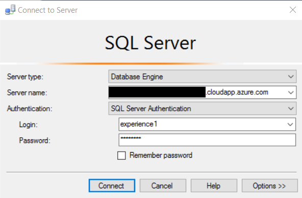
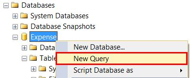
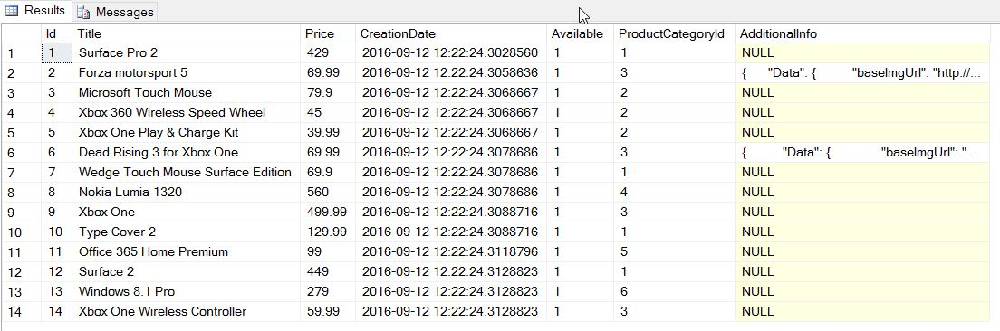

<page title="Creating a column to store JSON information"/>

CREATING A COLUMN TO STORE JSON INFORMATION
====

First we have to edit our current `Products` table to include a new column. This column will store the extra information we want to add about a particular videogame, in JSON format.

1. Open SQL Server Management Studio and connect to your SQL Server.

     

    The default SQL credentials are: experience1/P2ssw0rd@Dev.

2. Right click on the `Expenses` database and click *New query*
    
    

3. Copy and paste the following code, and execute it.

    ```sql
    ALTER TABLE [Catalog].[Product]
    ADD AdditionalInformation NVARCHAR(max) NULL
    CONSTRAINT AdditionalInformationMustBeJson
    CHECK (ISJSON(AdditionalInformation) > 0)
    GO 
    ```
    
    This code will create an additional column. Notice that there is nothing strange in the code: the only thing that stands out is the constraint. We use one of the built-in functions of SQL Server to check that the text introduced is in JSON format. `ISJSON` returns 1 if the text contains valid JSON, and 0 otherwise. 

    Now that we have our new column, let's populate it with data. As we saw in the introduction, there are services available that provide a lot of information about videogames. For our example, we have used the [TheGamesDB](http://thegamesdb.net/). In the following snippet you can see the information that this API returns about the two existent games in the catalog: Dead Rising 3 and Forza Motorsport 5.

    *Dead Rising 3*

    ```json
        {
            "Data": {
                "baseImgUrl": "http://thegamesdb.net/banners/",
                "Game": {
                    "id": "17810",
                    "GameTitle": "Dead Rising 3",
                    "PlatformId": "4920",
                    "Platform": "Microsoft Xbox One",
                    "ReleaseDate": "11/22/2013",
                    "Overview": "Dead Rising 3 is a survival horror video game developed by Capcom Vancouver and published by Microsoft Studios.[1] It was released as a launch title for the Xbox One platform on November 22, 2013; a Microsoft Windows port is due for release on September 5, 2014. The game wa announced as an Xbox One exclusive during Microsoft's E3 2013 press conference on June 10, 2013.[5]",
                    "ESRB": "M - Mature",
                    "Genres": {
                        "genre": [
                            "Action",
                            "Horror",
                            "Sandbox"
                        ]
                    },
                    "Co-op": "No",
                    "Publisher": "Capcom",
                    "Developer": "Capcom",
                    "Similar": {
                        "SimilarCount": "1",
                        "Game": {
                            "id": "22651",
                            "PlatformId": "1"
                        }
                    },
                    "Images": {
                        "boxart": {
                            "-side": "front",
                            "-width": "360",
                            "-height": "456",
                            "-thumb": "boxart/thumb/original/front/17810-1.jpg",
                            "#text": "boxart/original/front/17810-1.jpg"
                        }
                    }
                }
            }
        }
    ```

    *Forza Motorsport 5*

    ```json
        {
            "Data": {
                "baseImgUrl": "http://thegamesdb.net/banners/",
                "Game": {
                    "id": "17096",
                    "GameTitle": "Forza Motorsport 5",
                    "PlatformId": "4920",
                    "Platform": "Microsoft Xbox One",
                    "ReleaseDate": "11/22/2013",
                    "Overview": "Forza Motorsport 5 is a racing video game that was released on the Xbox One on the day of its launch. The game was revealed on May 21, 2013 during the Xbox One reveal event with a teaser trailer that showed an orange McLaren P1 racing against a silver McLaren F1. On August 15, 2013, Forza Motorsport 5 Limited Edition was announced, and includes multiple car packs and a VIP membership for the game.",
                    "ESRB": "E - Everyone",
                    "Genres": {
                        "genre": "Racing"
                    },
                    "Players": "4+",
                    "Co-op": "No",
                    "Youtube": "http://www.youtube.com/watch?v=r46D1lRpO1k",
                    "Publisher": "Microsoft Studios",
                    "Developer": "Turn 10 Studios",
                    "Rating": "9",
                    "Images": {
                        "boxart": {
                            "-side": "front",
                            "-width": "1034",
                            "-height": "1344",
                            "-thumb": "boxart/thumb/original/front/17096-1.jpg",
                            "#text": "boxart/original/front/17096-1.jpg"
                        }
                    }
                }
            }
        }
    ```

    Let's save this new information in the table.

4. Again, right click on the `Expenses` database and click *New query*

    

5. Copy and paste the following code to update the Dead Rising 3 game. Execute it.

    ```sql
        UPDATE [Catalog].[Product]
        SET [AdditionalInformation] = N'
            {
                "Data": {
                    "baseImgUrl": "http://thegamesdb.net/banners/",
                    "Game": {
                        "id": "17810",
                        "GameTitle": "Dead Rising 3",
                        "PlatformId": "4920",
                        "Platform": "Microsoft Xbox One",
                        "ReleaseDate": "11/22/2013",
                        "Overview": "Dead Rising 3 is a survival horror video game developed by Capcom Vancouver and published by Microsoft Studios.[1] It was released as a launch title for the Xbox One platform on November 22, 2013; a Microsoft Windows port is due for release on September 5, 2014. The game wa announced as an Xbox One exclusive during Microsoft''s E3 2013 press conference on June 10, 2013.[5]",
                        "ESRB": "M - Mature",
                        "Genres": {
                            "genre": [
                                "Action",
                                "Horror",
                                "Sandbox"
                            ]
                        },
                        "Co-op": "No",
                        "Publisher": "Capcom",
                        "Developer": "Capcom",
                        "Similar": {
                            "SimilarCount": "1",
                            "Game": {
                                "id": "22651",
                                "PlatformId": "1"
                            }
                        },
                        "Images": {
                            "boxart": {
                                "-side": "front",
                                "-width": "360",
                                "-height": "456",
                                "-thumb": "boxart/thumb/original/front/17810-1.jpg",
                                "#text": "boxart/original/front/17810-1.jpg"
                            }
                        }
                    }
                }
            }
        '
        WHERE [Title] = 'Dead Rising 3 for Xbox One'
        GO
    ```

6. Do the same with the following code, to update the Forza Motorsport 5 game.

    ```sql
    UPDATE [Catalog].[Product]
    SET [AdditionalInformation] = N'
    {
        "Data": {
            "baseImgUrl": "http://thegamesdb.net/banners/",
            "Game": {
                "id": "17096",
                "GameTitle": "Forza Motorsport 5",
                "PlatformId": "4920",
                "Platform": "Microsoft Xbox One",
                "ReleaseDate": "11/22/2013",
                "Overview": "Forza Motorsport 5 is a racing video game that was released on the Xbox One on the day of its launch. The game was revealed on May 21, 2013 during the Xbox One reveal event with a teaser trailer that showed an orange McLaren P1 racing against a silver McLaren F1. On August 15, 2013, Forza Motorsport 5 Limited Edition was announced, and includes multiple car packs and a VIP membership for the game.",
                "ESRB": "E - Everyone",
                "Genres": {
                    "genre": "Racing"
                },
                "Players": "4+",
                "Co-op": "No",
                "Youtube": "http://www.youtube.com/watch?v=r46D1lRpO1k",
                "Publisher": "Microsoft Studios",
                "Developer": "Turn 10 Studios",
                "Rating": "9",
                "Images": {
                    "boxart": {
                        "-side": "front",
                        "-width": "1034",
                        "-height": "1344",
                        "-thumb": "boxart/thumb/original/front/17096-1.jpg",
                        "#text": "boxart/original/front/17096-1.jpg"
                    }
                }
            }
        }
    }
    '
    WHERE [Title] = 'Forza motorsport 5'
    GO
    ```

7. If everything was correct, you should see the new data inserted in the new column created. You can check it executin the followin query:

    ```sql
        SELECT TOP(100) * FROM [Catalog].[Product]
    ```

    