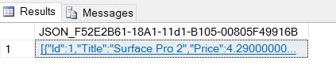
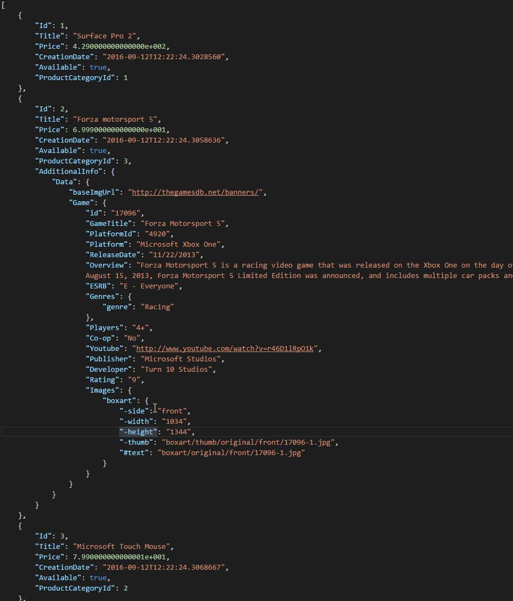
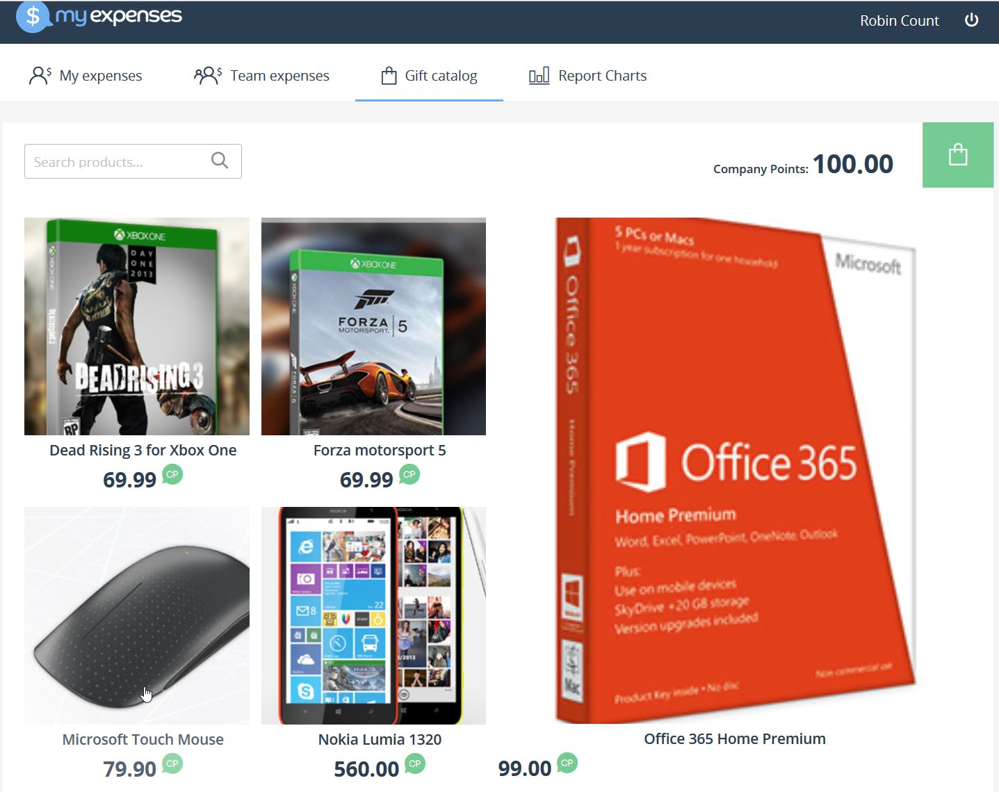
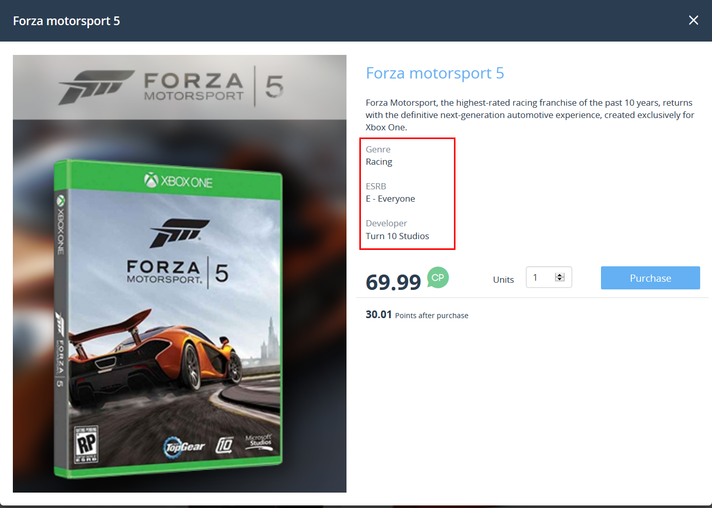

<page title="Format query results as JSON with FOR JSON"/>

FORMAT QUERY RESULTS AS JSON WITH *FOR JSON*
====

Now that we have all the required data, let's see how we can manipulate it so it can be retrieved properly.

1. Open SQL Server Management Studio and connect to your SQL Server.

2. Right click on the `Expenses` database and click *New query*
    
    

3. Copy and paste the following code:

    ```sql
        SELECT [Id]
            ,[Title]
            ,[Price]
            ,[CreationDate]
            ,[Available]
            ,[ProductCategoryId]
            ,JSON_QUERY([AdditionalInformation]) AS AdditionalInfo
        FROM [Catalog].[Product] 
        WHERE [Title] = 'Forza motorsport 5'
        FOR JSON PATH;
    ```

    Before executing it, let's explain what this query does.
    First of all, there are multiple built-in functions that we can use in our Transact-SQL statements. You can see a complete list of the functions [here](https://msdn.microsoft.com/en-us/library/dn921900.aspx).

    `JSON_QUERY` is one of the most useful functions, since it automatically extracts an object or array from a JSON snippet.  Since `AdditionalInformation` is a JSON object with more objects nested inside it, as well as arrays, `JSON_QUERY` will format all the text and will create the JSON structure.  For example, the *Forza Motorsport 5* output will look like this:

    ```json
        {
                "Id": 2,
                "Title": "Forza motorsport 5",
                "Price": 6.999000000000000e+001,
                "CreationDate": "2016-09-12T12:22:24.3058636",
                "Available": true,
                "ProductCategoryId": 3,
                "AdditionalInfo": {
                    "Data": {
                        "baseImgUrl": "http://thegamesdb.net/banners/",
                        "Game": {
                            "id": "17096",
                            "GameTitle": "Forza Motorsport 5",
                            "PlatformId": "4920",
                            "Platform": "Microsoft Xbox One",
                            "ReleaseDate": "11/22/2013",
                            "Overview": "Forza Motorsport 5 is a racing video game that was released on the Xbox One on the day of its launch. The game was revealed on May 21, 2013 during the Xbox One reveal event with a teaser trailer that showed an orange McLaren P1 racing against a silver McLaren F1. On August 15, 2013, Forza Motorsport 5 Limited Edition was announced, and includes multiple car packs and a VIP membership for the game.",
                            "ESRB": "E - Everyone",
                            "Genres": {
                                "genre": "Racing"
                            },
                            "Players": "4+",
                            "Co-op": "No",
                            "Youtube": "http://www.youtube.com/watch?v=r46D1lRpO1k",
                            "Publisher": "Microsoft Studios",
                            "Developer": "Turn 10 Studios",
                            "Rating": "9",
                            "Images": {
                                "boxart": {
                                    "-side": "front",
                                    "-width": "1034",
                                    "-height": "1344",
                                    "-thumb": "boxart/thumb/original/front/17096-1.jpg",
                                    "#text": "boxart/original/front/17096-1.jpg"
                                }
                            }
                        }
                    }
                }
            }
    ```

    meanwhile, since there are products without additional information, the statement will omit it and will return the rest of the columns as JSON:
    
    ```json
        {
            "Id": 1,
            "Title": "Surface Pro 2",
            "Price": 4.290000000000000e+002,
            "CreationDate": "2016-09-12T12:22:24.3028560",
            "Available": true,
            "ProductCategoryId": 1
        }
    ```

    If instead of extracting all the JSON snippet we just want specific properties, `JSON_VALUE` will do the trick. It parses JSON text and extracts scalar value on the specified JavaScript-like path. What does this mean? `AdditionalInformation` is the column that contains the JSON object. To extract specific values from this object, we use JSON_VALUE. For example, if we execute the following query:

    ```sql
        SELECT [Id]
        ,[Title]
        ,[Price]
        ,[CreationDate]
        ,[Available]
        ,[ProductCategoryId]
        ,JSON_VALUE([AdditionalInformation], '$.Data.Game.Platform') AS [GamePlatform]
        FROM [Catalog].[Product] 
        WHERE [Title] = 'Forza motorsport 5'
        FOR JSON PATH;
    ```

    Here we ask SQL Server to just return the `GamePlatform` property which is inside the `Game` object.
    When we put `$.Data.Game.Platform`, we are telling SQL Server that the `Platform` field is in the `Game` object, which at the same time is in the `Data` object. `$` refers to the root. From there, we can type the path to the desired value.

    Finally, we have `AS [GamePlatform]`. We tell SQL Server that we want to store the extracted value in a JSON property called `GamePlatform`. Now the *Forza Motorsport 5* output look like this:

    ```json
        {
            "Id": 2,
            "Title": "Forza motorsport 5",
            "Price": 6.999000000000000e+001,
            "CreationDate": "2016-09-12T12:22:24.3058636",
            "Available": true,
            "ProductCategoryId": 3,
            "GamePlatform": "Microsoft Xbox One"
        }
    ```
    
    `FOR JSON` tells SQL Server to serialize all the results requested in a JSON object. We have two options when creating this JSON:
        
        **PATH**: When you use `PATH` mode with the `FOR JSON` clause, you maintain full control over the format of the JSON output. You can create wrapper objects and nest complex properties. Because we want to create properties with nested properties inside, this is the option we must use.
        **AUTO**:  When you use `AUTO` mode with the `FOR JSON` clause, the JSON output is formatted automatically based on the structure of the `SELECT` statement.

4. Executing the first snippet, you will get something similar to the following picture.

    

    If you copy and format the results, you can see the JSON results generated by SQL Server.

    

    As you can see, not all the products have the properties requested. Only those properties that have been set will be outputted, meaning that those products with no additional information will have just the table properties. Isn't that cool? However, if you'd like to include all the properties, even when they are not defined in some products, you can specify `INCLUDE_NULL_VALUES` to achieve it.

5. Let's go back to the website. Open your Visual Studio, stop the website to edit the file "server\model\Catalog\Product.js" to enable the JSON column created in the last step:

    ```js
        thumbnailPicture: {
                type: 'VARBINARY',
                allowNull: true
            },
            //additionalInformation: {
            //    type: DataTypes.STRING,
            //    allowNull: true
            //}
            }, {
            tableName: 'Product',
            schema: 'Catalog',
            timestamps: false

        });
    };    
    ```

    Just remove the comment from the "additionalInformation" column and save the file:

    ```js
        thumbnailPicture: {
                type: 'VARBINARY',
                allowNull: true
            },
            additionalInformation: {
                type: DataTypes.STRING,
                allowNull: true
            }        
        }, {
            tableName: 'Product',
            schema: 'Catalog',
            timestamps: false

        });
    };
    ```

6. Run the web application again, and go to the *Gift catalog* screen. Keep in mind that images will now be pulled from the internet for some games, so they may take some time to load

    

7. Click on the *Dead Rising 3* or *Forza Motorsport 5* videogame. You should see something like the following image:

    