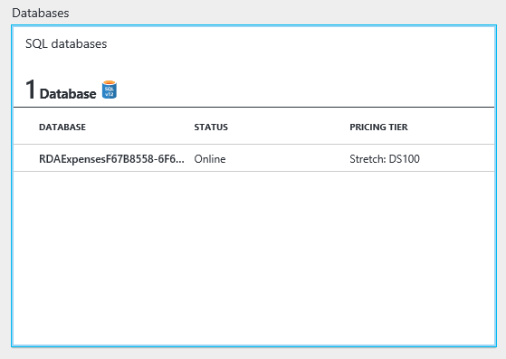

<page title="Configuring the database"/>

CONFIGURING THE DATABASE
====

StretchDB can be applied to the whole database, to selected tables or even to select rows from a table. The information of the StretchDB is stored in a SQL Database for Azure. You have one created by the default credentials: experience1/P2ssw0rd@Dev

The first step is configure the Expenses database to enable the StretchDB feature.

1. Connect to your database using SQL Server Management Studio or SQL Server Data Tools

    You must be connected to the expenses database on the SQL Server 2016 that has been deployed into a VM, with the administrative login. Check the setup step to get the DNS name of the created VM. For example, the login screen for SQL Server Management is:

     

    The default SQL credentials are: experience1/P2ssw0rd@Dev.

    Once you are connected to the SQL Server, press right button over "Expenses" database and select "New Query"

     

    This will allow you to execute queries to "Expenses" database.

2. Enable the "remote" option for the SQL Server execuing the following command:  

    ```sql
    exec sp_configure 'remote data archive', 1
    RECONFIGURE;
    ```

3. First, a master key should be created to securize the keys and the credentials:  

    ```sql
    CREATE MASTER KEY ENCRYPTION BY PASSWORD='MyPassword.123'; 
    ```

4. Then, the credentials to connect to the SQL Database for Azure should be created:  
    
    ```sql
    CREATE DATABASE SCOPED CREDENTIAL StretchDBCredential 
    WITH IDENTITY = 'experience1' , SECRET = 'P2ssw0rd@Dev' ;
    ```

    Note that the credentials should be exactly the same as the default credentials.

5. The next step is to enable the integration between the Expenses database and the one created on Azure:  

```sql
ALTER DATABASE [Expenses]
SET REMOTE_DATA_ARCHIVE = ON  
    (  
        SERVER = '{YOUR SQL DATABASE SERVER}.database.windows.net' ,  
        CREDENTIAL = StretchDBCredential 
    );
```

After executing this command, a new Database has been created inside the SQL Server for Azure:



You can check it going to http://portal.azure.com/, in the resource groups and selecting the SQL Server item. You will find the new database created inside.