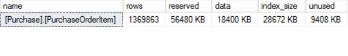

<page title="Moving data to StretchDB"/>

MOVING DATA TO STRETCHDB
====

Before moving the table to Azure, we have the following options:
- Move the entire table
- Move a selected rows

In this example, as the PurchaseOrderItem is a historic table, we are going to move all the data before 2016 to Azure.

1. To create the proper scenario, go to the Solution and Execute the following script. This script will load some millions of rows in the table. It will take a while (~15 min).

    ```sql
    SET STATISTICS TIME OFF;  
    SET NOCOUNT ON;  

    DECLARE @i INT = 1;  
    DECLARE @rowcount INT = 500000;  
    
    
    BEGIN TRAN;  
        WHILE @i <= @rowcount  
        BEGIN;  
            INSERT INTO [Purchase].[PurchaseOrderItem] VALUES (12,1,'Surface Pro 2',1,1, '2015-01-01');  
            INSERT INTO [Purchase].[PurchaseOrderItem] VALUES (12,1,'Surface Pro 2',1,1, '2015-02-01');
            INSERT INTO [Purchase].[PurchaseOrderItem] VALUES (12,1,'Surface Pro 2',1,1, '2015-03-01');
            INSERT INTO [Purchase].[PurchaseOrderItem] VALUES (12,1,'Surface Pro 2',1,1, '2015-04-01');
            INSERT INTO [Purchase].[PurchaseOrderItem] VALUES (12,1,'Surface Pro 2',1,1, '2015-05-01');
            INSERT INTO [Purchase].[PurchaseOrderItem] VALUES (12,1,'Surface Pro 2',1,1, '2015-06-01');
            INSERT INTO [Purchase].[PurchaseOrderItem] VALUES (12,1,'Surface Pro 2',1,1, '2015-07-01');
            INSERT INTO [Purchase].[PurchaseOrderItem] VALUES (12,1,'Surface Pro 2',1,1, '2015-08-01');
            INSERT INTO [Purchase].[PurchaseOrderItem] VALUES (12,1,'Surface Pro 2',1,1, '2015-09-01');
            INSERT INTO [Purchase].[PurchaseOrderItem] VALUES (12,1,'Surface Pro 2',1,1, '2015-10-01');
            INSERT INTO [Purchase].[PurchaseOrderItem] VALUES (12,1,'Surface Pro 2',1,1, '2015-11-01');
            INSERT INTO [Purchase].[PurchaseOrderItem] VALUES (12,1,'Surface Pro 2',1,1, '2015-12-01');
            INSERT INTO [Purchase].[PurchaseOrderItem] VALUES (12,2,'Forza motorsport 5',1,1, '2016-01-01');
            INSERT INTO [Purchase].[PurchaseOrderItem] VALUES (12,1,'Surface Pro 2',1,1, '2016-02-01');
            INSERT INTO [Purchase].[PurchaseOrderItem] VALUES (12,2,'Forza motorsport 5',1,1, '2016-03-01');
            INSERT INTO [Purchase].[PurchaseOrderItem] VALUES (12,1,'Surface Pro 2',1,1, '2016-04-01');
            INSERT INTO [Purchase].[PurchaseOrderItem] VALUES (12,2,'Forza motorsport 5',1,1, '2016-05-01');
            INSERT INTO [Purchase].[PurchaseOrderItem] VALUES (12,1,'Surface Pro 2',1,1, '2016-06-01');
            INSERT INTO [Purchase].[PurchaseOrderItem] VALUES (12,2,'Forza motorsport 5',1,1, '2016-07-01');
            SET @i += 1;  
        END;  
    COMMIT;  

    SET STATISTICS TIME ON;  
    SET NOCOUNT OFF;  
    ```

2. If the seed script was executed in the previous step, the PurchaseOrderItem table should have some millions rows for the last year. We can check the size of the table with the following query:  

    ```sql
    EXEC sp_spaceused N'[Purchase].[PurchaseOrderItem]'
    ```

    

3. To move a selected number of rows, a new function should be defined. This function should return 1 to consider the row as candidate to move to StretchDB and 0 in other case. In this case, the function will return 1 if the row has a date before 2016 and 0 in any other case:  

    ```sql
    CREATE FUNCTION Purchase.fn_StretchBySystemEndTime20160101(@systemEndTime datetime2)   
    RETURNS TABLE   
    WITH SCHEMABINDING 
    AS    
    RETURN SELECT 1 AS is_eligible   
    WHERE @systemEndTime < CONVERT(datetime2, '2016-01-01T00:00:00', 101) ; 
    ```
    
    The function is very simple. All the rows where PurchaseDate is before 2016, will be moved to StretchDB. The rest of the rows (those ones for 2016) will be kept only in the local table.

4. Then we need to associate the function with the PurchaseOrderItem item. We are going to enable the table to use StretchDB and also specify the function that applies the row filtering:  

    ```sql
    ALTER TABLE [Purchase].[PurchaseOrderItem]  SET ( REMOTE_DATA_ARCHIVE = ON
    ( 
        FILTER_PREDICATE = Purchase.fn_StretchBySystemEndTime20160101(PurchaseDate)
        , MIGRATION_STATE = OUTBOUND
    )) ;  
    ```

    The MIGRATION_STATE value defines when SQL Server will start to move the data to Azure. There are two options:

    - OUTBOUND: Start the migration at the moment.
    - PAUSE: Postpone the start migration data.

5. Let's check the relationship between the local table and the Azure table:  

    ```sql
    SELECT * FROM sys.remote_data_archive_tables 
    ```

    

6. Since the migration has been configured as OUTBOUND, the migration will start as soon as possible. You can execute the following query to check how the system is migrating the data  

    ```sql
    SELECT * 
    FROM sys.dm_db_rda_migration_status
    ```

    

    This table is the log of the internal process from SQL Server that migrates the data to Azure, but it's limited to 200 rows:

7. In addition, we can check the space used function to check the details of the data.
    
    To check the local space  

    ```sql
    EXEC sp_spaceused N'[Purchase].[PurchaseOrderItem]', @mode = N'LOCAL_ONLY'
    ```
        
    

    Note that are less than the 9,5 million rows. It is because some of them have already been migrated to Azure. Check the next query:

    To check the remote space  
    
    ```sql
    EXEC sp_spaceused N'[Purchase].[PurchaseOrderItem]', @mode = N'REMOTE_ONLY'
    ```

    

    Note that there are a few rows in the remote table. 

    SQL Server will migrate the data in a silent-way and automatically, and as it does it the local space occupied by the data is being reduced and the remote one is being increased.