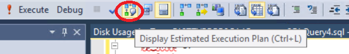
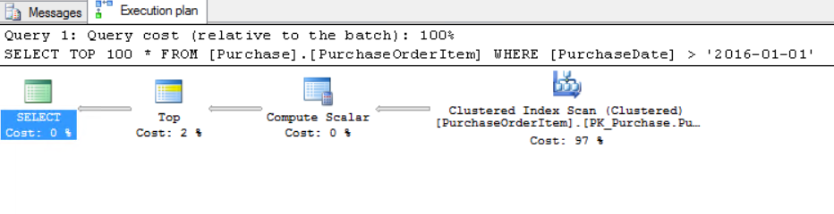
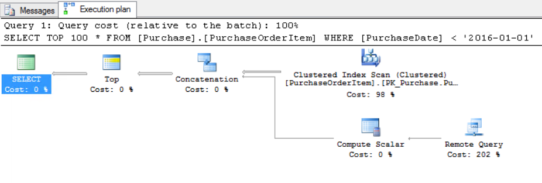

<page title="Querying the PurchaseOrderItems table"/>

QUERYING THE PURCHASEORDERITEMS TABLE
====

Once the StretchDB has been enabled on the PurchaseOrderItem table, the next thing to do is to check the queries.

1. By default, you can query the table as usual:  

    ```sql
    SELECT TOP 100 * FROM [Purchase].[PurchaseOrderItem]
    ```

2. The difference is that depending on the query, SQL Server will take into consideration whether it's needed to retrieve the data from Azure or from the local DB. As an example, check the following query:  

    ```sql
    SELECT TOP 100 *
    FROM [Purchase].[PurchaseOrderItem]
    WHERE [PurchaseDate] > '2016-01-01'
    ```

    We are going to analyze the execution plan for this query. To open the execution plan, select the query and press selected the button near "Execute":

    

    After pressing it, SQL Server will show you the projected execution plan for the query.
    
    

    This a common execution plan.

3. Now, execute the following query to retrieve some items from last year  

    ```sql
    SELECT TOP 100 *
    FROM [Purchase].[PurchaseOrderItem]
    WHERE [PurchaseDate] < '2016-01-01'
    ```
    
    And check the execution plan again:

    

    There is some different steps from the other query. The main difference is the "Remote Query" step, which means that the query is getting information from Azure directly.

4. In addition, there is the possibility of querying the table and changing the scope to retrieve only results from local data:  

    ```sql
    SELECT TOP 100 * 
    FROM [Purchase].[PurchaseOrderItem] 
    WITH (REMOTE_DATA_ARCHIVE_OVERRIDE = LOCAL_ONLY)
    ```

    Or from remote only:  

    ```sql
    SELECT TOP 100 * 
    FROM [Purchase].[PurchaseOrderItem] 
    WITH (REMOTE_DATA_ARCHIVE_OVERRIDE = REMOTE_ONLY)
    ```

    This can be useful for an application that only wants to retrieve the local data and not the historical, or vice versa.