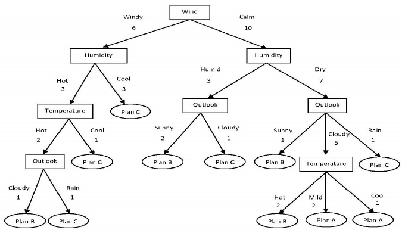

<page title="Introduction to Decision Trees"/>

INTRODUCTION TO DECISION TREES
====

Once R Services has been successfully configured, it is time to create a simple model for assessing expenses, so that we can investigate expenses with a higher amount of money than the usual. For this purpose we are going to use R language, an excellent tool for data analysis and machine learning. The approach used in this example will be creating a decision tree in order to assess whether or no a given expense is suspicious of being false.

Decision tree learning is one of the most widely used and practical methods for inductive inference. A decision tree is a flowchart-like structure in which each internal node represents a "test" on an attribute, e.g. whether a expense amount of money can be categorized as fraudulent or suspicious).

A graphic description of a decision tree is:

In this example, we model the way of choosing a plan depending of the weather condition. Our variable to predict is Plan, which will vary depending on the wind, humidity, temperature and outlook.

In order to build a model, we would need a training set which is the historic data that is going to be used to build the model. That set must contain the weather conditions and the selected plan. Once we have the model built, we need a training set which will not contain the plan. Exemplifying: In the plan case, our training set would be the last 30 days of weather condition and the selected plan. The training set would be the current values of weather conditions. With this input, the model will be able to predict the plan that is going to be chose depending of these variables.

Expenses suspicious modeling
------------------

For our model we are going to use the Amount as source to infer if the expense is suspicious or not. So, the steps for building a model will be as follows:

- Get a training set
- Get a test set
- Create a service in order to assess a given expense