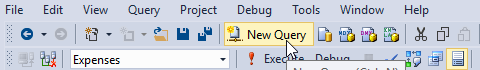

<page title="Training the model"/>

TRAINING THE MODEL
====

1. Open the SQL Server Management Studio and click New Query

	

2. The way we'll use R in SQL Server 2016 is via a Stored Procedure. That is, we are going to create a new Stored Procedure which will call a system Stored Procedure called *sp_execute_external_script*. This Stored Procedure (SP) needs the following parameters:
 
	**@language:** the only available language is R
	**@script:** the R script itself
	**@input_data_1:** the data source which is a T-SQL query

3. So, right click in Expenses -> Programmability -> Stored Procedures and choose *New Stored Procedure*

	

4. Now copy and paste this Stored Procedure (it will be explained later):

```sql
ALTER PROCEDURE [Expense].[TrainSuspiciousExpensesModel]
AS
BEGIN

TRUNCATE TABLE [Expense].[PredictionModel]

INSERT INTO [Expense].[PredictionModel]
exec sp_execute_external_script  @language =N'R',    
@script=N'
model.tree <- rpart (IsSuspicious~.,data=InputDataSet,method="class")	
trainedmodel<-data.frame(payload = as.raw(serialize(model.tree,connection=NULL)))
OutputDataSet<-trainedmodel',      
@input_data_1 =N'SELECT Amount, ExpenseCategoryId,
CASE
	WHEN se.SuspiciousExpenseId is not null
	THEN 1
	ELSE 0
	END as IsSuspicious
FROM [Expense].[Expense] e
LEFT JOIN Expense.SuspiciousExpense se
on e.Id = se.SuspiciousExpenseId'
END
```

Let's explain how this script works.

The @script parameter is pretty simple, it contains the actual R script which is going to be executed in the database. The **rpart** function in the decision tree training. This function has 3 parameters:

- The variable to be predicted, in this case is the IsSuspicious column from the Expense.SuspiciousExpense table
- The data parameter is the dataset itself, in this example is the query result passed in the @input_data_1 parameter
- The method parameter is the used to choose between decision tree and regression

The script outcome is the actual model which has been converted to binary (`data.frame(payload = as.raw(serialize(model.tree,connection=NULL)))`. The model is inserted in the table *[Expense].[PredictionModel]* which will be used later on in the assessment process.