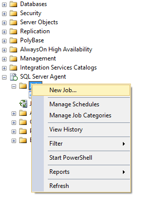
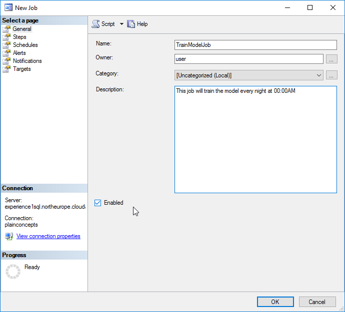
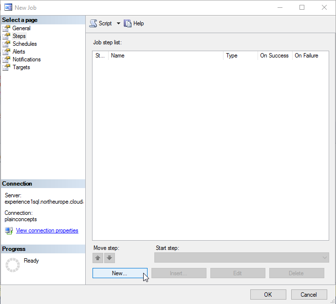
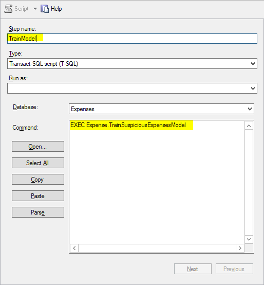
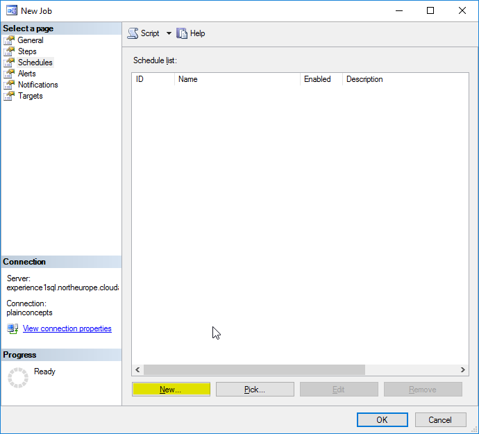
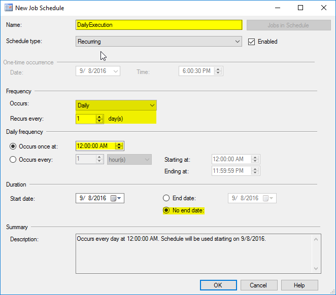
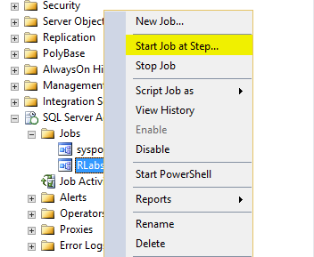
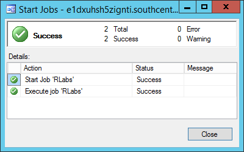

<page title="Automatizing the training process"/>

AUTOMATIZING THE TRAINING PROCESS
====

The model has be updated in order to make the application "learn". How often we do this is open for discussion, but for now we are going settle with updating the model every day at night (00:00AM).

1. To do so, let's create a SQL Agent job with a daily recurrence. Navigate in the Management Studio Server Explorer to SQL Server Agent and right click in Jobs. Then, choose *New job...*

    

2. Fill the general tab as desired, for example:

    

3.  Navigate to Steps tab and create a new step:

    

    Press on the "New" button at the bottom of the popup.

4.  Configure the job to execute the SP created before

    

    The job will be executed over the "Expenses" database and with the following Transact SQL script:

    ```sql
        EXEC [Expense].[TrainSuspiciousExpensesModel]
    ```

5.  Press OK and navigate to *Schedule* tab, then click in *New...*

    

6.  Fill the dialog as follows:

    

7. Press OK twice and now we have configured our recurrent training job.

8. In order to check that everything is OK and, at the same time, initialize the model, let's execute the job. A "success" outcome is expected when the job is finished.

	
	
	 