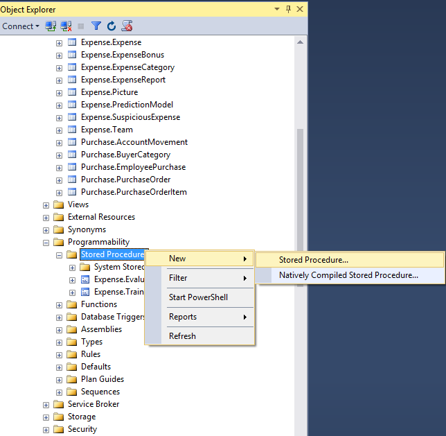
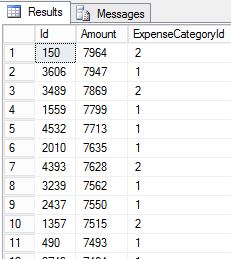

<page title="Evaluating the model"/>

EVALUATING THE MODEL
====

Now it is time to create a mechanism for evaluating if a given expense is suspicious or not. At this point we have a fresh model stored in the database so the next step is to use it in order to predict the IsSuspicious variable. 

1. Right click in Expenses -> Programmability -> Stored Procedures and choose *New Stored Procedure*

    

2. Paste the following T-SQL script:

    ```sql	
	CREATE PROCEDURE [Expense].EvaluateExpense 
	@ExpenseId NVARCHAR(50),
	@threshold float = 0.8
	AS
	BEGIN
	SET NOCOUNT ON;

	if not exists (select * from sysobjects where name='TemporalSuspiciousExpense' and xtype='U')
	CREATE TABLE TemporalSuspiciousExpense(id int,Amount float, ExpenseCategoryId int ,[no] float ,yes float)


	DECLARE @model varbinary(max) = (SELECT TOP 1 Model FROM Expense.PredictionModel);
	
	
	DECLARE @query nvarchar(500) = N'SELECT e.Id, e.Amount, e.ExpenseCategoryId FROM [Expense].[Expense] e WHERE e.Id = '+ @ExpenseId


	INSERT INTO TemporalSuspiciousExpense
	exec sp_execute_external_script  @language =N'R',    
	@script=N'
	model <- unserialize(model)
	test<-InputDataSet	
	pred.tree <- predict(model,test)
	output<-cbind(test,pred.tree)
	OutputDataSet<-cbind(test,pred.tree)',      
	@input_data_1 =@query,
	@params =N'@model varbinary(max)',
	@model = @model


	MERGE Expense.SuspiciousExpense as target
	USING(select Id from TemporalSuspiciousExpense WHERE yes > @threshold) as source
	ON (source.Id= target.SuspiciousExpenseId)
	WHEN NOT MATCHED THEN
		INSERT (SuspiciousExpenseId)
		VALUES (source.Id);
	

	DROP TABLE TemporalSuspiciousExpense

	SELECT CASE WHEN COUNT(*) > 0 THEN 1 ELSE 0 END AS IsSuspicious
	FROM Expense.SuspiciousExpense
	WHERE SuspiciousExpenseId = @ExpenseId

	END
    ```

    This SP receives two parameters: first the ID of the expense which is going to be evaluated and secondly a threshold (which is >80% by default) which we'll use to determine if a expense is or not suspicious. 

    After that we create a temporal table in order to populate the values retrieved by the R script execution.

    The R script does the following:
        
    1. Unserialize the binary model
    2. Predict the value of IsSuspected for the given dataset, in this example we are passing just one row, the given expense
    3. The cbind function will append the prediction results to the original dataset so that we can see the likelihood of the expense of being suspicious 
    4. The output is inserted in the temporal table
    5. If the likelihood of being suspicious is greater than the threshold, then, it will be added to the suspicious expense table (Expense.SuspiciousExpense)    

3. Now let's test our Stored Procedure. Open a new query and you should see something like this:

	```sql	
	exec [Expense].EvaluateExpense 774
	exec [Expense].EvaluateExpense 773
	exec [Expense].EvaluateExpense 772
	
	SELECT *
	FROM Expense.Expense e
	INNER JOIN Expense.SuspiciousExpense se
	ON e.Id = se.SuspiciousExpenseId
	WHERE e.Id in (772,773,774)
	```


Note that the Id's passed in this example may vary in your case since the database is randomly generated so that you can find an empty outcome. Feel free to execute the stored procedure as desired in order to find suspicious expenses.

If you want to spot a suspicious expense, you can try it by looking for the expenses with the highest amount. To do so, execute this query:

```sql
select Id, Amount, ExpenseCategoryId
from Expense.Expense
where Amount > 1000
order by Amount desc 
```

In this case, the query outcome is:



Then, pick one of the top 10 results and execute the procedure with the your selected expense Id, in our example Id = 150: 

```sql
exec [Expense].EvaluateExpense 150 
```

Finally, the stored procedure returns:


Note that this does not ensure that you are going to find a suspicious expense since the model is built depending on the historic amount and the expense category, but likely one of the top 10 will be suspicious.

Being said this, please keep in mind that this is a little experiment to show the SQL Server R Services. This experiment cannot be considered as a guideline in a real world scenario. Even if the experiment could be applied, a lot of data and a lot of iterations are needed before drawing a valid conclussion and solid results.

Now we have our evaluation system and it can be invoked by using T-SQL from a webapp, mobile app, desktop, etc...