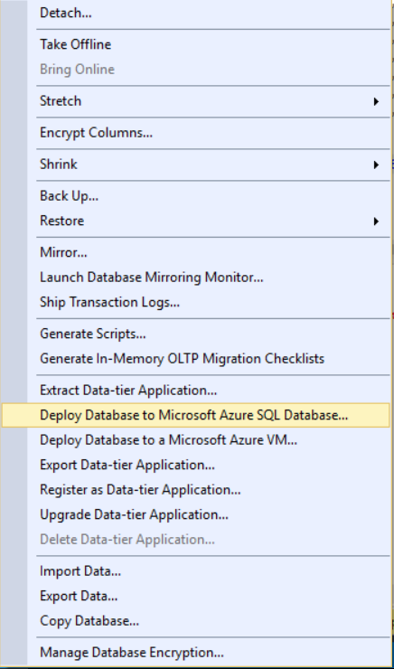
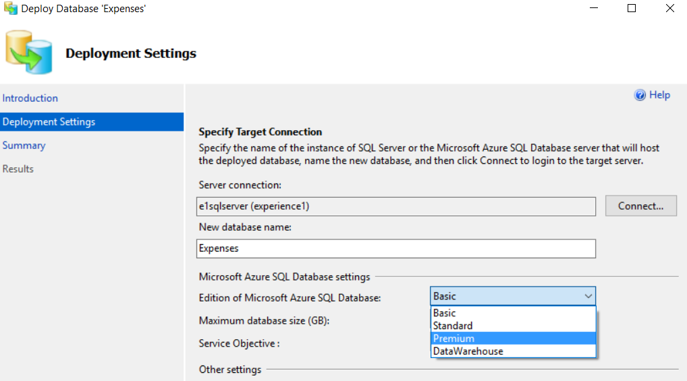
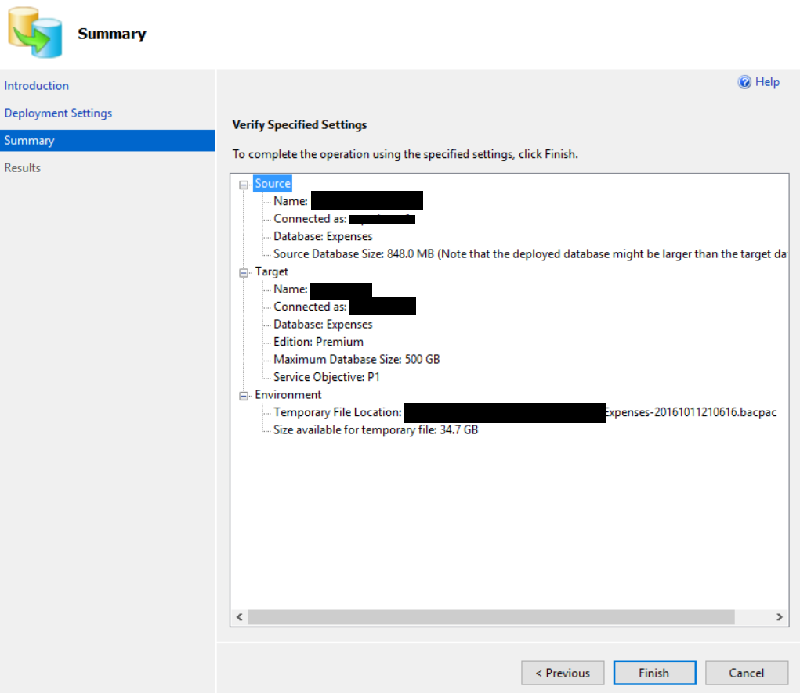
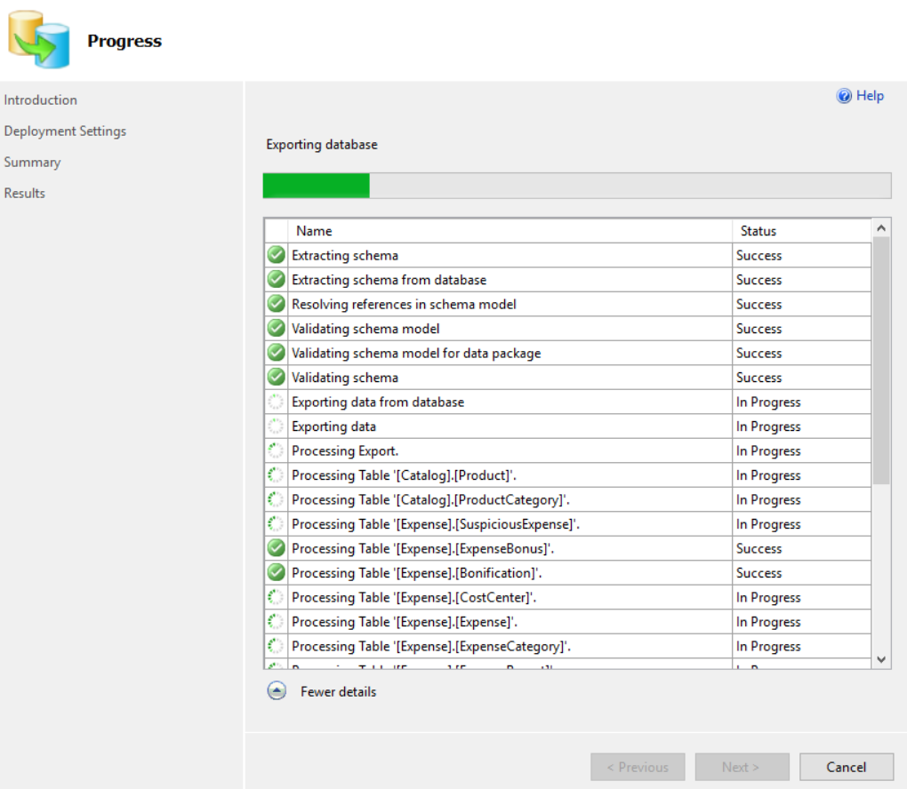

<page title="Migrate Expenses"/>

MIGRATE EXPENSES
====

> **NOTE**: When migrating a database, you should take into account that users may experience some issues when connecting to the website for a short period of time. All applications that communicate with remote services and resources must be sensitive to transient faults. This is especially the case for applications that run in the cloud. These faults are often self-correcting, and if the action is repeated after a suitable delay it is likely succeed. In a real application you should implement a retry policy that handle these temporal outages. You can find a list of best practices and patterns regarding retry policies [here](https://azure.microsoft.com/en-us/documentation/articles/best-practices-retry-service-specific/).

We are going to migrate the database from SQL Server 2016 to the Azure SQL Database.

1. In SQL Server Management Studio, press right button over the "Expenses" database. A new popup will be opened. Choose "Tasks" and then, "Deploy to Azure SQL Database..." option

    

2. This wizard will help us to do the migration. It will create a BACPAC file from the content of the SQL Server database and then it will upload it to the Azure SQL Database instance. In the newly opened window, press next:

    

3. In this window there are two steps you need to complete. The first one is to set the connection string to the Azure SQL Server. Press *Connect*:

    

    A new popup will be opened. Introduce the server name and the credentials. The server name takes this form: *{YOUR_SERVER_NAME}.database.windows.net*. By default, the credentials are:

    User: experience2

    Password: P2ssw0rd@Dev

    

4. Press the "Connect" button and it will go to the last window. Once the connection is set, the second step is configuring the edition of the Azure SQL Database. We will need to choose "Premium", because some of the amazing features that we use in the Expenses database (such as InMemory OLTP tables) are only available in the Premium edition.

    

5. The final configuration should be:

    

6. Press "Next". The next window is a summary of the migration operation. Take a look to ensure that all the values are correct, because the migration will take time:

    

7. If everything is right, you can press to "Finish" to start the migration:

    

8. The migration will take some time and then, once it has finished, you'll see there is a copy of the database in the Azure SQL Server. When you are done, connect to the SQL Server <inject key="sqlazureservername" /> from the SQL Server Management Studio, which is the one where you have made the new database. Right click on the database, click on *New query* and enable Row-Level Security on the ExpenseReports table executing the following statement:

```sql
    CREATE SECURITY POLICY ExpensesReportPolicy
    ADD FILTER PREDICATE [Expense].fn_expensesReportsPredicate(EmployeeId) ON [Expense].[ExpenseReport]
    GO
```

    This step is required since we disabled it in order to perform the backup without issues in the previous page