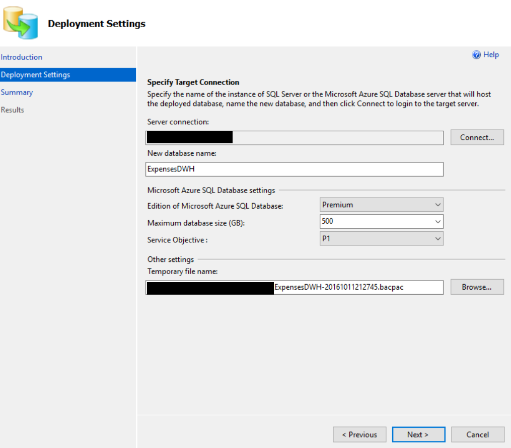

<page title="Migrate DWH"/>

MIGRATE DWH
====

We are going to migrate the "ExpensesDWH" database from SQL Server 2016 to the Azure SQL Database.

1. We are going to repeat the same steps of the last page. First, we need to connect to the Azure SQL Server. Introduce the server name and the credentials. The server name takes this form: *{YOUR_SERVER_NAME}.database.windows.net*. By default, the credentials are:

    User: experience2

    Password: P2ssw0rd@Dev

    
    
2. Then, once again, select the Premium edition to migrate this database. The steps are exactly the same but for the "ExpensesDWH" database:

    

3. Since this is a smaller database, it will be migrated much faster:

    