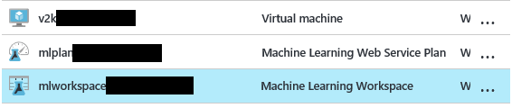
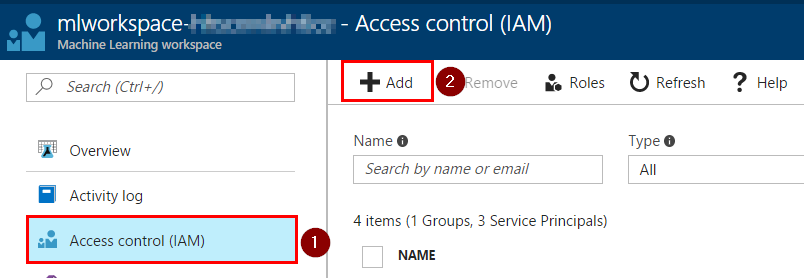
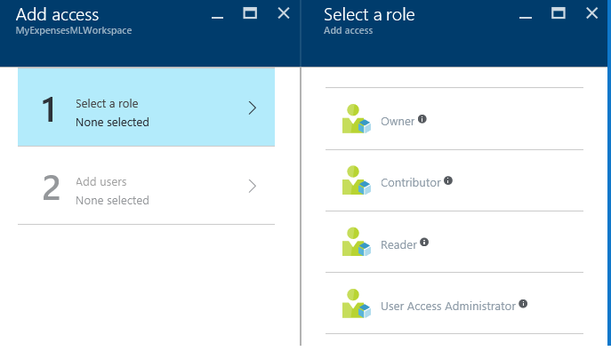
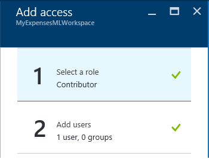

<page title="Creating Azure ML Workspace"/>

CREATING AZURE ML WORKSPACE
====

We'll start our work by creating an Azure ML workspace from the Azure portal.

1. First, login into the Azure portal at http://portal.azure.com using your credentials

2. There is a *Machine Learning Workspace* created for you:

    

3. Optionaly, in a collaborative project, you can share this workspace with other users contributing in a predictive experiment

    From the deployed workspace select *Access Control (IAM)*. Then click Add.

    

    You must select the Role of the users.

    

    And then add the new members (the only requirement is that they have a valid Microsoft Account)   

    

4. Navigate into [Azure ML Studio](http://studio.azureml.net)