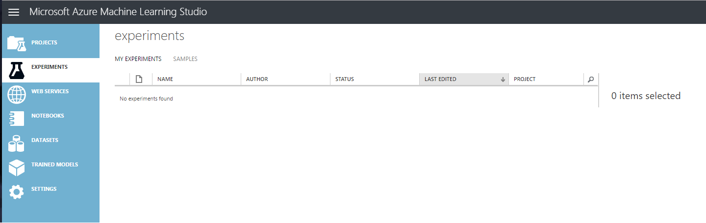

<page title="Azure ML Studio"/>

AZURE ML STUDIO
====

Now we'll learn how to work with [Azure ML Studio](http://studio.azureml.net) 

The Azure ML Studio workspace includes different sections to manage predictive experiments workflows:

**Experiments**. The collection of created experiments.

**Web Services**. The REST API for all published experiments.

**Notebooks**. A Notebook is like a Read-Eval-Print loop or “REPL”, where you enter some script code and get a response. They provide a delightful interface for running code quickly, visualizing data, exploring insights and trying out new ideas.

**DataSets**. Sample data or experiments datasets stored in the associated storage account of the ML Workspace.

**Trained Models**. When an experiment is published, the trained model is stored here so it can be used from the REST API.

**Settings**. Some workspace settings like workspace name, users, etc.

