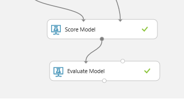

<page title="Creating the experiment"/>

CREATING THE EXPERIMENT
====

In this step we'll create the machine learning experiment using the training data set we just imported. On *Azure ML Studio* you can create experiments using *out of the box* templates, or start with a new blank experiment. In this case, for *My Expenses Suspicious experiment* we select a new blank experiment.

Once the experiment is created, Azure ML will show a canvas and many modules for creating machine learning models. In the next tasks we´ll perform all the required steps in order to create our experiment.

1. Add training data

    Our first task is setting the data for our experiment. If you want to use *sqlcmd* to export data you can add this data from the *datasets* section in *Azure ML*. If you prefer, by using the *ImportData* activity in *Azure ML* it's possible to connect with *Sql Azure* directly and perform any query required to get the experiment data. We've already exported the data into a dataset called *dataset.csv*, which we've loaded into *Azure ML Studio*.

    

    In order to set the valid data type for each feature a new activity, the *MetadataEditor*, is used. You can find it in "Data Transformation > Manipulation > Edit Metadata". In this case we modify the *Amount* as numerical and *ExpenseCategoryId, IsSuspicious* as factor features. You can edit with the proper values selecting the item and changing the values in the right side properties:

    

2. Split and training data

    Now, our dataset is split into training and validation data using the *Split* activity. The training data is used to train our classification model, *Two-Class Logistic Regression*.

    

3. Validate and Score

    Once we have the trained model and validation data, the experiment can be evaluated using the *Score and EvaluateModel* activities.

    

    Usually the performance of a classification model is evaluated using a *confusion matrix* and some measures like *accuracy, recall, precision...*. After the evaluation, this experiment shows excellent results for our suspicious expenses classification.

    