<page title="Creating the experiment"/>

CREATING THE EXPERIMENT
====

In this step we'll create the machine learning experiment using the training data set we just imported. On [Azure ML Studio](http://studio.azureml.net) you can create experiments using *out of the box* templates, or start with a new blank experiment. In this case, for *My Expenses Suspicious experiment* we select a new blank experiment.

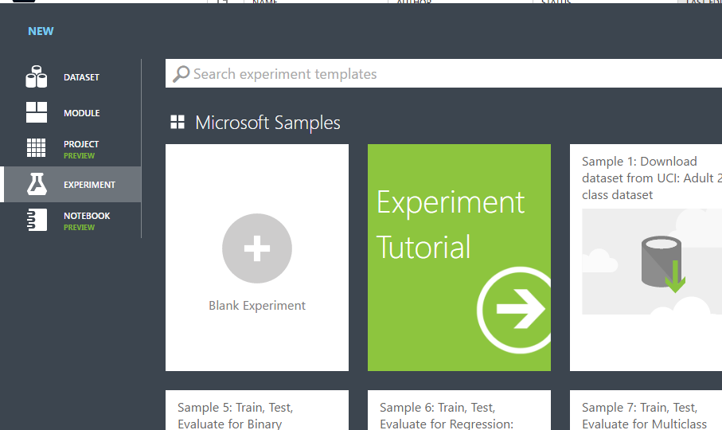

Once the experiment is created, Azure ML will show a canvas and many modules for creating machine learning models. In the next tasks we´ll perform all the required steps in order to create our experiment. The creation of the experiment is as simple as just draging and dropping the necessary *boxes* to the canvas.

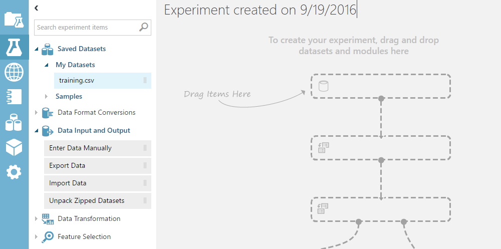

1. Add training data

    Our first task is setting the data for our experiment. If you want to use *sqlcmd* to export data you can add this data from the *datasets* section in *Azure ML*. If you prefer, by using the *ImportData* activity in *Azure ML* it's possible to connect with *Sql Azure* directly and perform any query required to get the experiment data. We've already exported the data into a dataset called *dataset.csv*, which we've loaded into *Azure ML Studio*. You should already have imported the dataset generated in the previous step, *Creating the Dataset*.

    To add the dataset to the experiment, just drag and drop the dataset box to the canvas.

    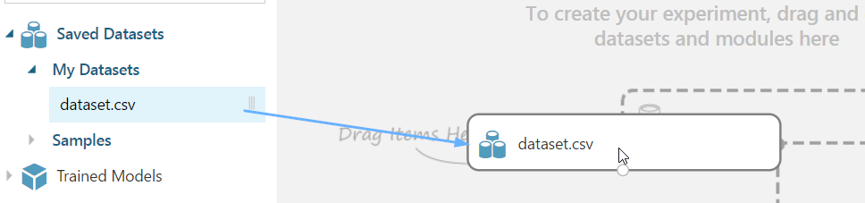
  
    In order to set the valid data type for each feature a new activity, the *MetadataEditor*, is used. You can find it in "Data Transformation > Manipulation > Edit Metadata". In this case we modify the *Amount* as numerical and *ExpenseCategoryId, IsSuspicious* as factor features. You can edit with the proper values selecting the item and changing the values in the right side properties.

    First, drag one *Edit Metadata* box below the dataset box we already added before.

    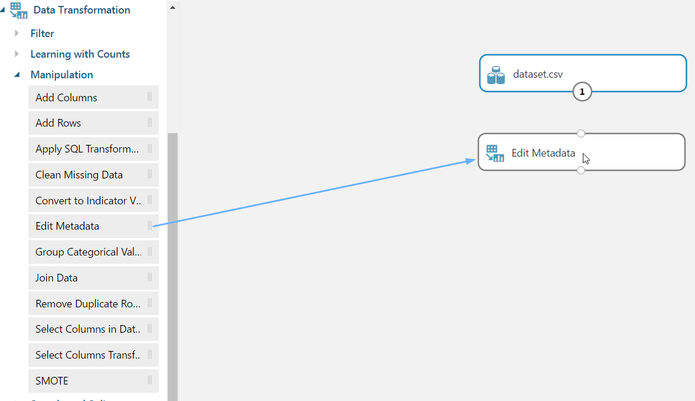

    Now, *Edit Metadata* needs to know what data it should edit. We have to specify that we want to edit the dataset. In other words, we need to set the dataset as the input for the *Edit Metadata* box. To do so, just click on the *output* circle from the dataset box, and drag it to the *input* circle from the *Edit Metadata* box.

    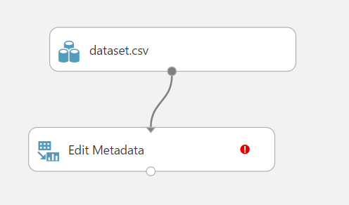

    Click on the *Edit Metadata* box. At the right, you will see the properties of it. We want to set *ExpenseCategoryId, IsSuspicious* as categorical values. So click on *Launch column selector*.

    

    Select both, *ExpenseCategoryId, IsSuspicious* and click on the arrow to move them to the right. Then click ok.

    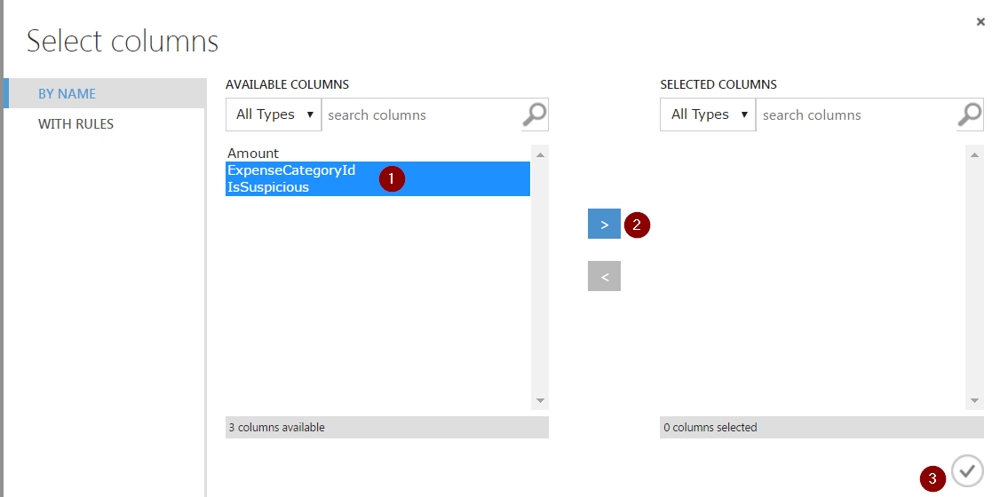

    Lastly, select *Make categorical* from the properties window.

    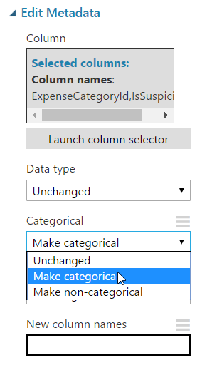

    If you double click on the boxes, you can add a description to them so it makes clear what that step does.

    Now add another *Edit Metadata* box, that uses as input the output of the previous box. In this case, what is going to do is set the *Amount* field from the CSV file as numerical. 

    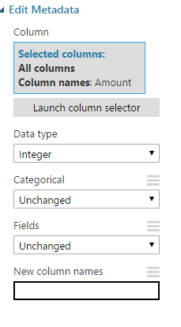
    
    You should end up with something like the following:

    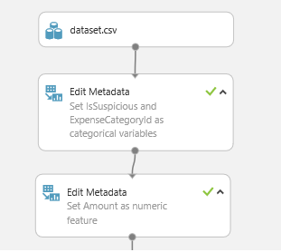

    That's it.

2. Split and training data

    Now, our dataset is split into training and validation data using the *Split* activity. *Split* receives the output from the last *Edit Metadata* as input.

    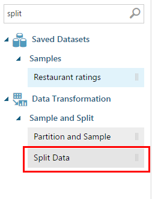

    It has two outputs. One of them is used to train the classification model, which is a *Two-Class Logistic Regression*. The other one is used to score model, so we can see how accurate the results are.    

    Connect the the *Two-Class Logistic Regression* and the first output from the *Split Data* box to the inputs of the *Train model*, as shown in the image.

    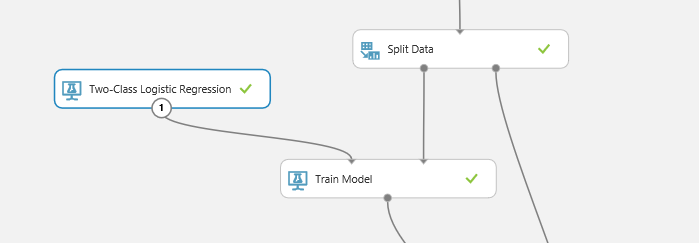

    Then, click on the *Train model*, and, in the input properties, launch the column selector. Select the column that we want to predict, which is *isSuspicious*, since we want to determine if a particular expense is suspicious or not.

    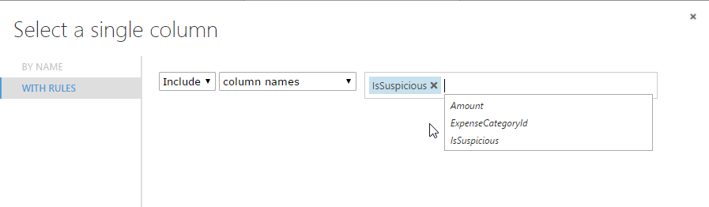

3. Validate and Score

    Once we have the trained model and validation data (which is the second output from the *Split* box), the experiment can be evaluated using the *Score and EvaluateModel* activities. Connect them as shown in the image:

    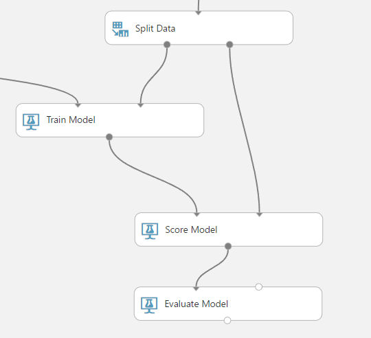

    Now, in order to evaluate our experiment, we have to run it. Doing so is as easy as clicking the *Run* button at the bottom of the page.

    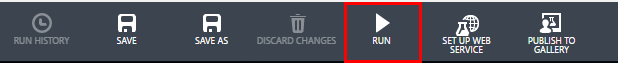

    It will be take a few seconds running.

    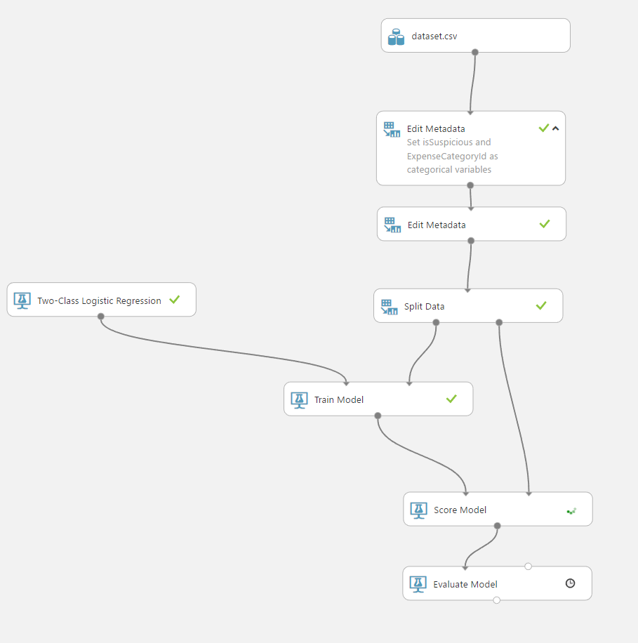

    Once it's run, right click on the *Evaluate Model* box, then *Evaluation Results* and then *Visualize*.

    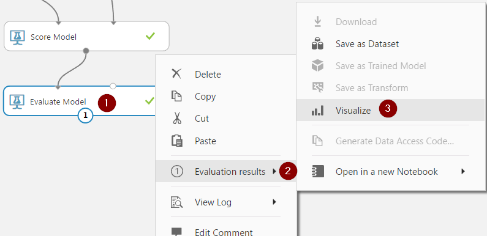

    Usually the performance of a classification model is evaluated using a *confusion matrix* and some measures like *accuracy, recall, precision...*. After the evaluation, this experiment shows excellent results for our suspicious expenses classification.

    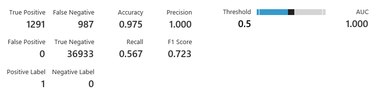