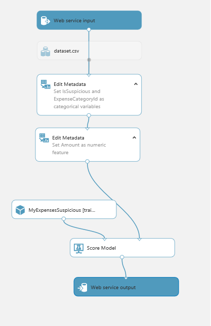
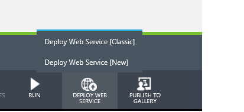
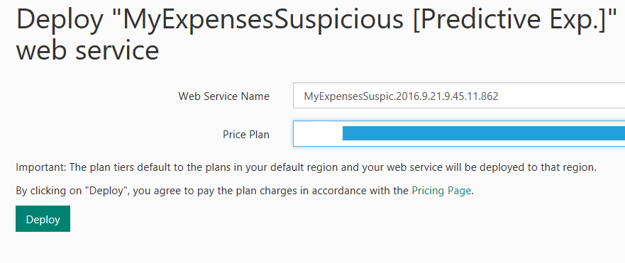
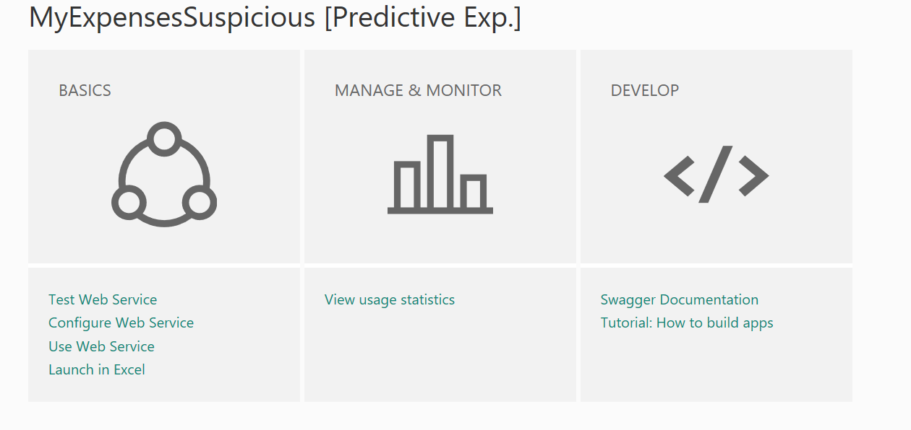
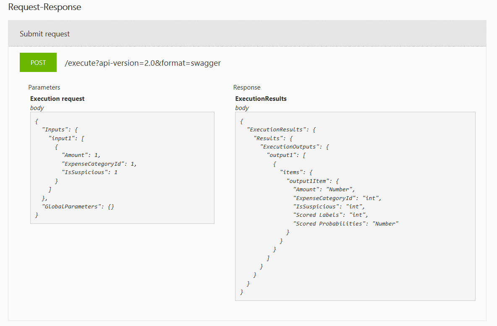
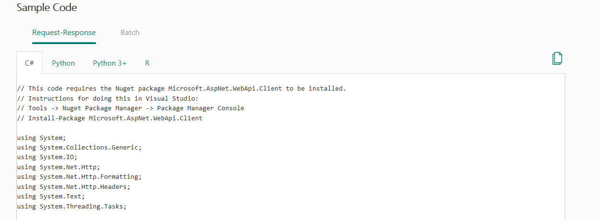

<page title="Publishing the experiment"/>

PUBLISHING THE EXPERIMENT
====

At this moment the experiment is complete and a new model is trained, but to be able to use it in our application and get predictions for new expenses filed in the system, it needs to be published. Let's get in with it!

1. First, let's set up a web service. When the experiment is finished and executed, the toolbar shows an option to set up the web service for this experiment.

    

2. Now, let's run the new predictive experiment. After going through the "Setting up Web Service" option, *Azure ML Studio* modifies the experiment to include two new activities, *Web Service Input and Web Service output*. They're the endpoints of the web service. Before continuing with the publication of the web service, the new experiment need to be executed.

    

3. Once that's out of the way, we can deploy the Web Service. Note that the toolbar now shows "Deploy Web Service (New)" instead of "Setting up Web Service"

    

    When the "Deploy Web Service (New)" option is selected, *Azure ML Studio* shows a new window to deploy this experiment, as well as the result of this deployment.

    

    

4. The deployment is complete, let's use the experiment! On the deployment web page you now have a *Swagger API* option. Here all the swagger information for service is exposed and can be used to create the HTTP API requests from MyExpenses.

    

    Also, in the *Consume* section of the deployment web page you can check sample code to consume this experiment from different languages like C#, Python, R, etc.

    
