<page title="Creating the Indexes"/>

CREATING THE INDEXES
====

The first step we need to take to implement Azure Search in MyExpenses is creating the indexes.

An index is a persistent store of documents and other constructs, that will be used by an Azure Search service. A document is a single unit of searchable data in your index. In our case, each expense report or each product in the gift catalog will be a document. Mapping these concepts to more familiar database equivalents: an index is conceptually similar to a table, and documents are roughly equivalent to rows in a table.

When queries are submitted to Azure Search, they are submitted to a specific index in your search service.

1. Let's begin by opening the Azure Portal, and click on Search Service inside the MyExpenses resource group.

    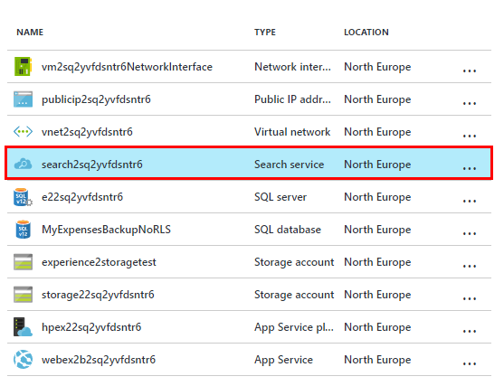

    Let's create what is called an *Indexer*. An indexer is a feature of Azure Search that allows us to pull data from an external data source to populate our index. Because we want to use Azure Search for both the products and expenses data, we are going to create two indexers.

    Let's start with the products indexer.

2. Click on *Import data*

    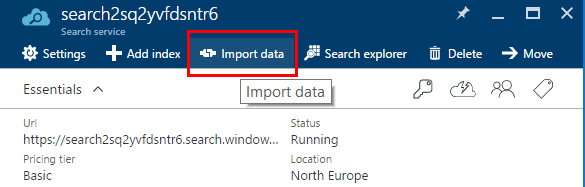

3. First we define the data source. Click on *Connect to your data* and then pick *Azure SQL Database*. 

    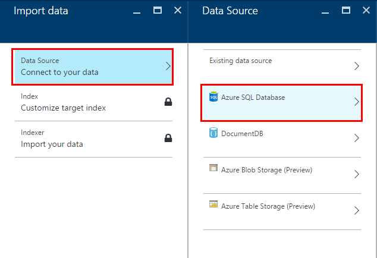

4. Now we need to fill the information to properly connect to the database.

    __SQL Database__: Click on this blade and select the Azure SQL Database created.

    __User Id__: It should be *{user}*@*{sqlServerName}*. It will be automatically filled when selecting the database.

    __Password__: P2ssw0rd@Dev

    Then click on test connection to check that everything is right. You should see a *Connection validated* message.

    __Table/View__: Here you pick the table you are going to import the data from. For this indexer, select the *Catalog.Product* table.

    You should have something similar to the image:

    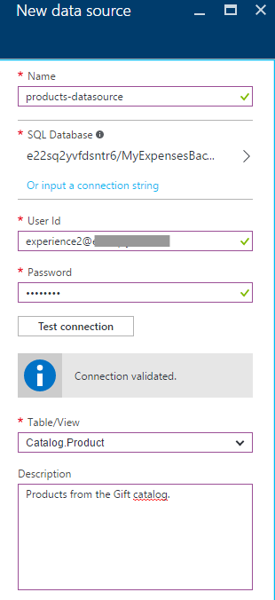

    When you are done, click *OK*.

5. After a few seconds, Azure Search will suggest a default index for us, as shown in the image:

    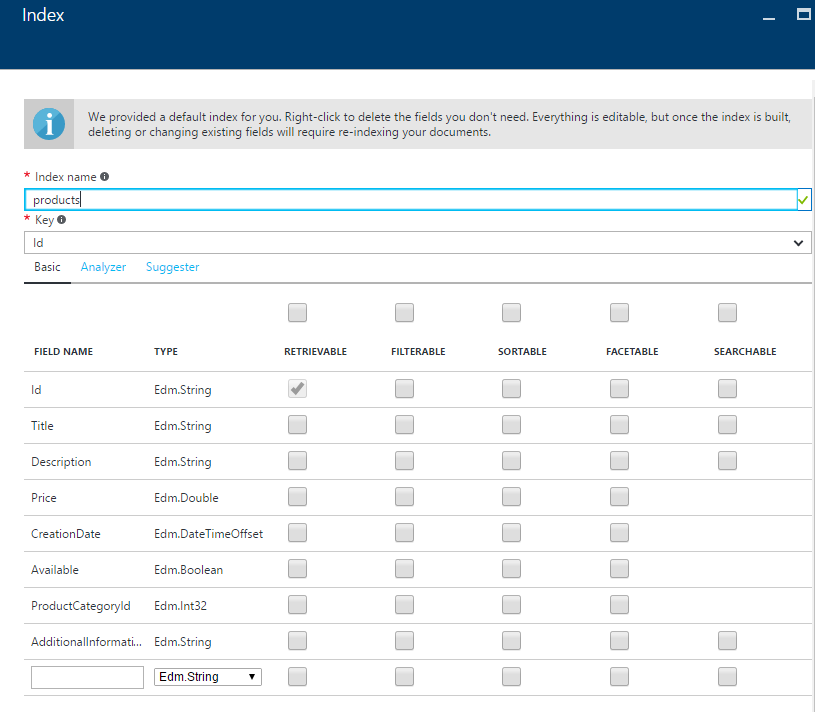

    Every index has a key that must be unique and marks the field as containing unique identifiers for documents within the index, and several fields that determine how data is stored in the index. Each field has its own type and a set of attributes that specifies how the field can be used:

    __Searchable__: Marks the field as full-text searchable.

    __Retrievable__: The field can be returned as a search result.

    __Filterable__: Allows the field to be used in filter queries.

    __Sortable__: Allows a query to sort search results using this field.

    __Facetable__: Allows a field to be used in faceted navigation. For example, it could be used in a presentation of search results that includes count by category.

    Now we must determine the behaviour of each field checking the attributes' boxes or unchecking them. This is the result we want for each field:

    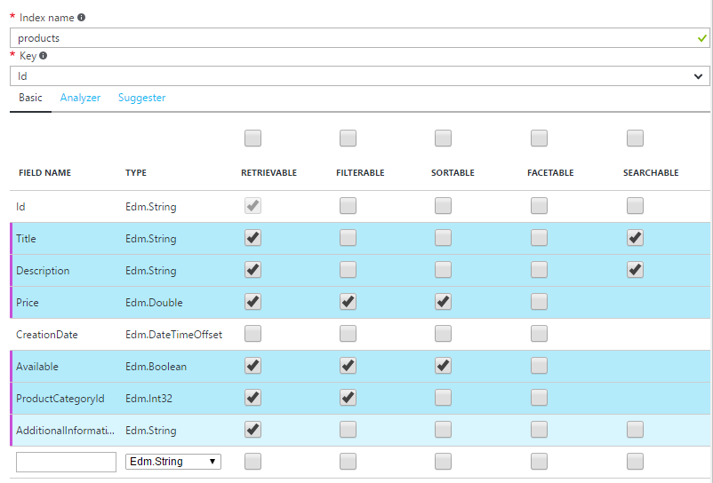

    When we search for products, we want to search in fields like title or description. We also want to retrieve all the fields but the CreationDate, and allow the user to sort the elements by the price or the product availability.

    When you are done, click *OK*.

6. Finally, we specify the schedule for the indexer: how often the indexer will be executed so the index is up to date with all the existent data in the database. For the products index, we will leave it on *Once*, since we will not be updating the table regularly.

    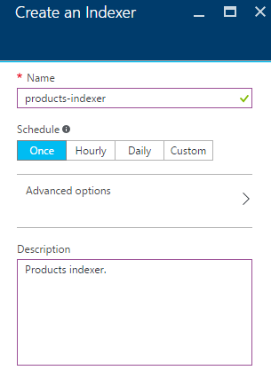

    Click *OK* when you are done.

7. Click *OK*. 

    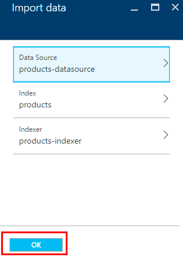

    After that, the indexer will be run and it will start importing data on our index. If you click on *Indexers* you can see the progress.

    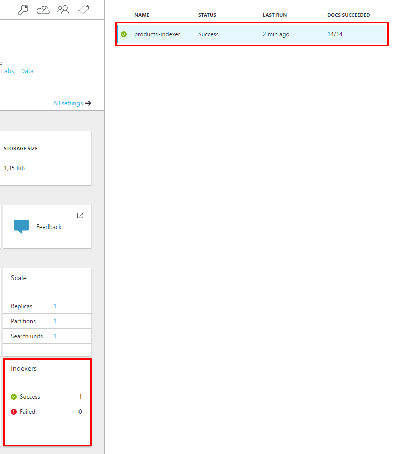

8. Let's check the results. Click on *Search Explorer*.

    

    The search explorer is very useful to test queries and see what results they would retrieve. For now, just click on *Search* to retrieve all the results in the index.

    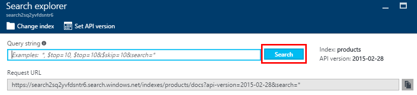

    And here you can see all the products from the database!

    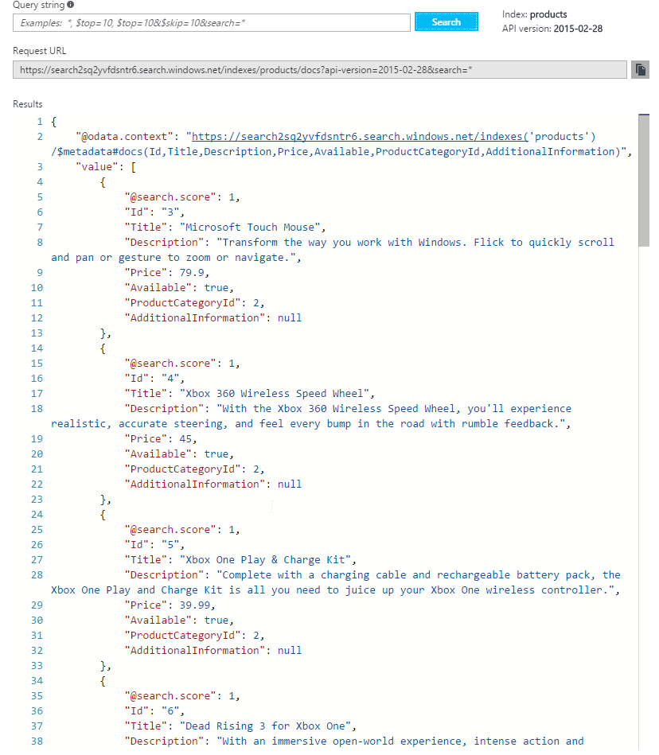

9. Now repeat the same steps with the reports indexer. Here's the data source, index and indexer schedule configuration:

    __Data source configuration__, for the step 7:

    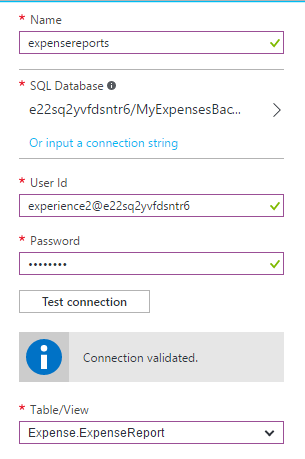

    __Index configuration__, for the step 8:

    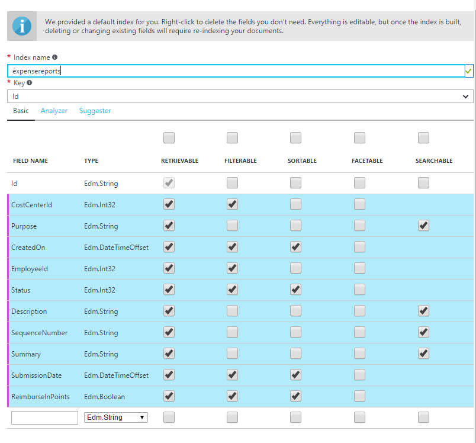

    __Indexer schedule configuration__, for the step 9:

    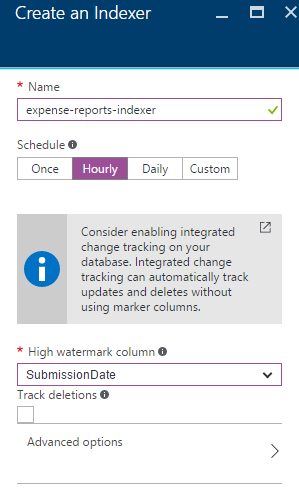

    When you are done, test the new index using the search explorer, as you've previously done with products

    Now that we have both indexes, it's time to implement the search system in our website!

    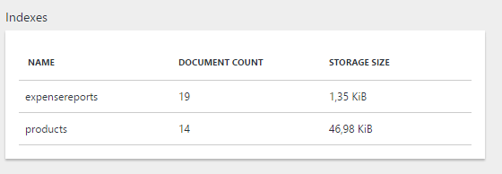

