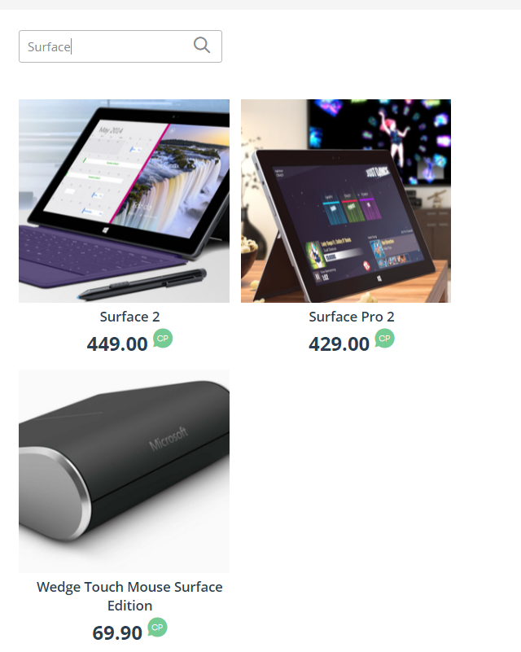
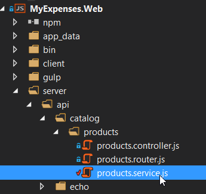
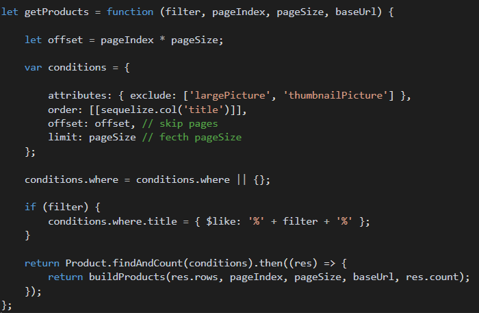
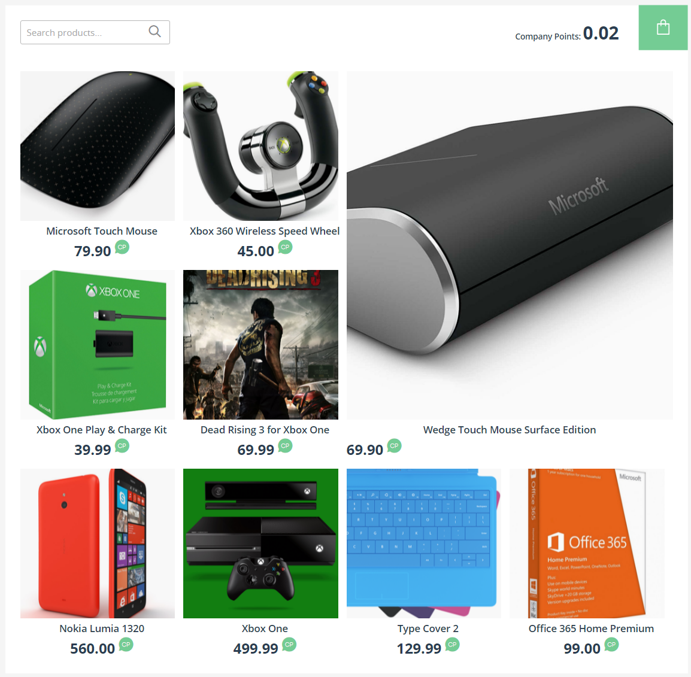
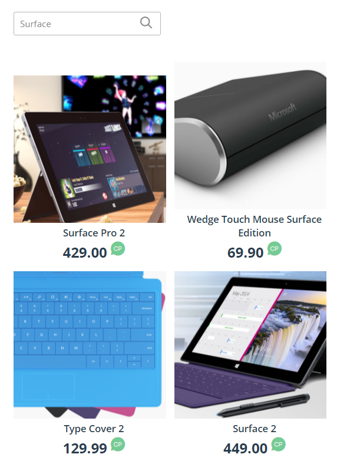

<page title="Implementing Products search"/>

IMPLEMENTING PRODUCTS SEARCH
====

Right now, the products search system works by sending a filter to [Sequelize](http://docs.sequelizejs.com/en/v3/) so the database applies that filter when retrieving results. Let's replace this search system with the Azure Search we have just created.

1. Before we go any further, let's do a search on the current search system. Run the application and, on the *Gift catalog* section, search *Surface*. You should see the following results:

    

    Later we'll see how the new search system improves the current one.

2. Go to the Azure Portal, and from there go to the Azure Search resource. Then go to *Settings* => *Keys*

    

3. Click on *Manage query keys*, and write down the key that appears in the open blade.

    

4. In Visual Studio, open *products.service.js*

    

5. Scroll down to the *getProducts* method. Right now it looks like this:

    

6. Replace that method with the following code:

    ```javascript
    let getProducts = function (filter, pageIndex, pageSize, baseUrl) {

        let offset = pageIndex * pageSize;
        // Search filter. '*' means to search everything in the index.
        let search = filter ? filter : '*';
        // Path that will be built depending on the arguments passed.
        let searchPath = '/indexes/products/docs?api-version=2015-02-28&$top=' + pageSize + '&search=' + search;
        // Request needed to get the total number of documents available, so pagination works as expected.
        let totalCountPath= '/indexes/products/docs/$count?api-version=2015-02-28';

        if (offset > 0) {
            searchPath += '&$skip=' + offset;
        }

        return azureSearchRequest(totalCountPath).then(count => {
            return azureSearchRequest(searchPath).then(responseString => {
                var responseObject = JSON.parse(responseString);
                // We map the values not to alter the buildProducts function.
                var mappedResponse = responseObject.value.map((val) => ({
                    id: val.Id,
                    title: val.Title,
                    price: val.Price,
                    description: val.Description
                }));
                return buildProducts(mappedResponse, pageIndex, pageSize, baseUrl, parseInt(count, 10));
            });
        });
    };

    let azureSearchRequest = function (requestPath) {
        var options = {
            hostname: '{YOUR_AZURE_SEARCH_NAME}.search.windows.net',
            method: 'GET',
            path: requestPath,
            headers: {
                'api-key': '{YOUR_AZURE_SEARCH_KEY}',
                'Content-Type': 'application/json'
            },
        };

        // Request to get the number of elements.

        let deferred = new Promise((resolve, reject) => {
            var req = https.request(options, function (res) {
                res.setEncoding('utf-8');

                var responseString = '';

                res.on('data', function (data) {
                    responseString += data;
                });

                res.on('end', function () {
                    console.log(responseString);
                    resolve(responseString);
                });
            });

            req.on('error', function (e) {
                reject(e);
                console.error(e);
            });

            req.end();
        });

        return deferred;
    }
    ```

    Let's explain what this code does. First of all, we have created a method to submit requests to the Azure Search service, `azureSearchRequest`. Make sure you use your Azure Search service name and the key you wrote down before here.

    The `getProducts` method doesn't query the database anymore. What it does now is make two requests to the Azure Search service: one to get the total number of products (so the pagination system isn't broken down) and another to search the products depending on the search text introduced by the user. In case there is not search text, we use `*` to retrieve all the results existent in the index. We use several query parameters in the requests:

    __$top__: Allows us to get only an specified number of records.

    __$skip__: Allows us to skip an specified number of records.

    __$search__: It is used to specify the search text.

    __$count__: This one can be used in two ways. The way we have used it retrieves the total number of records existent in our products index. However, if we used it as another query parameter (like `$top`, or `$skip`) in the search query, it would retrieve the total number of results retrieved by the search.

7. At the top of the file, copy the following line, just after `let Catalog = require('../../../model/Catalog');` :

    ```javascript
    let https = require('https');
    ```

    Your file will look similar to the following:

    ```javascript
    'use strict';

    let Catalog = require('../../../model/Catalog');
    let https = require('https');
    let Product = Catalog.Product;
    let sequelize = Catalog.sequelize;
    ```

8. Run the application, and go to the Gift catalog section. If everything went right, you should see the complete list of products here:

    

9. Again, search for *Surface*. Now you will see the following:

    

    As you can see, there is a new result. The *Type Cover 2* wasn't shown before. Why it is there now? If you remember, when we built the index, we checked those fields which we wanted to make *searchable*, which were Title and Description. Due to the type cover having the term Surface in its description, Azure Search retrieves it as a result. With just a few clicks we can configure the behavior of our search system, without having to code a single line.