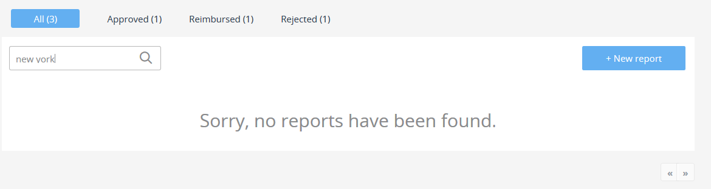
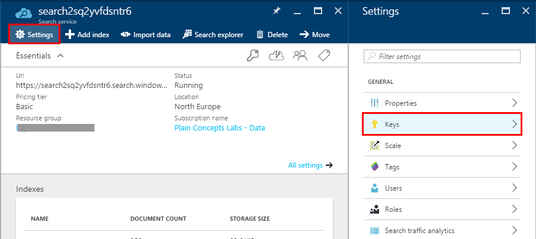
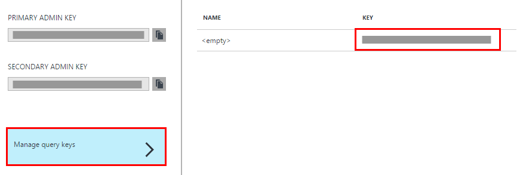
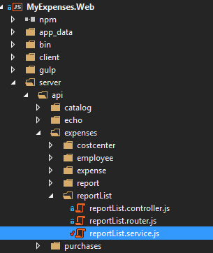
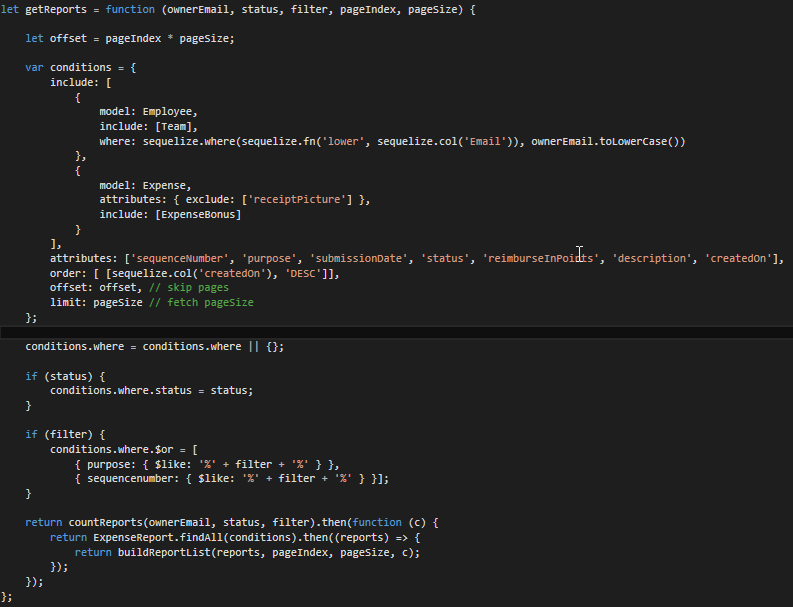
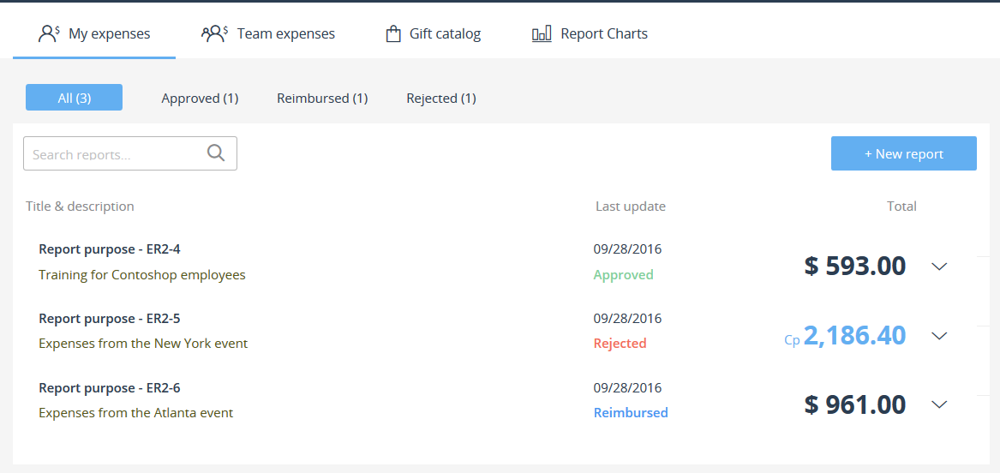
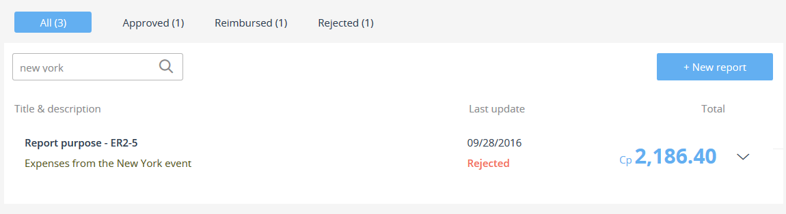

<page title="Implementing Expenses search"/>

IMPLEMENTING EXPENSES SEARCH
====

Let's implement the search system for the Expense Reports page.

1. Before we go any further, let's make a search on the current search system. Run the application, and, on the *My expenses* section, search *new york*. You should see the following results:

    

    No results? That's not expected from a good search system...

2. Go to the Azure Portal, and from there go to the Azure Search resource. Then go to *Settings* => *Keys*

    

3. Click on *Manage query keys*, and write down the key that appears in the opening blade.

    

4. Open *reportList.service.js*

    

5. Scroll down to the *getReports* function. Right now it looks like this:

    

6. Replace that function with the following code:

    ```javascript
    let getReports = function (ownerEmail, status, filter, pageIndex, pageSize) {
        return getEmployeeId(ownerEmail).then(id => {
            return searchReports(filter, pageIndex, pageSize, id).then((reports) => {
                var conditions = {
                    include: [
                        {
                            model: Employee,
                            include: [Team]
                        },
                        {
                            model: Expense,
                            attributes: { exclude: ['receiptPicture'] },
                            include: [ExpenseBonus]
                        }
                    ],
                    attributes: ['sequenceNumber', 'purpose', 'submissionDate', 'status', 'reimburseInPoints', 'description', 'createdOn'],
                    order: [[sequelize.col('createdOn'), 'DESC']],
                    where: {
                        id: {
                            in: reports.ids
                        }
                    }
                };
                conditions.where = conditions.where || {};

                if (status) {
                    conditions.where.status = status;
                }

                return ExpenseReport.findAll(conditions).then((reports) => {
                    return buildReportList(reports, pageIndex, pageSize, reports.total);
                });
            });
        });
    };

    let getEmployeeId = function (ownerEmail) {
        return Employee.find({
            where: sequelize.where(sequelize.fn('lower', sequelize.col('Email')), ownerEmail.toLowerCase())
        }).then((employee) => employee.id);
    }
    ```

7. Now, create the following function, that will be in charge of searching reports.

    ```javascript
    let searchReports = function (filter, pageIndex, pageSize, employeeId) {
        let offset = pageIndex * pageSize;
        // Search filter. '*' means to search everything in the index.
        let search = filter ? filter : '*';
        // Path that will be built depending on the arguments passed.
        let searchPath = encodeURI('/indexes/expensereports/docs?api-version=2015-02-28&$top=' + pageSize + '&search=' + search + '&$filter=EmployeeId eq ' + employeeId);
        // Request needed to get the total number of documents available, so pagination works as expected.
        let totalCountPath = encodeURI('/indexes/expensereports/docs?api-version=2015-02-28&$count=true&$filter=EmployeeId eq ' + employeeId);
        let totalCount;

        if (offset > 0) {
            searchPath += '&$skip=' + offset;
        }

        return azureSearchRequest(totalCountPath).then(count => {
            var parseCount = JSON.parse(count);
            totalCount = parseCount['@odata.count'];
            return azureSearchRequest(searchPath).then(responseString => {
                var responseObject = JSON.parse(responseString);
                // We return the total number of reports and the array of ids.
                var reportIds = responseObject.value.map((val) => parseInt(val.Id,10));
                var reports = {
                    total: totalCount,
                    ids: reportIds
                };
                return reports;
            });
        });
    }
    ```

8. And, finally, create the following function, which will be the one that communicates with the Azure Search Service.
    ```javascript
    let azureSearchRequest = function (requestPath) {
        var options = {
            hostname: '{YOUR_AZURE_SEARCH_NAME}',
            method: 'GET',
            path: requestPath,
            headers: {
                'api-key': '{YOUR_AZURE_SEARCH_KEY}',
                'Content-Type': 'application/json'
            },
        };

        // Request to get the number of elements.

        let deferred = new Promise((resolve, reject) => {
            var req = https.request(options, function (res) {
                res.setEncoding('utf-8');

                var responseString = '';

                res.on('data', function (data) {
                    responseString += data;
                });

                res.on('end', function () {
                    console.log(responseString);
                    resolve(responseString);
                });
            });

            req.on('error', function (e) {
                reject(e);
                console.error(e);
            });

            req.end();
        });

        return deferred;
    }
    ```

    Let's explain what all of this does. we have created a method to submit requests to the Azure Search service, `azureSearchRequest`. Make sure you use your Azure Search service name and the key you wrote down before here.

    The method `searchReports` receives several parameters. It will submit a query to the search service looking for reports with the text introduce by the user. However, this time the query is a bit different from the products one. We have included a new parameter, called __$filter__. This is used to filter queries by a specified field of the index. In this case, we want to search only reports related to the logged in user, and that's why we filter by his EmployeeId, so the search does not retrieve reports from other employees.

    The method `getEmployeeId` retrieves the employee's ID using the email of the logged in employee. This is the first step before submitting any search request, since as we have explained before, we need to filter search results by the employee ID.

    Finally, `getReports` method does not query the database anymore. It looks for the employee ID of the current logged in employee and, after that, it submits the search request. The `searchReports` method retrieves the IDs of the hit results, as well as the total report count for such employee. We need to do this because besides the report details, the application needs to retrieve more data from the database. So, after the search, we use each report ID to retrieve additional details, like the expenses associated to the reports. 

9. At the top of the file, copy the following line, just after `let Expenses = require('../../../model/Expenses');` :

    ```javascript
    let https = require('https');
    ```

    Your file will look similar to the following:

    ```javascript
    'use strict';

    let Expenses = require('../../../model/Expenses');
    let https = require('https');

    let Expense = Expenses.Expense;
    let ExpenseReport = Expenses.ExpenseReport;
    let Employee = Expenses.Employee;
    let ExpenseBonus = Expenses.ExpenseBonus;
    let sequelize = Expenses.sequelize;
    let Team = Expenses.Team;
    ```

10. Run the application, and go to the *My expenses* section. If everything went right, you should see the complete list of reports for the logged in employee, something similar to the following (it may differ in your application):

    

11. Try to search for any term of the searchable fields (like the description). Now you have your search working!

    
