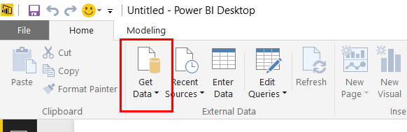
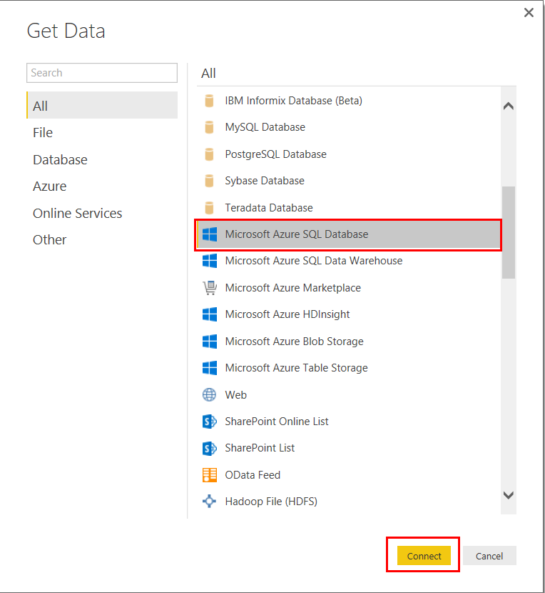
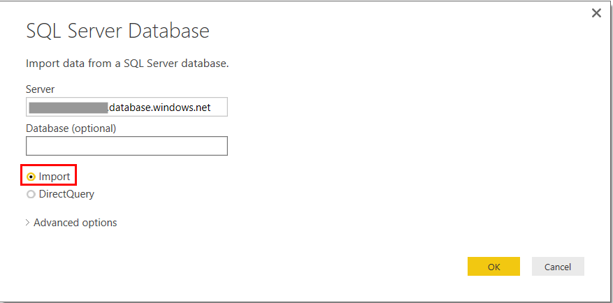
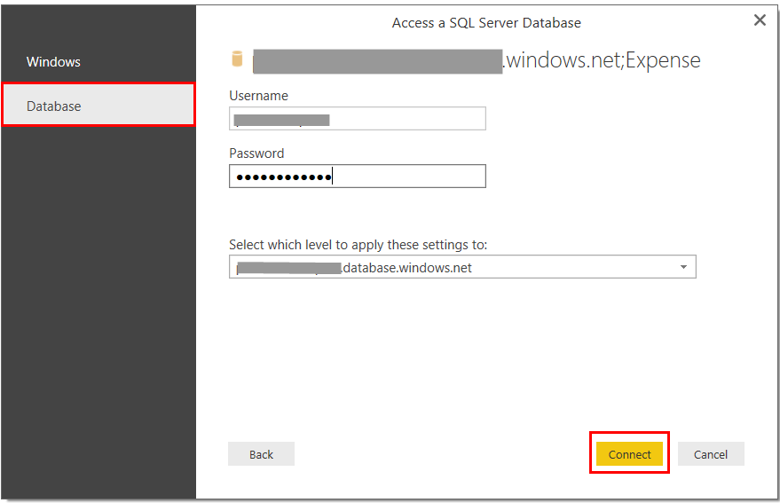
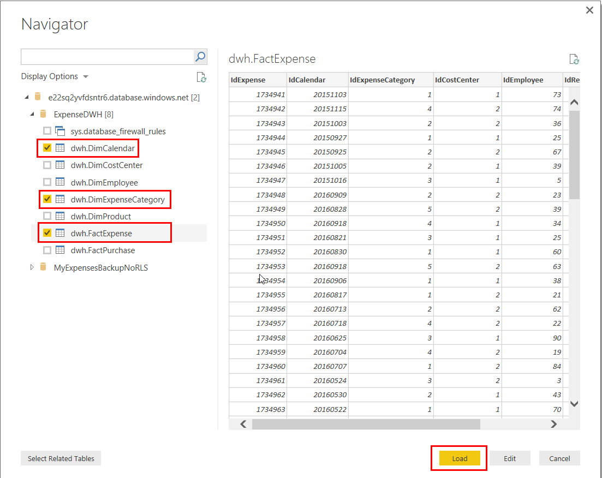
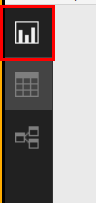
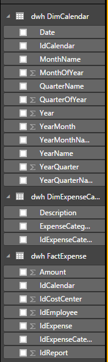
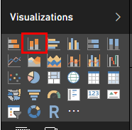
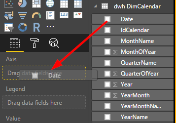

<page title="Creating a PowerBI report"/>

CREATING A POWERBI REPORT
====

We are going to generate a report which include several charts that will show information like the number of expenses generated by the employees per month and number of expenses classified by category each month. We will later see how to import this report in the PowerBI Embedded service to put it easily on the website.

1. We need data to work with, and we will be using all the expenses data stored in the Azure SQL Database that we use as DataWarehouse. To be able to do that, we need to configure the table as our data source.

2. Click on *Get data*

    

3. Click on *Azure SQL Database* and then click on *Connect*

    

4. Fill the form with the server and database name. You can find this information on the [Azure Portal](http://portal.azure.com). You will also have to choose between *Import* and *DirectQuery*. *Import* connects to the database and import the entire model in our machine, meanwhile *DirectQuery* connects retrieves data from the database when the report is going to be built. Select *Import* and then click *OK*. The server database is the one you have used in the Azure SQL Database tutorial, where the Expenses database has been migrated too. You can find the name of the server connecting to the [Azure Portal](http://portal.azure.com), in the Expenses resource group and checking the name of the SQL Server type.

    You can check the server name clickin on it. In any case, the name will be {SERVER NAME} plus the sufix ".database.windows.net":

    

5. Now you will need to provide the credentials to access to the database. Select the *Database* tab and introduce the username and password (experience2 / P2ssw0rd@Dev). After that, click *OK*. 

    

    After a few seconds, you will be shown a *Navigation* window, where you will pick those tables you will query to retrieve data for your reports.

6. As we are going to create reports related to the user expenses, select the *dwh.DimCalendar*, *dwh.DimExpenseCategory* and *dhw.FactExpense* tables.

    

    After that, click on *Load*. You will see a new window that will start the data import in our local report. It may take a few minutes.

7. Once the loading is complete, click on the icon shown in the image to start building our report.

    

    On the right side of the screen, you can see the list of fields that are available for our report. If you expand the tables, you'll see the fields that we have requested in the query. We could edit the selected tables to delete fields that we are not going to use or to generate new measures from the existing ones, but that is out of the scope of this lab. We are going to use the fields as they are in the original database.

    

    Let's build our first chart. We are going to show the number of expenses generated by the employees by month. For this task, we need two fields: *idExpense*, which we'll use to get the total count of expenses per month, and *Date*.

8. Click on the *Stacked column chart*.

    

9. Drag the *Date* field to the chart axis.

    