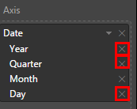
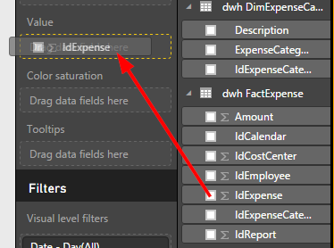
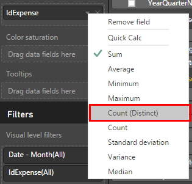
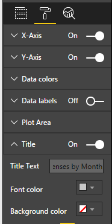
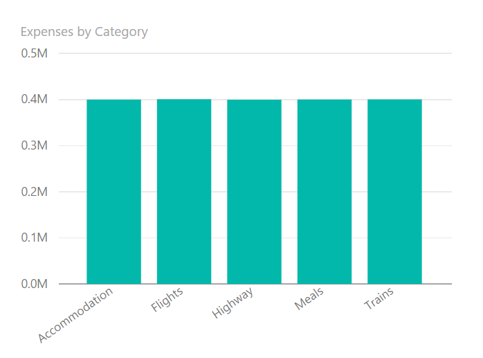
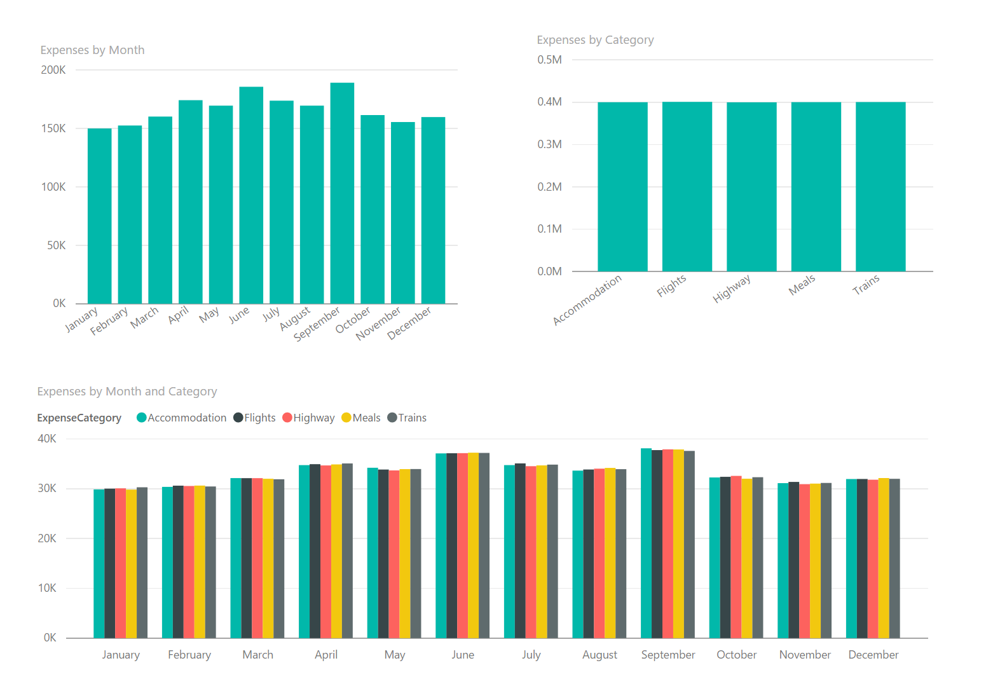

11. We only want to show the month, so delete *Year*, *Quarter* and *Day* from the *Date* field.

    

12. Drag the *idExpense* field to the value 

    

    By default, PowerBI shows the SUM of all the values of *idExpense* by month, but what we want to do is to COUNT them. Change it to be handled as *Count (Distinct)*:

    

13. You can customize the chart as you want. For example, we have changed the title, but you can change the background, font, and many other things.

    

14. Do the same to create a chart that shows the number of expenses, but this time by category. Similar to the previous chart, here we need to use the *ExpenseCategory* field as the axis and the count of *idExpense* as the value. You should see something similar graph in the following image:

    

    You can play with the charts if you'd like to include more information in your report, it's up to you. Build the report as you like! We have included a final chart that shows the number of expenses by category and month. So, our final report looks like this:

    

15. All right, the last step is saving the report. Click *File* => *Save as* and save it wherever you want.

    

