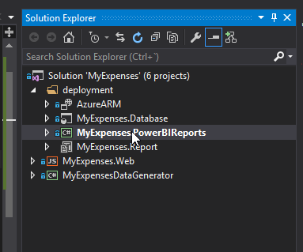
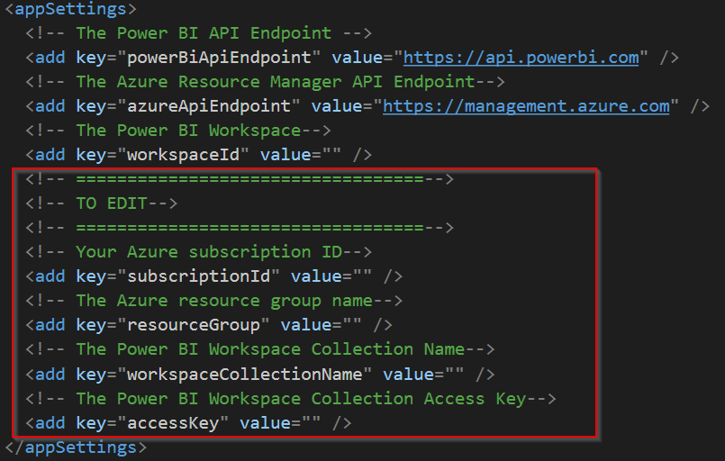
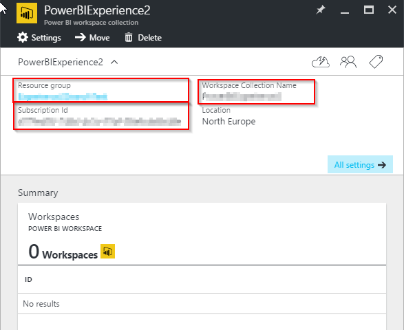
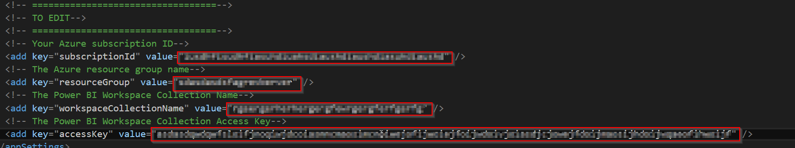
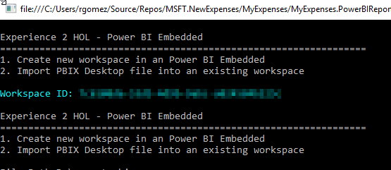
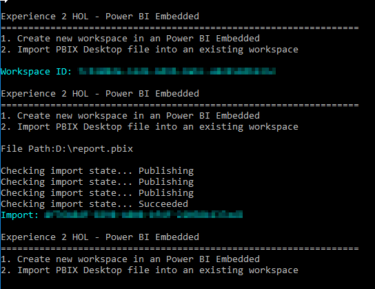
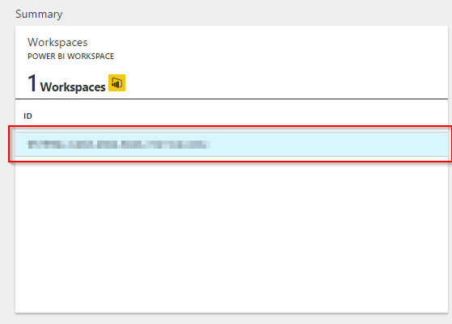

<page title="Deploy the PBIX file"/>

DEPLOY THE PBIX FILE
====

Let's see which steps we need to take to get our PowerBI report into Azure

1. First, go to the Visual Studio solution and find the project named *“MyExpenses.PowerBIReports”*.
 
    

2. Expand the project and open the *“App.config”* file. There are a few values that you need to configure:

    
 
3. To get the values to fill in the gaps, go to the [Azure Portal](http://portal.azure.com), click in the newly created Power BI Embedded service and copy the highlighted information.

    
 
4. Then, in the Power BI Embedded settings, click on *“Access keys”* and copy *“KEY 1”*:

    

5. Once the above steps are complete, the *App.config* file must have the following "values" filled:

    
 
6. Now let's set the PowerBIReports project as a startup project and execute it by pressing F5

    
 
7. In the application, select option *1*. A new workspace has been created

    
 
8. Once the workspace has been created, upload the pbix by choosing option *2* and typing in the path to your pbix file. If Power BI Desktop program is opened, please close it before upload the file.

    

9. If you check the PowerBI service, you will find the new Workspace that has been created on Azure 

    
