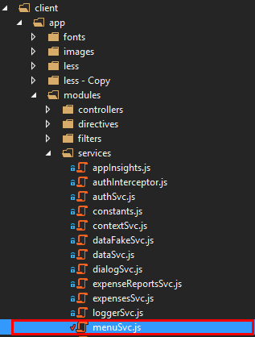
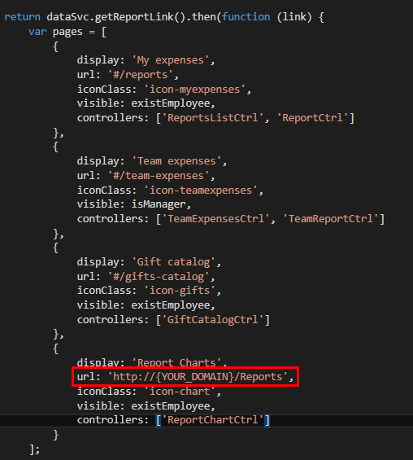
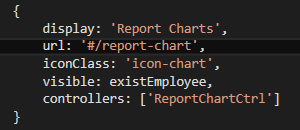
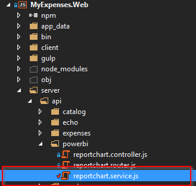
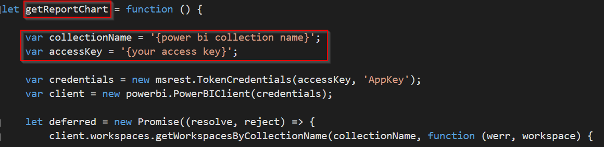
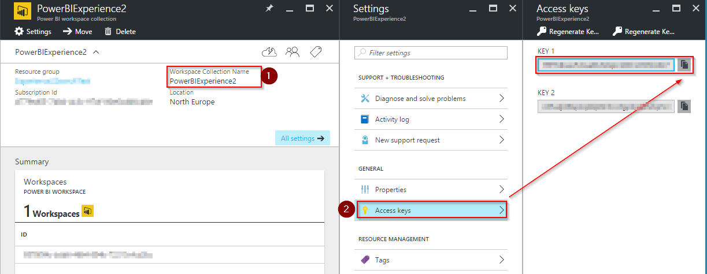
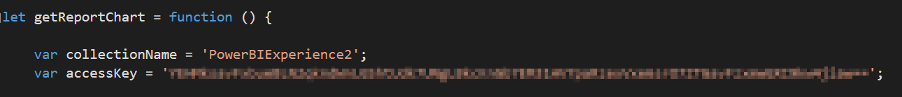
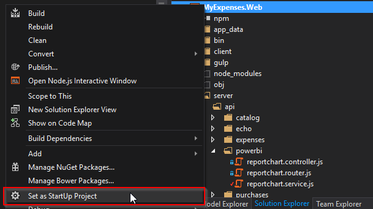
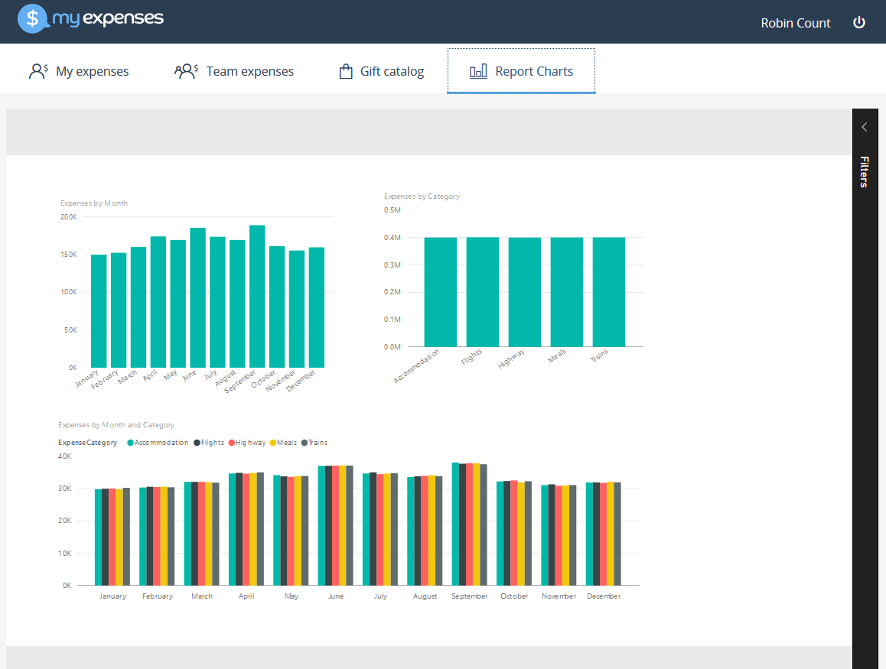

<page title="configure website"/>

CONFIGURE WEBSITE
====

Once the workspace is created and the desktop report has been uploaded to our PowerBI Embedded Azure Service, it is time to integrate the report in our website. By doing this integration, the users can retrieve the report and analyze it without opening a new tab like we had when we worked in SSRS. 

To integrate PowerBI Embedded with a website there are some easy to use APIs written by Microsoft for different technologies such as [JavaScript]( https://github.com/Microsoft/PowerBI-JavaScript) , [React](https://github.com/Microsoft/PowerBI-React), [Angular]( https://github.com/Microsoft/PowerBI-Angular), ASP .NET and so on. In our case, we've developed our website with Node.js and we'll use this [API](https://github.com/Microsoft/PowerBI-Node).

1. First, let's change the Reports URL so it points to an internal page that we have already developed. Open Visual Studio and go to the *menuSvc.js* file.

    

2. Scroll down and, in the `Reports charts` page, change the URL property to `#/report-chart`.

    

3. It should look like this:

    

4. Great, now find *reportchart.service.js* located in *server/api/powerbi*.
 
    

5. There is a function called “getReportChart” that connects to the PowerBI Embedded service and retrieves the first chart in the workspace collection.
 
    

6. As we saw in previous steps, we need to copy the `CollectionName` and `AccessKey` into the *reportchart* service: 

    Go to the [Azure Portal](https://portal.azure.com/). Navigate to your Resource group and find the PowerBI Embedded where you uploaded the report in the previous page.
    Copy the CollectionName (PowerBI service name) and the AccessKey.
    
    

7. Paste both values in your “reportchart.service.js” file:
 
    

8. Once the PowerBI embedded credentials are configured, set your project as StartUp and press F5 to run the application.
 
    

9. If you now go to the *Report Charts* section, you will see the report created with PowerBI desktop!

    
