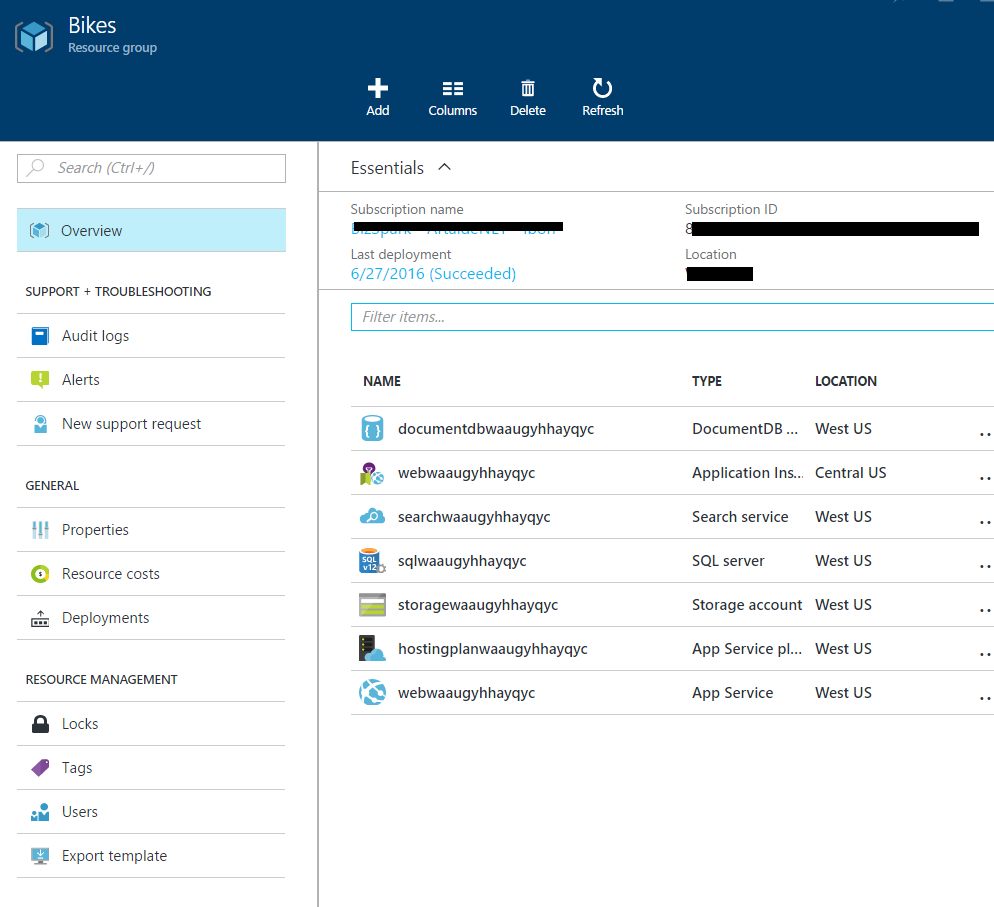

# Evolving SQL Workloads from Software to SaaS

In this scenario we will build an e-Commerce retail based SaaS (Software as a Service) application using Azure database services (Azure SQL Database).

### Pre-requisites for the lab

-   [Visual Studio 2015 Update 3](https://msdn.microsoft.com/en-in/library/mt613162.aspx)

-   [Latest Microsoft Azure SDK](https://azure.microsoft.com/en-us/downloads/)

-   [.NET Core SDK Visual Studio Tools](https://www.microsoft.com/net/core#windows)

-   [Latest version of Node.js](https://nodejs.org/en/download/)

-   An active Microsoft Azure Subscription for deployments

-  [SQL Server Management Studio or SQL Data Tools for Visual Studio](https://go.microsoft.com/fwlink/?LinkID=824938)

-   [NPM Task Runner extension for Visual Studio](https://visualstudiogallery.msdn.microsoft.com/8f2f2cbc-4da5-43ba-9de2-c9d08ade4941)

-   [Azure Data Lake Tools for Visual Studio 2015](https://www.microsoft.com/en-us/download/details.aspx?id=49504)

-   gulp and bower installed as global  
        - `npm install bower -g`
        - `npm install gulp -g`

### Provision the Azure Resources

1. Create the Azure resources.
    
  Simply click the Deploy to Azure button below and follow the wizard to create the resources. You will need to log in to the Azure Portal.
                                                                     
  

  The resources will be deployed to a Resource Group. You can delete the resource group in order to remove all the created resources at any time.

  

### Modules

<a href="./story_a_elasticdatabasepools/intro.md">Module 1: Azure SQL Database, the developers' cloud database</a>
    
  Build multitenant applications with customer isolation and efficiency and leverage built-in service intelligence for greater performance 
  and data security.

<a href="story_a_elasticdatabasepools//intro.md">Start</a>
