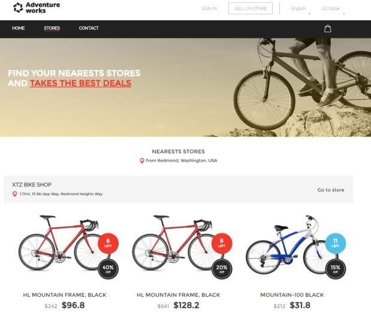
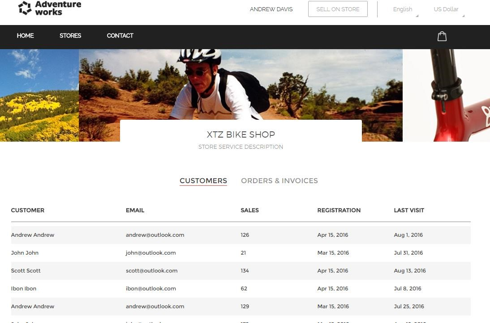

# TOUR

1. Go to the Azure Portal 
1. Click on Resource Groups

    

1. You should see a resource group with the name you provided previously.  
1. Click on it.  

    

1. Click on the AppService `webend`.  
1. Click on the AppService URL. 

    

1. Click on Stores. 

    

1. Click on `Sign In` and use these credentials. 

    > Username: Store1 

    > Pasword: P2ssw0rd@1 

    

    

<a href="1.GetStarted.md">Next</a>
