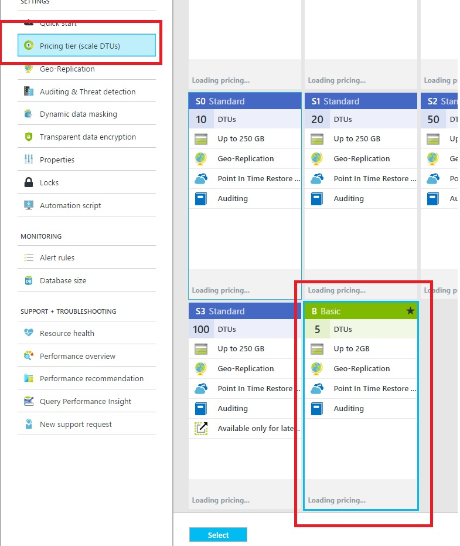
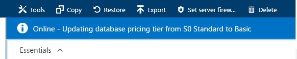
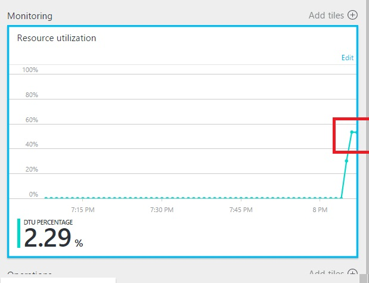

# VERTICAL SCALING

One of the benefits of Azure SQL Database is the ability to scale up and down as needed, with zero impact to uptime.
 
1.	Open the Azure portal.	

    

1.	Select AdventureWorks.Bikes.Store1	

    

1.	Click Pricing tier.

1.	Click Basic.

    

1.	Click Select.	

    > One of the benefits of Azure SQL Database is the ability to scale up and down as needed, with zero impact to uptime.

    > Basic would not be used for a real-world, but is used in this lab scenario primarily to make it easy to show a spike in CPU utilization and to demonstrate how easy it is to scale up on demand.

    > Within a few seconds, the S0 pricing tier is updated to the Basic tier.

    

1.	Go to the `source\AdventureWorks.Bikes\resources\ElasticPoolLoadGenerator` directory.

    > To demonstrate a task where an offer has just gone and many users purchase bikes at the same time, we have a load generator that can simulates a spike in demand.

1.	Open the ElasticPoolLoadGenerator.exe.config file.

1.	Add the connection string to the AdventureWorks.Bikes.Store1 database.

    > **NOTE:** Get the connection string from the Azure Portal.

1.  Run the process ElasticPoolLoadGenerator.exe	

    

1.	Check the resource utilization.	

    > Within a minute or so, you should notice a spike in the resource-utilization chart. CPU usage spiked over 80 percent, which would obviously cause a problem.

    

    > **Note:** You could optionally create an alert that would trigger once the CPU utilization reaches a certain threshold.
    
    > As the database uses the Basic pricing tier, which the current test shows not be enough capacity to handle an even larger spike or multiple concurrent events.

1.	In the Store1 Database summary pane, scroll down to Pricing tier.

1.	Click Pricing tier.

1.	Click S2 Standard.

1.	Click Select.	

    > Within a few seconds, the Basic pricing tier is upgraded to the S2 tier, and the allotted capacity has increased from 5 database throughput units (DTUs) to 50 DTUs.

    > DTUs are based on a simple, blended measure of CPU, memory, reads, and writes, and they provide a convenient means of describing the relative capacity of the performance levels of different Azure SQL Database SKU pricing tiers.

1.	Check the resource utilization.	

    > Now that we’ve upgraded the capacity!

    

    > Beyond scaling up individual databases, you will next see how to let Azure SQL Database help customers dynamically scale groups of databases to meet changes in demand, rather than having to manage this manually.

1.	Close the ElasticPoolLoadGenerator process.	

<a href="3.ElasticDatabasePools.md">Next</a>
