# ELASTIC DATABASE POOLS

**Elastic pools** provide a simple cost effective solution to manage the performance goals for multiple databases that have widely varying and unpredictable usage patterns. 

Each store (database) has unpredictable resource requirements for memory, IO, and CPU. With these peaks and valleys of demand, how do you allocate resources? Traditionally, you had two options: (1) over-provision resources based on peak usage and over pay as you saw before, or (2) under-provision to save cost, at the expense of performance and customer satisfaction during peaks. 

**Elastic database** pools solve this problem by ensuring that databases get the performance resources they need, when they need it, while providing a simple resource allocation mechanism within a predictable budget. 
 

1. Go to the Azure Portal. 
1. Click on Resource Groups.

    > AdventureWorks Bikes has several stores with different locations so customers can buy products in the nearest one to them. Each of this stores uses its own database. 

    > We should allocate resources for each store, but because each one will have different activity, it is hard to allocate resources and get the best performance with the lowest cost possible.

    > As you have seen before, we could over-provision resources based on peak usage and over pay.

    > Due to this, AdventureWorks Bikes has decided to use Elastic Database pools, a features that comes very handy when we face situations like the described.

    

1. Click on the Resource Group you created before.

    

1. Click on the `SQL Server` from the Resource Group, as shown in the image. 

    > There are two ways you can create a pool.  

    > You can do it from scratch if you know the pool setup you want, or start with a recommendation from the service. SQL Database has built-in intelligence that recommends a pool setup if it's more costefficient for you based on the past usage telemetry for your databases. 
    
    > You can´t add databases from different servers to the same pool, so only databases on this server will be eligible for the pool. 
    
    > AdventureWorks Bikes has all their store databases in a single server, so this will not be a problem to create the pool. 

    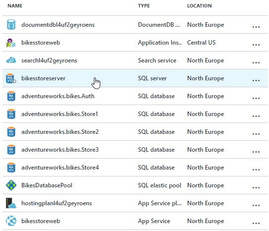

1. Click on New Pool to start the process. 

    > We are going to set up the pool from scratch, to show how it should be done. 

    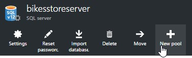

1. Provide a name for the pool 

    > If you chose a recommended pool, the recommended tier and configuration of the pool are already chosen, but you can still change them. 
    We'll name this pool BikesDatabasePool. 

    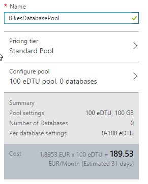

1. Click on Pricing tier to determine the features of our elastic pool. 

    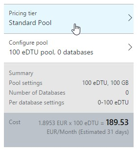

1. Click on the Standard pool. 

    Pay for what you need. Remove the guesswork and commitment of buying infrastructure to support the performance goals for your app. Only pay for the performance you need, when you need it. 

    The pool's pricing tier determines the features available to the elastic databases in the pool, and the maximum number of eDTUs, and storage (GBs) available to each database. 
      
    

    **NOTE:** Once set, it is not possible to change the pricing tier. To change the pricing tier for an existing elastic pool, create a new elastic pool in the desired pricing tier and migrate the elastic databases to this new pool. 

    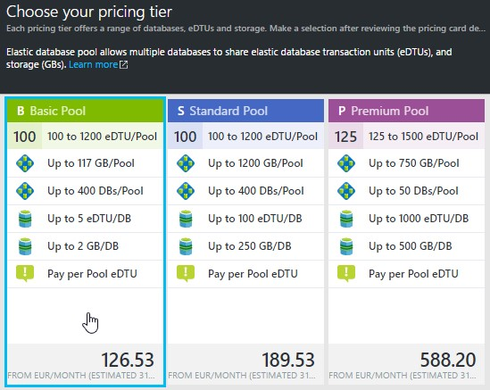

1. Click on Select. 

    

1. Click on Configure pool. 

    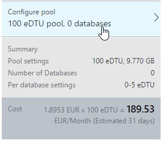

1. Click on Add to Pool to select the databases. 

    > Efficient Database scaling. Efficiently scale the number of tenants in Elastic Database Pool without having to worry about price and performance management for each database within the pool. 

    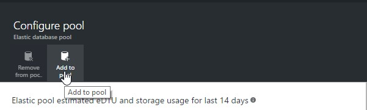

1. Click on the Store databases and then on the blue Select button. 

    > We can see database information like the Peak DTU and Average DTU.  
    
    In our case there is not enough use of the databases, so this information does not appear. 
    
    If AdventureWorks Bikes would like to open a new store in the future, we could add the new store database to the pool with no more effort than just clicking again on Add to pool and adding the new database to the pool. 

    > **Database Isolation**:
    
    Define the desired performance range for each elastic databases pool, and let the pool automatically provide the resources and monitoring each database needs within your defined parameters.    
    
    If the databases have enough historical usage telemetry, the Estimated eDTU and GB usage graph and the Actual eDTU usage bar chart update to help you make configuration decisions. 

    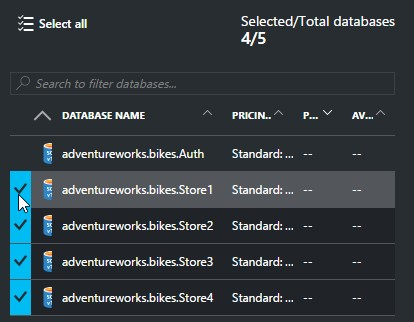
    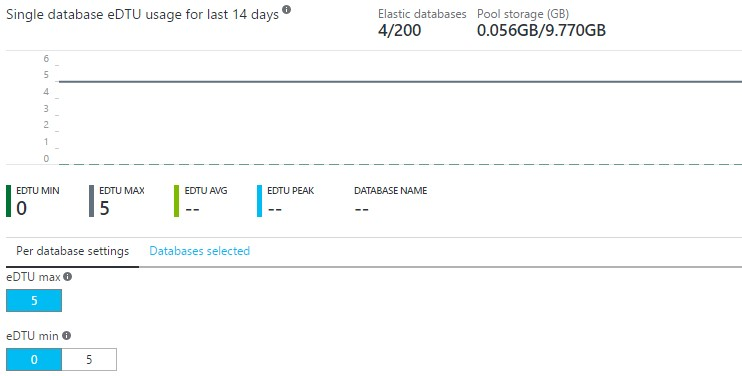

1. Click and drag the slider to see how we can change the controls. 

    > Resource & tenant administration. With Elastic Database Pools, you gain automatic management and administration of compute and storage across an unlimited number of databases helping cap your spending, maximize utilization, and effectively scale multitenant apps. 

    > Scale on the fly. With one mouse click in the Portal or a single API call, scale up the resources provided to your app to accommodate growth periods or peak workload demand. 

    > This is a useful feature since AdventureWorks Bikes has its own sales seasons, and, of course, many people will be trying to catch the best bargains! In sales seasons, the increment of traffic is something very noticeable and we have to be ready to satisfy the demand. These controls allow us to scale and provide enough resources. 
    However, AdventureWorks bikes does not need to scale right now, so we´ll just let it at 100 eDTU, since it will be enough. 

    > Changing these controls will affect to the limit of eDTU that an individual database can consume. 

    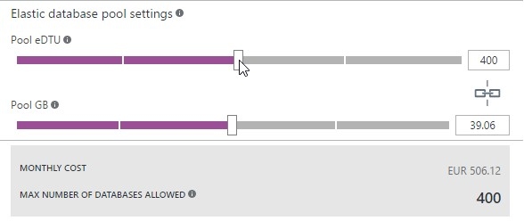

1. Click on Select. 

    > When we are done, we´ll see a summary of our final configuration, and we´ll have our Elastic Database Pool configured. 
    Azure will recalculate the estimated cost per month based on the configuration set. 

    

    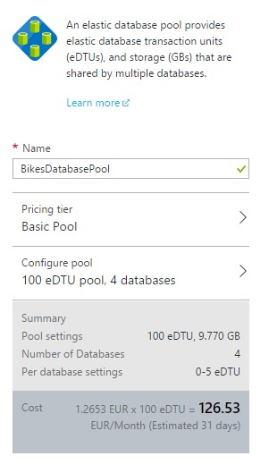

1. Click on Ok. 

    > The deployment process will start. It may take a few minutes to finish. 
    You can see an alternative scenario using Elastic Database Pools here, which will help you to better understand the concepts. 

    
    
    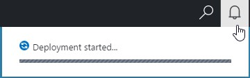

1.	Go to the `source\AdventureWorks.Bikes\resources\ElasticPoolLoadGenerator` directory.

    > Let´s try the same test that we did in the previous lab scenario!

1.	Open the ElasticPoolLoadGenerator.exe.config file.

1.	Add the connection string to the AdventureWorks.Bikes.Store1 database.

1.	Run the process ElasticPoolLoadGenerator.exe	

    

1.	Switch to the Azure Portal.

1.	Click on the SQL Server.

1.	Click on the elastic pool.

1.	Check the resource utilization.	

    > Notice also in the ElasticPool resource-utilization chart that the pool is barely affected by this spike in usage.

    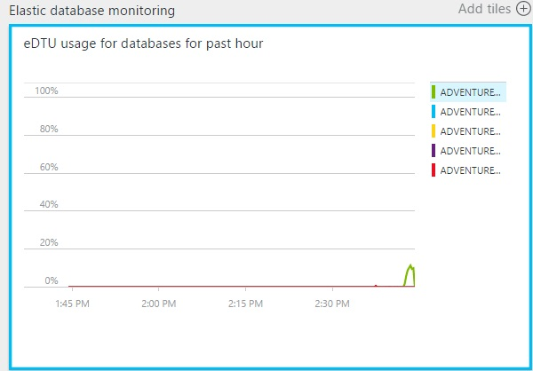

    > The databases were previously set to S2 (50 DTUs). 
    The max pool setting that was created by default for this new ElasticPool is 100 DTUs, which means any of the databases in this pool can now spike to 100 DTUs, but their capacities won’t need to be managed individually.
    
    

<a href="4.ElasticDatabaseJobs.md">Next</a>
