# ELASTIC DATABASE JOBS

**Elastic Database** jobs is currently a customer-hosted Azure Cloud Service that enables the execution of ad-hoc and scheduled administrative tasks, which are called jobs. With jobs, you can easily and reliably manage large groups of Azure SQL Databases by running Transact-SQL scripts to perform administrative operations. Why use jobs? 

- Manage: Easily do schema changes, credentials management, reference data updates, performance data collection or tenant (customer) telemetry collection. 
- Reports: Aggregate data from a collection of Azure SQL Databases into a single destination table. 
- Reduce overhead: A job handles the task of logging in to each database in the target group. You also define, maintain and persist Transact-SQL scripts to be executed across a group of Azure SQL Databases. 
- Accounting: Jobs run the script and log the status of execution for each database. You also get automatic retry when failures occur. 
- Flexibility: Define custom groups of Azure SQL Databases, and define schedules for running a job. 

### Steps

1. Go to the Azure Portal.
1. Go to Resource Groups. 
1. Click on the resource group created. 

    > AdventureWorks Bikes stores databases store information about customers and orders made by them. All databases share the same schema. However, there will be times in which we wil probably need to introduce new changes to these schemas. For example, we may want to store additional information about customers. Or even store new information, having to create new tables. 

    > Does this mean that we have to update the databases one by one? Right now, it wouldn´t such a big a problem, because we have just four databases. But AdventureWorks Bikes has plans to achieve the bikes sector world domination! When it has hundreds of stores, it won´t be so easy to update the databases! 

    > This is where Elastic Database Jobs come into play to help us achieving our goal. Instead of having to go one by one, we can use Elastic Database Jobs, that will let us to update each one of every database that exists in the pool at once. This way we could update our stores databases easily, and assuring that all databases receives the same update, without forgetting any of them. 

    > Pool management and monitoring tools. Execute jobs, transactions, schema updates, or collect telemetry data across an elastic pool at once, giving you the time and capacity to manage both the pool and individual customers. 

    > Right now, AdventureWorks Bikes wants to gather information about the gender of its customers, to have statistics about which products are preferred by men and what are preferred by women. 

    > It´s time to update the Customers table to include this new change. 

    > First we need to install Elastic Database jobs components to enable execution of administrative tasks against each database in the Elastic Database pool. 

    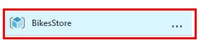

1. Click on the Database pool you just created. 

    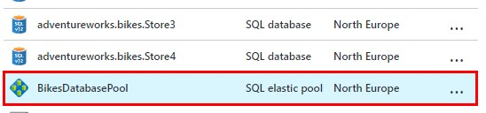

1. Click on Manage jobs. 

    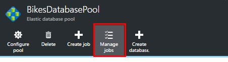

1. Click on Preview terms. 

    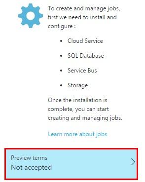

1. Mark the checkbox. 
1. Click Ok. 

    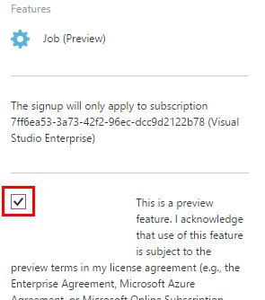

1. Click on Job credentials. 

    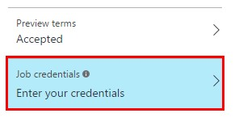

1. Create the following credentials: 
Username: bikes 
Password: P2ssw0rd 
1. Click Ok 

    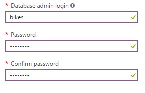

1. Click on Create. 

    > It may take a few minutes to install the components. 

    

1. Click on the pool. 

    > Once created, it is very easy to create a job to target all databases. 

    

1. Click on Create job. 

    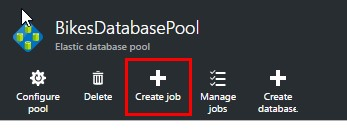

1. Use the credentials we created before. 

    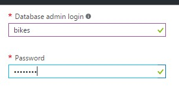

1. Give the job a name. Use the credentials of the server where the databases are. 
User: bikes 
Password: P2ssw0rd 

    > **NOTE:** Don´t confuse these credentials with the ones created previuously
    
    > These credentials are to access the target databases. The ones that we created are just to access to the jobs administration

    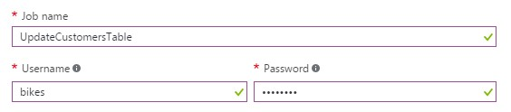

1. Type the T-SQL script.

    > Write the SQL code to update our Customer tables with the new column! 

    You define, maintain and persist TransactSQL scripts to be executed across a group of Azure SQL Databases

    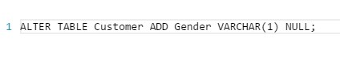

1. Click Run to run the job. 

    > Finally, you just Run the job and it will execute.  

    

1. Click on the job. 

    > You can see the details of the job, like the starting time, when it was created and its status. 
    As you can see, it is executed across all the pool databases. It is an easy way to manage large groups of Azure SQL Databases, performin administrative operations with a single T-SQL script. 
    You can find an alternative scenario using Elastic Database Jobs here, which will help you to better understand the concepts. 

    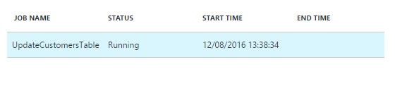

    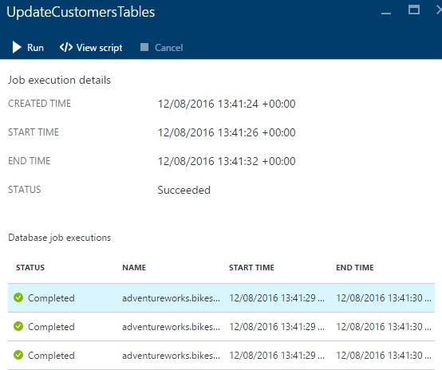

    > Now, if you go to any of our stores databases, you will see the new column. At it took just a couple of minutes! 

1. Connect to your database using SQL Server Management Studio o SQL Server Data Tools.

    > Get the server name from your Azure Resource Group (you_sql_server.database.windows.net)

    

    > The default SQL credentials are: 
        Bikes 
        P2ssw0rd 

    

1. Expand the adventureworks.bikes.store1 and check the new column.

    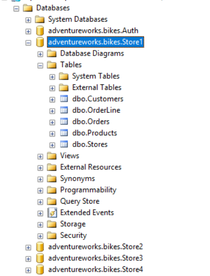

    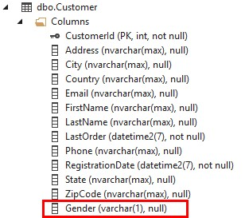
    
<a href="5.SqlDatabaseAdvisor.md">Next</a>
