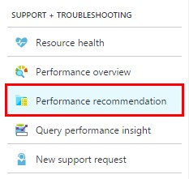
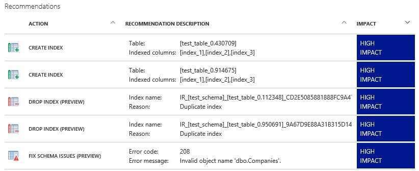
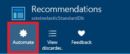
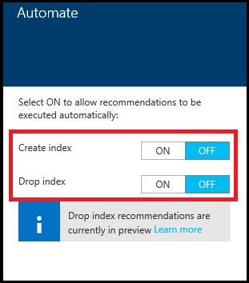
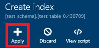

# SQL DATABASE ADVISOR

The **Azure SQL Database** provides recommendations for creating and dropping indexes, parameterizing queries, and fixing schema issues. The SQL Database Advisor assesses performance by analyzing your SQL database's usage history. The recommendations that are best suited for running your database´s typical workload are recommended.  

Create Index recommendations appear when the SQL Database service detects a missing index that if created, can benefit your databases workload (nonclustered indexes only). 

Drop Index recommendations appear when the SQL Database service detects duplicate indexes (currently in preview and applies to duplicate indexes only). 

Parameterize queries recommendations appear when the SQL Database service detects that you have one or more queries that are constantly being recompiled but end up with the same query execution plan. This opens up an opportunity to apply forced parameterization, which will allow query plans to be cached and reused in the future improving performance and reducing resource usage. 

1. Go to the Azure Portal.
1. Click on Resource Groups. 

    > It is important to get the best performance out of our databases. AdventureWorks Bikes wants to offer the best experience to its customers, and to do so it is important that the overall system works in an efficient and fast way. However, changes to the database and its schema design can impact to the performance, and that is where the SQL Database Advisor comes into play. Enabling it will alow us to know what changes we can do to the databases of our Bikes stores so they can work as fast as possible with minimum error rates, keeping all out customers happy and avoiding that they leave the store because they are not able to navigate through the website, or, what is worst, they cannot complete a purchase! 

    > **NOTE:** To get recommendations a database needs to have about a week of usage, and within that week there needs to be some activity. There also needs to be some consistent activity as well. 

    

1. Click on the Resource Group you created before.

    

1. Click on the database. In our case, `adventureworks.bikes.Store1`.

    

1. Click on `Performance Recommendations`. 

    > Actionable recommendations. Gain recommended actions for security policies and performance issues which require your attention. Built-in advisors provide one-click implementation options to minimize your time coding or troubleshooting. 

    
    

1. Click on Automate.

    > There are two ways to apply recommendations: We can do it one by one or we can automate the process. 

    > Let´s start automating the process.  

    

1. Toggle the switches to On. 

    > Automating will apply recommendations as soon as they are available. 

    > In this case, we can automate the creation or droping of indexes when recommendations related to it become available. 

    > If this results in a negative performance, the recommendation can be reverted. 

    

1. Click on a single recommendation. 

    > Clicking on Apply would apply this single recommendation to the database. 

    

<a href="7.ThreadDetection.md">Next</a>
