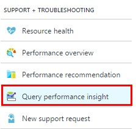
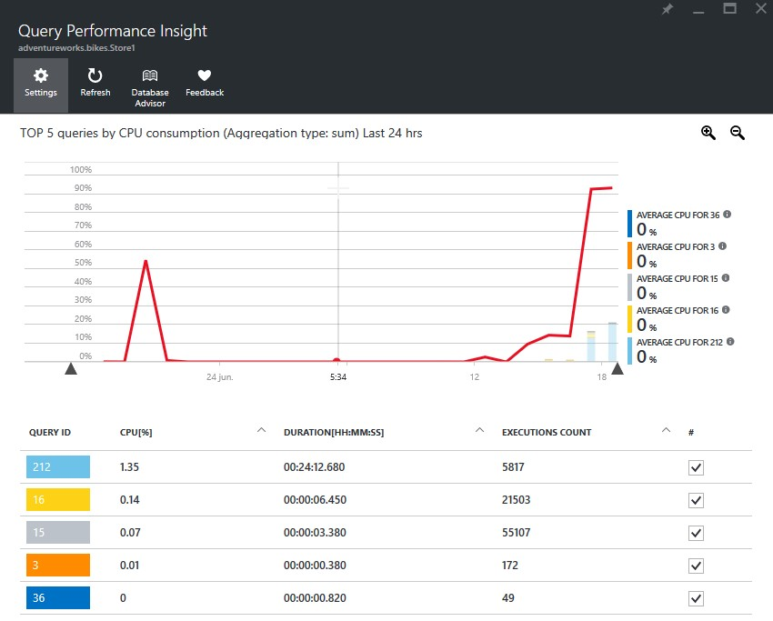
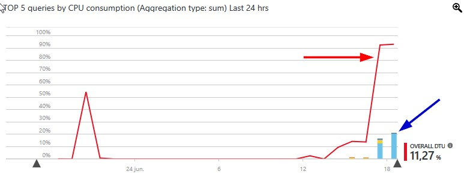
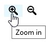
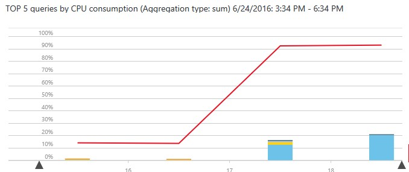
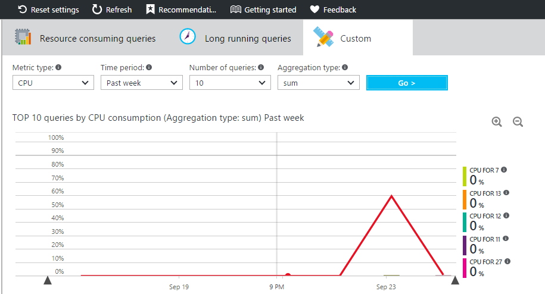
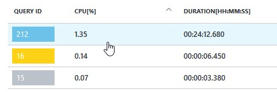
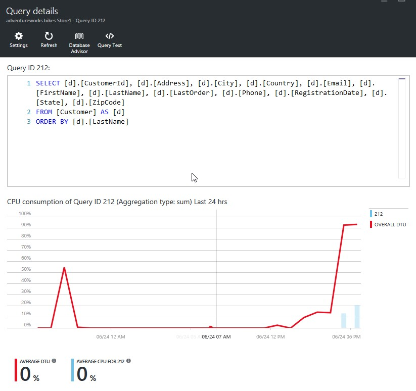
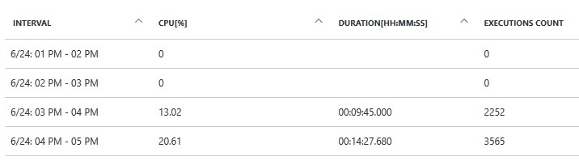

# QUERY PERFORMANCE INSIGHT

Managing and tuning the performance of relational databases is a challenging task that requires significant expertise and time investment. Query Performance Insight allows you to spend less time troubleshooting database performance by providing the following: 
- Deeper insight into your databases resource (DTU) consumption. 
- The top CPU consuming queries, which can potentially be tuned for improved performance. 
- The ability to drill down into the details of a query.

Query Store acts as a "flight data recorder" for the database, continuously collecting critical information about the queries. It dramatically reduces resolution time in case of performance incidents, as pre-collected, relevant data is available when you need it, without delays.

You can use Query Store in scenarios when tracking performance and ensuring database performance predictability is critical.

### Steps

1. Go to the Azure Portal.

    > Similar to the Database Advisor, the Query Performance Insight tool provides information about the queries that are executed against the database. 

    > When someone is in the backoffice of AdventuresWorks Bikes, there are several queries executed against the databases to retrieve different information about customers and orders. Obviously, these queries are transparent to the user, but it is important to know the impact of them and how they can be improved over time to provide a better experience. 

    > With this tools we can know how those queries impact on the database, its CPU usage and more information that will encourage us to improve them so we can get the best performance queries. 

    > Let´s see how we can see details of our database consumption, and which queries are the most CPU-consuming. 

    > **NOTE:** Query Performance Insight is only available with Azure SQL Database V12. 

1. Click on Resource Groups. 

    

1. Click on the Resource Group you created before.

    

1. Click on the database. In our case, adventureworks.bikes.Store1.

    

1. Click on Query performance insight. 

    

    > Self-tuning performance. Query and operational patterns of your app are continuously monitored for effectiveness. Performance tuning is continuously implemented and automatically refined to adapt to changes in your app patterns, without your intervention. 
    Here we can see a chart displaying DTU% and CPU% consumed, as well as the top consuming queries. 
    We´ll see how to change the number of queries displayed and the time interval in a moment. 

    

    > The top line shows overall DTU% for the database (red arrow), while the bars show CPU% consumed by the selected queries during the selected interval (blue arrow). 

    

    

1. Click on the Zoom in icon.

    > We can also Zoom in to focus on a more specific interval. 

    

    > For our application, we can see that users have had a relatively high activity period between 4:30PM and 6:30PM.  
    The bars represent the total sum of CPU consumed by all executed queries at an specific time. However, we can change the aggregation type as we�ll see now. 

    

1. Click on Custom.

    > On the Custom screen we are able to customize how CPU consumption data is displayed, or to show a different time period. Clicking on the previous Zoom in / Zoom out icon just changes this same period of time. 
    We can also set the maximum number of queries we want to display on the chart. 

    

1. Click Go.

1. Click on a query to see specific details about it. 

    > Let´s see details about a query. 

    

    

1. Scroll down.

    

<a href="7.ThreadDetection.md">Next</a>
