# THREAT DETECTION

Threat Detection detects anomalous database activities indicating potential security threats to the database. It makes it simple to address potential threats to the database without the need to be a security expert or manage advanced security monitoring systems.

1. Go to the Azure Portal.
1. Click on Resource Groups. 

    > AdventureWorks Bikes is concerned about the security of its web application. A store like this manages lots of sensible data about its customers and an attack agains it could have serious and very important consequences. 
    Because of that, the company wants to use the Threat Detection feature to track any suspicious activity that could be potentially dangerous and act as fast as possible to solve and reduce the damage done if any. 
    Let´s see how Threat detection can be enabled and how it works when there is an exploited vulnerability in our application. 

    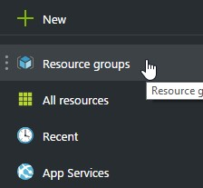

1. From the `Resource Group` dropdown, select your resource group.

    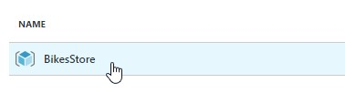

1. Click on the database. In our case, adventureworks.bikes.Store1.

    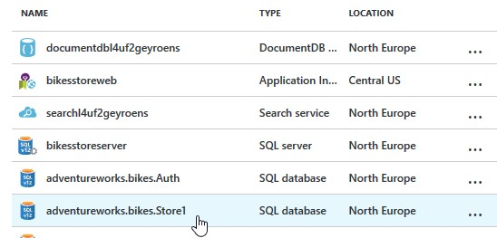

1. Click on Auditing & Threat detection.

    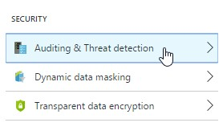

1. Uncheck the Inherit settings from server option.

    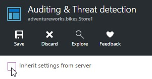

1. Under Auditing, click on the On button.

    > In order to display the Threat detection settings, we must enable Auditing. 

    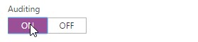

1. Click on Configure required settings.

    > It´s a good practice saving log records to see what has been happening with our database in the last days. To do so, we have to set up a storage account, in which all this data will be saved. 

    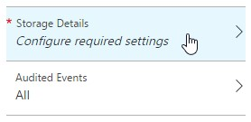

    > In this blade we can choose what subscription we´ll use to create our storage account (or use an already created one). 

    > Also, we´ll set the retention period, this is, how many days we want to save data. 

    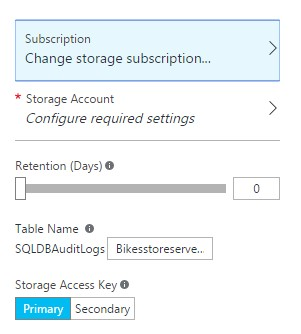

1. When you are done, click Ok.

    

1. Under Threat detection, click on the On button.

    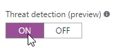

1. Click on Threat detection types.

    > We can choose what type of threats we want to audit.  

    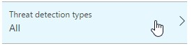

    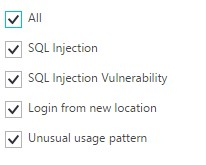

1. Click on Ok

    

1. Put an email address to be alerted when something happens.

    > Finally, we´ll need to provide a list of e-mails addresses separated by semicolons. When any anomalous activity is detected, a mail will be send to these addresses.  

    > <span style="color:red">**NOTE**: You can use your personal email address.</span>

    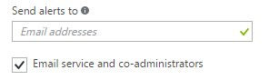

1. Click on Save.

    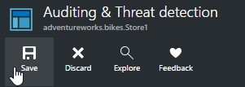

1. Open CustomersController.cs (API>Controllers). 

    > We have prepared an scenario so you can see what a SQL injection attack could look like. 

    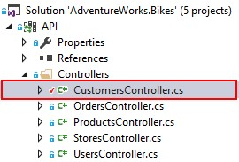

    > The method GetAllAsync() receives a name as optional parameter. In such case, it will retrieve all the customers whose first name match the received as parameter. 

    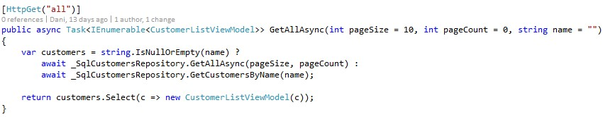

1. Open SQLCustomersRespository.cs (Infra.Sql>Repositories). 

1. Find the GetCustomersByName method.

    > Maybe you don´t see anything strange in this code, but it is a source of SQL injection attacks.  
    You will see why in a moment. 

    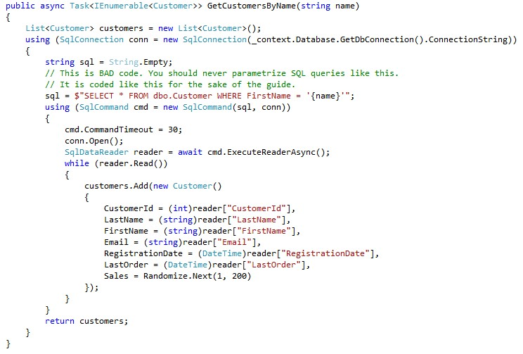

1. Run the application. 

1. Log in to the application with the following credentials: 
    > Username: Store1 

    > Pasword: P2ssw0rd@1 
    
1. Click on Customers 

    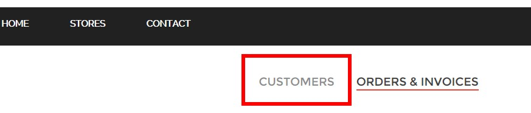

1. Put a name in the filter. 

1. Hit enter.

    > There is a filter that allows you to retrieve only customers with a given name. Test it. 

    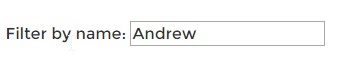

    > As you can see, it works properly. Nothing extraordinary.  

    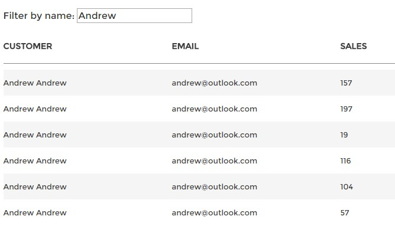

1. Now try to search this: 
'; DELETE FROM dbo.Customers WHERE FirstName = 'Ibon'  

    

    > You will see that there are no results returned. It´s not a common name. 
    But if you wait a few minutes (or even seconds), you will get an email warning you about a potential SQL injection attack!

    > **NOTE**: If you click on "view vulnerable statement" and you used your personal email, you must enter the Azure credentials on the portal.azue.com again to see the audit logs. 

    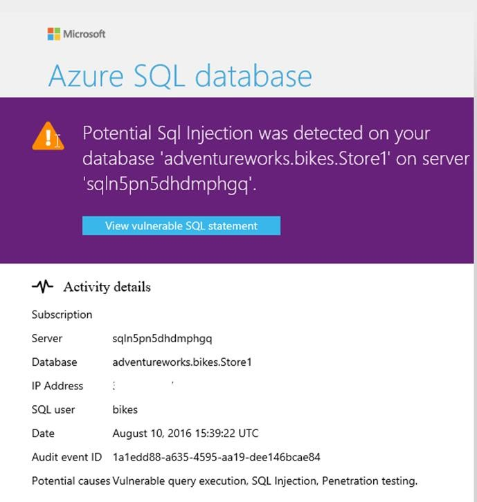

1. What happened?. 

    If you remember, previously, when in our GetCustomersByName method, we have used a filter name. When building the SQL query, we just appended the parameter passed to the query and then executed it. 
    
    What was the problem with our request? If we decode the parameter, we get the following:  
    ```sql
    '; DELETE FROM dbo.Customers  WHERE FirstName = 'Ibon'  
    ```

    And, thus, our SQL query would look like this: 

    ```sql
    SELECT * FROM dbo.Customers WHERE FirstName = ''; 
    
    DELETE FROM dbo.Customer WHERE FirstName = 'Ibon' --' 
    ```

    As you can see, our query does not just search customers with the specified first name anymore. It executes a totally different query. It also deletes customers from the table! This is a SQL injection attack.  

    But, due to the fact that we enabled it in our database, Azure detected a potential SQL injection attack and sent an email to the owner. This did not prevent the query execution, it is just a warn telling you that suspicious activity has been detected, and you have a look at it. In fact, if you look for customers whose name is Ibon now, you won´t see anyone! 

    > To check the suspicious activity, click on the email link. It will redirect you to the Audit Records. 

    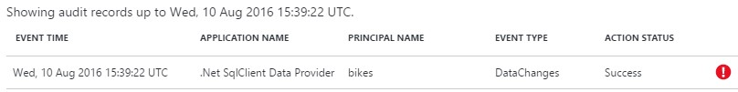

    > This screen shows the relevant Auditing records around the time of the suspicious event. 
    If we click on one of the records, we´ll see details on the suspicious database activities such as SQL statement, failure reason and client IP. 
    This will let you fix the vulnerable code so it does not happen again. It´s important to keep all our customers in the database!! 

    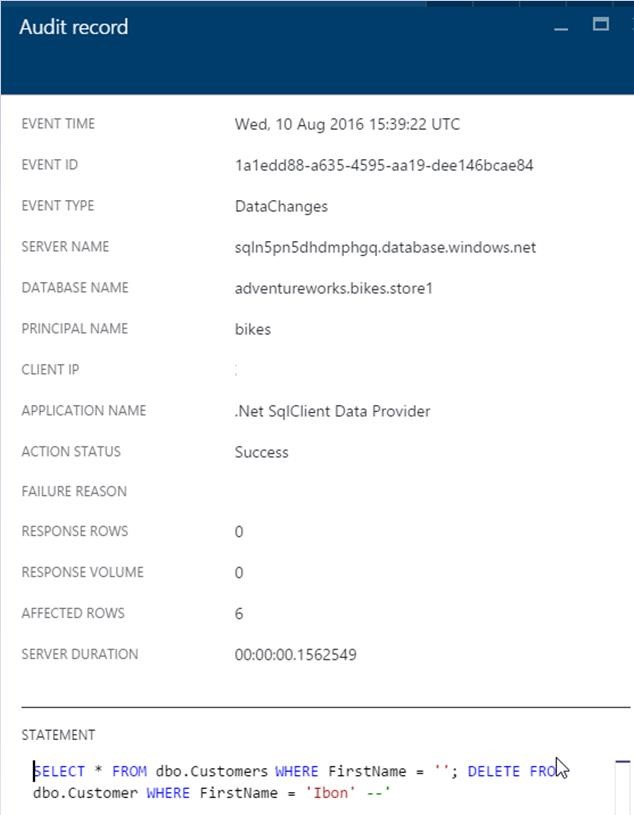

<a href="8.AzureActiveDirectory.md">Next</a>

