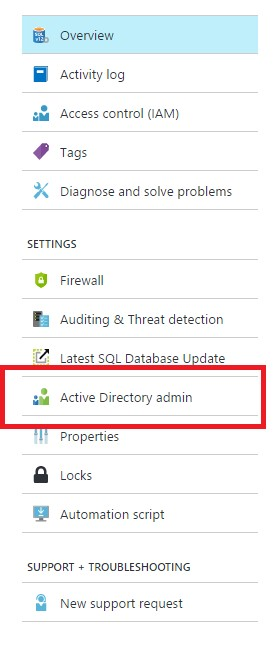
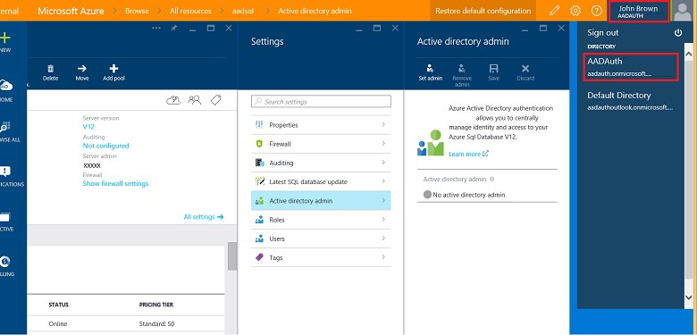
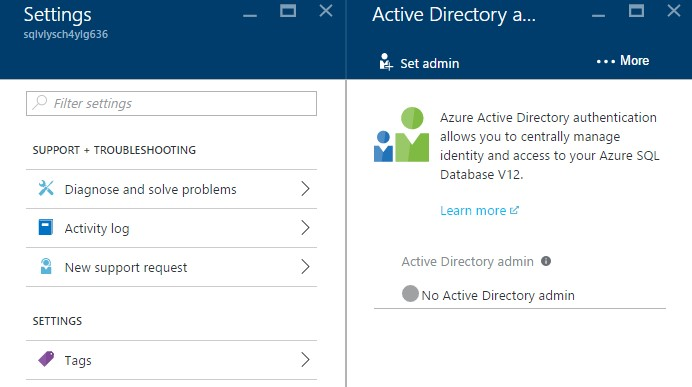
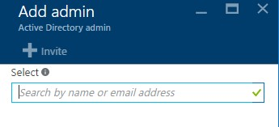
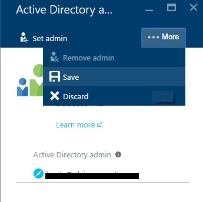
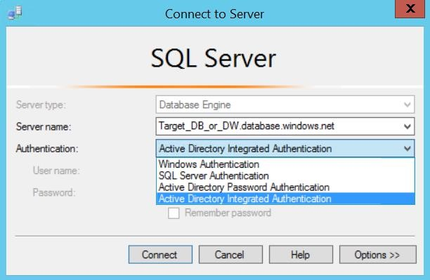
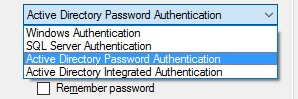
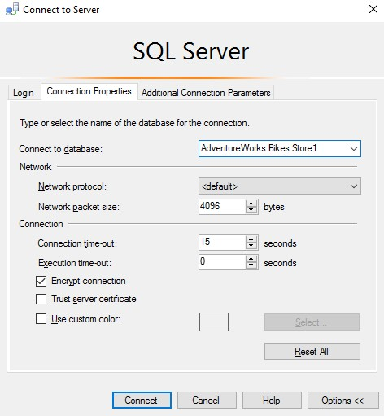
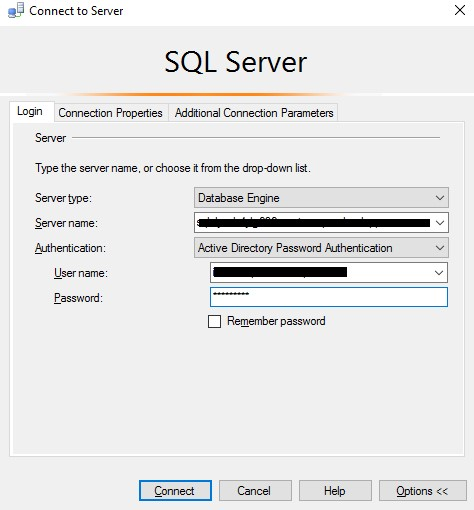
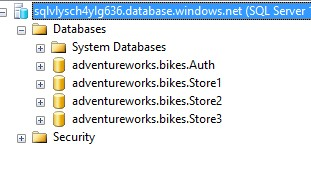

# AZURE ACTIVE DIRECTORY

Azure Active Directory authentication is a mechanism of connecting to Microsoft Azure SQL Database and SQL Data Warehouse by using identities in Azure Active Directory (Azure AD).  
With Azure Active Directory authentication, you can centrally manage the identities of database users and other Microsoft services in one central location.  
Benefits include the following: 

- It provides an alternative to SQL Server authentication. 
- Helps stop the proliferation of user identities across database servers. 
- Allows password rotation in a single place. 
- It can eliminate storing passwords by enabling integrated Windows authentication. 
- Azure Active Directory authentication uses contained database users to authenticate identities at the database level. 
- Azure Active Directory supports token-based authentication for applications connecting to SQL Database. 
- Azure Active Directory authentication supports ADFS. 
 
In our scenario, AdventureWorks Bikes has a group of database administrators that can access to the existing databases to maintenance them so it´s very important for the company to grant the access using his corporarte credentials, without creating addicional users. 

### Provision an Azure Active Directory administrator 

1. Go to the Azure Portal.
1. Click on Resource Groups.

    

1. Click on the Resource Group you created before.

    

1. Click on your SQL Server.

    

1. Click on Active Directory Admin.

    

1. In the upper-right corner, click your connection to drop down a list of possible Active Directories. Choose the correct Active Directory as the default Azure AD. 

    > This step links the subscription association with Active Directory with Azure SQL Server making sure that the same subscription is used for both Azure AD and SQL Server. (The Azure SQL Server can be hosting either Azure SQL Database or Azure SQL Data Warehouse.) 

    

1. Click on Set admin.  

    

1. Search for a user. 

    > Use the user and password that you use to connect to the Azure portal. It should be similar to testxxx@xxx.onmicrosoft.com.
     
1. Select the user or group to be an administrator. 

1. Click Select. 

    > The Active Directory admin blade shows all members and groups of your Active Directory. Users or groups that are grayed out cannot be selected because they are not supported as Azure AD administrators. 

    

1. Click Save. 

    > The process of changing the administrator may take several minutes. Then the new administrator appears in the Active Directory admin box.  

    

### Connect to the database using SQL Server Management Studio  

1. Start Management Studio. (or SQL Server Data Tools in Visual Studio 2015). 
1. Connect to Server.  

    > To confirm the Azure AD administrator is properly set up, connect to the master database using the Azure AD administrator account. 

    > **NOTE**: Get the server name from your Azure Resource Group (you_sql_server.database.windows.net)

    

    > Support for Azure Active Directory authentication is available with SQL Server 2016 Management Studio and SQL Server Data Tools in Visual Studio 2015.  

    > The August 2016 release of SSMS also includes support for Active Directory Universal Authentication, which allows administrators to require Multi-Factor Authentication using a phone call, text message, smart cards with pin, or mobile app notification. 

    

1. Select Active Directory Password Authentication. 

    > Use this method if you are logged in to Windows using credentials from a domain that is not federated with Azure, or when using Azure AD authentication using Azure 
    AD based on the initial or the client domain.

    > **NOTE:** Use the user and password that you use to connect to the Azure portal. It should be similar to testxxx@xxx.onmicrosoft.com.

    

1. Click the Options button.
1. Click Connection Properties. 
1. Type the name of the database: `AdventureWorks.Bikes.Store1`. 

    

1. Add your AD credentials.
1. Click Connect.

    > In the User name box, type your Azure Active Directory user name in the format username@domain.com. 
    
    > In the Password box, type your user password for the Azure Active Directory account or federated domain account. 

    

    

<a href="9.DynamicDataMasking.md">Next</a>

