# DYNAMIC DATA MASKING

SQL Database Dynamic Data Masking limits sensitive data exposure by masking it to non-privileged users. Dynamic data masking is supported for the V12 version of Azure SQL Database. 

Dynamic data masking helps prevent unauthorized access to sensitive data by enabling customers to designate how much of the sensitive data to reveal with minimal impact on the application layer. It´s a policy-based security feature that hides the sensitive data in the result set of a query over designated database fields, while the data in the database is not changed. 


1. Open the Azure Portal.
1. Go to your Resource Group.

    

1. Click on the AppService `webend`.

    

1. Click on the AppService URL.

    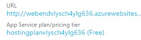

1. Click SIGN IN.

    

1. Add the default sample credentials.

    > Store1 
    
    > P2ssw0rd@1 

    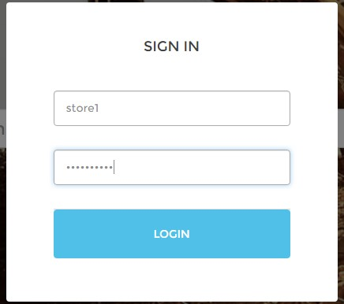

1. Click Customers. 

    > The credit card number is a sentive data that we want to protect

    > For example, a masking rule can be defined to mask all the last four digits of any credit card number in the result set of any query.  

    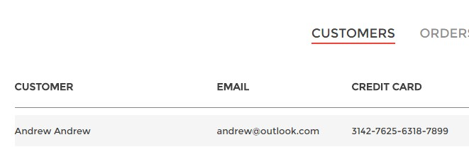

1. Go to the Azure Portal. 
1. Go to your Resource Group. 
1. Click adventureworks.bikes.store1. 

    

1. Click the Dynamic Data Masking tile. 

    > In the Dynamic Data Masking configuration blade you may see some database columns that the recommendations engine has flagged for masking. 

    > In order to accept the recommendations, just click Add Mask for one or more columns and a mask will be created based on the default type for this column

    > You can change the masking function by clicking on the masking rule and editing the masking field format to a different format of your choice. Be sure to click Save to save your settings. 

    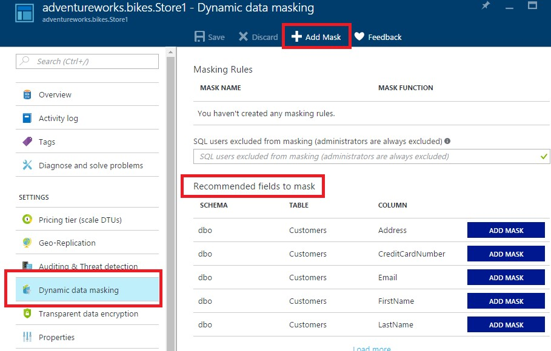

1. Click `Add Mask`.

    To add a mask for any column in your database, at the top of the Dynamic Data Masking configuration blade click Add Mask to open the Add Masking Rule configuration blade. 

1. Select the Schema, Table and Column to define the designated field that will be masked.
1. Choose a Masking Field Format from the list of sensitive data masking categories.

1. Click Save.
1. Click Save in the data masking configuration blade.

    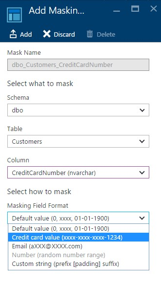

1. Go to the Customers page.

    > Users with administrator privileges always have access to the original unmasked data so the Bikes app will show the data due to it uses administrator privileges by default.  

    

1. Connect to your database using SQL Server Management Studio o SQL Server Data Tools.

    > You must be connected to the master database on SQL Azure with the administrative login. 

    > Get the server name from your Azure Resource Group (you_sql_server.database.windows.net)

    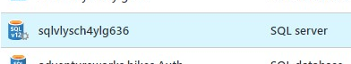

    > The default SQL credentials are: 
        Bikes 
        P2ssw0rd 

    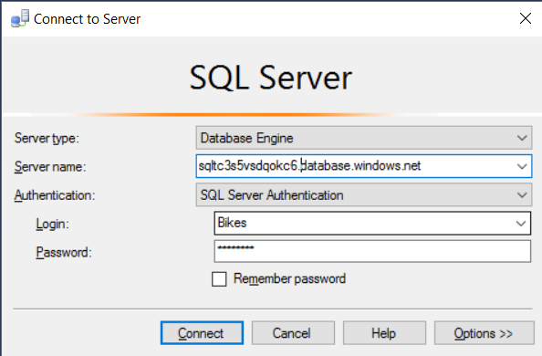

    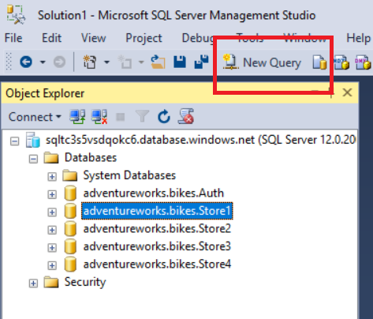    

1. Create a new login. The new login will be a read-only user.

    > Run this query against master database.

    ```sql
    CREATE LOGIN readonlyuser WITH password='P2ssw0rd'; 
    ```

    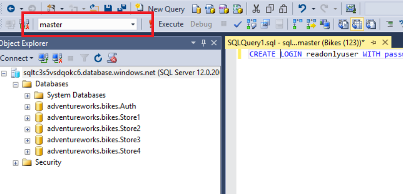

    > Run this query against adventureworks.bikes.store1 database.

    ```sql
    CREATE USER readonlyuser FROM LOGIN readonlyuser;
    ``` 

    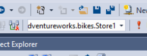

1. Grant access. (Read-only privileges)

    > Run this query against store1 database.    

    ```sql
    EXEC sp_addrolemember 'db_datareader', 'readonlyuser';
    ``` 

        

1. Connect to adventureworks.bikes.Auth database.

    > Get the current connectionstring. The current connectionstring uses the admin username so we have to change it to use the new read-only user.

    ```sql
    select ConnectionString from dbo.AspNetUsers WHERE UserName = 'store1' 
    ```

1. Replace the user and password of the connection string to use the readonly user that you have created in the previous steps.

    > The connection string should be similar to:
    
    - Data Source=xxxxx.database.windows.net;Initial Catalog=adventureworks.bikes.Store1;User Id=readonlyuser@xxxx;Password=P2ssw0rd;

1. Update the connection string to use the read-only user.

    ```sql
    update dbo.AspNetUsers SET ConnectionString = '<readonly_connection_string>' WHERE UserName = 'store1'
    ``` 

1. Now, the web application should use the new user to connect to the database, the readonly one.

1. Let´s go to check if the new user can view the data.

1. Switch to the Azure Portal.

1. Go to your Resource Group and click on the AppService `webend`.

    

1. After restarting, open up a new browser in private or incognito and click on the AppService URL.

    
       
1. Click SIGN IN.

    

1. Add the default sample credentials.

    > Store1 

    > P2ssw0rd@1 

    

1. Click Customers.

    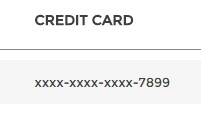

<a href="conclusion.md">Next</a>
