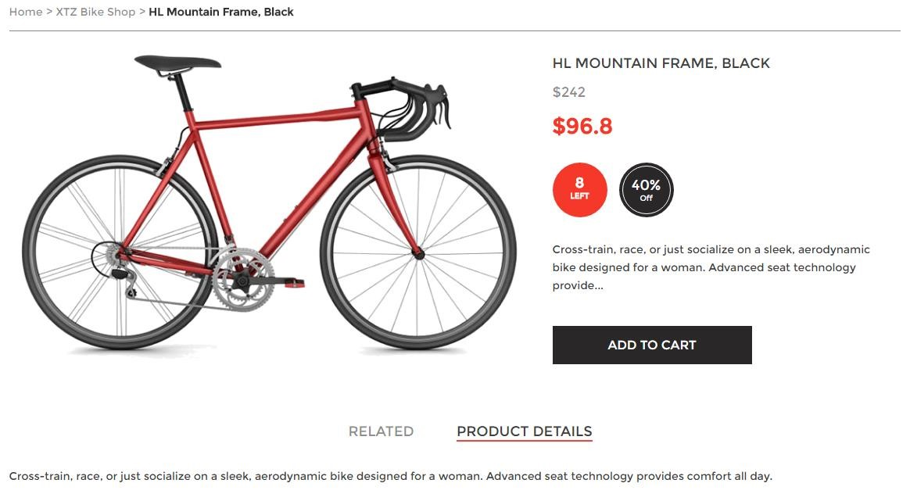
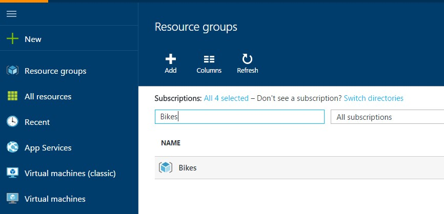
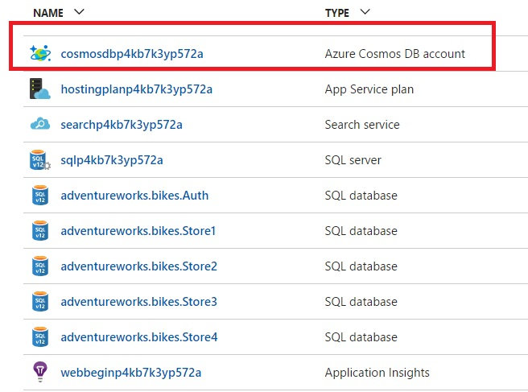
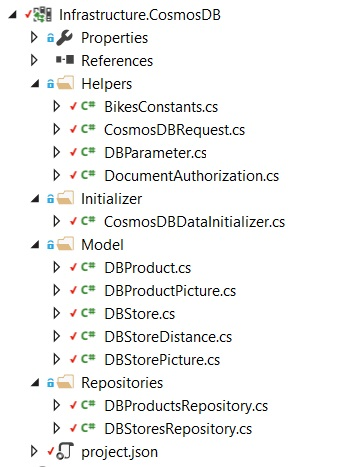

# JSON STORE

1. Open the application and click on a product to see the product details.	

	> In AdventureWorks we have two product stores, Cosmos DB which is the master product store and the product index from within Azure Search. The product information which you see on this product details page is extracted directly from Cosmos DB and passed to the browser for display.
	> Picking up Cosmos DB to build applications  is extremely easy to develop new applications rapidly using familiar tools.

	

1. Open the Azure Portal and go to your Resource Group.	

 	

1. Click on the Cosmos DB service.	

	

1. Click on the existing database.	

	> A database is a logical container of document storage partitioned across collections. 

	> AdventureWorks Bikes only use one database to store all the information related to products and stores.

	

	> It has four different collections.

	> A collection is a container of JSON documents and the associated JavaScript application logic. A collection is a billable entity, where the cost is determined by the performance level associated within the collection. Collections can span one or more partitions/servers and can be horizontally scaled to handle practically unlimited volumes of storage or throughput.

	

1. Click on the Query Explorer.	

	> Run a SQL Query to view the existing documents stored.

	

1. Select “products” collection.
1. Run the query.	

	> A document is a user defined (arbitrary) JSON content. By default, neither the schema needs to be defined nor do secondary indexes need to be provided for all the documents added to a collection.

 	

1. Click on document explorer.

1. Select “products” collection from the drop down menu.

1. Select an ID# from the list generated to view a query.

1. Run the query.	

	> We can also use the Document Explorer to browse through the existing documents.

	

1. Open a Windows command line, go to the **c:\source** directory and restore the project dependencies.

    ```shell
    cd c:\source
    dotnet restore
    ```
1. Open Visual Studio.

1. Open the AdventureWorks.Bikes solution. (source\AdventureWorks.Bikes directory)

	

	> **NOTE:**: If Visual Studio shows this message "An item with the same key has already been added", remove the project.lock.json file from the project that generates the message and try again.

1. Build the Web App. 


    > **NOTE:**: If Visual Studio shows this message "An item with the same key has already been added", remove the project.lock.json file from the project that generates the message and try again.

1. Open the Task Runner Explorer. (View>Other Windows)

1. Run the build.prod npm task. (in the Task Runner Explorer menu)

    > You must run the build.prod npm task after completing any change in the front-end.
	
1. Click on the appsettings.json file (in the solution explorer)	

	

1. Scroll down to find the master key token.

	> The master key token is the full-access key token that allows individuals to have full control of Cosmos DB resources in a particular account. The master key is created during the account creation.

	

1. Expand the Cosmos DB project.	

	> Cosmos DB supports the use of HTTP methods to create, read, replace, get, and delete Cosmos DB resources using the REST API.

	> Cosmos DB allows us to use industry-standard JavaScript, industry-standard JSON, and industry-standard RESTful over HTTP API calls so you can get up and running quickly

	> AdventureWorks Bikes uses the existing REST API to use the Cosmos DB service.

	> The Cosmos DB REST API supports the following:
	
	>	- Access control to resources.
	
	>	- Query functionality for resources.
	
	>	- Basic CRUD operations for resources.

	> The Cosmos DB project contains all the methods to access to the Cosmos DB service.

	

<a href="2.UpdatingIndex.md">Next</a>
