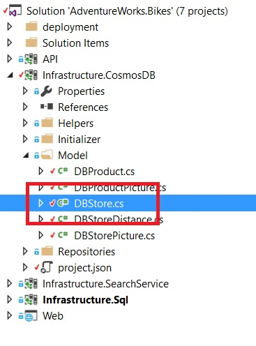
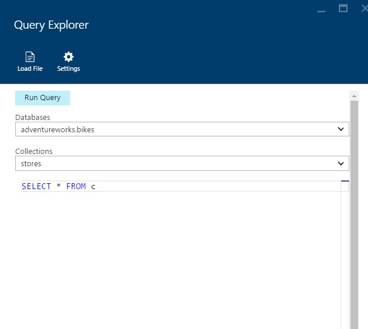
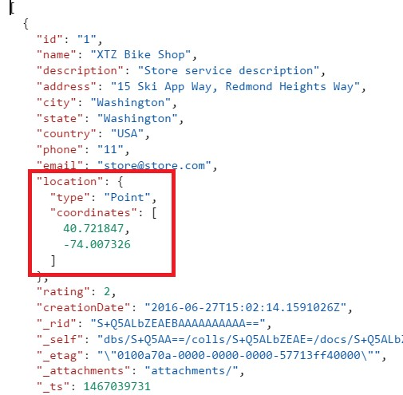
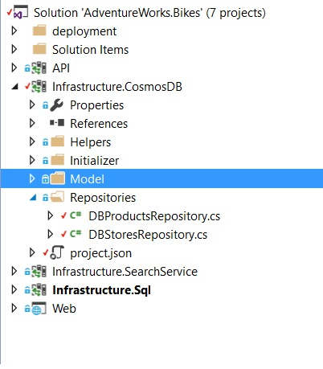

# GEOSPATION

Spatial data describes the position and shape of objects in space. In most applications, these correspond to objects on the earth, i.e. geospatial data. Spatial data can be used to represent the location of a person, a place of interest, or the boundary of a city, or a lake. Common use cases often involve proximity queries, for e.g., "find all bikes shops near my current location".

1.	Click on DBStore.cs (Infra.CosmosDB>Model).	

	> AdventuresWorks wants that its customers can find the product they wish to be as near as possible from them. To do so, the application must offer the possibility to show the customers the nearest stores so they can buy there and have their desired bikes at home as soon as possible.

	

1.	Highlight the property Location in the Store class. 

	> Each shop has its own location. The user will find all bikes shops near his current location.

	

1.	Go to the Point class definition.	

	> A Point denotes a single position in space. 

	> In geospatial data, a point represents the exact location, which could be a street address of a bikes store.

	> A point is represented in GeoJSON (and Cosmos DB) using its coordinate pair or longitude and latitude. 

	

1.	Open the Azure Portal.
1.	Click on the Cosmos DB Service.
1.	Click on Query Explorer.
1.	Query the stores collection.	

	

	> The stores contain spatial information.

	

	> Spatial functions can be used to perform proximity queries against spatial data .

	> AdventureWorks uses this info to show the stores that are near the customer position.

	

1.	Click on DBStoresRepository.cs (Infra.CosmosDB>Repositories). 	

	

	

	> Let’s see how the backend retrieves the distance. 
	
	```sql
	ST_DISTANCE(f.location, {'type': 'Point', 'coordinates':[31.9, -4.8]}) < 30000
	``` 

<a href="conclusion.md">Next</a>
	

