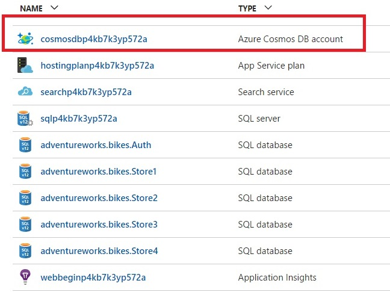
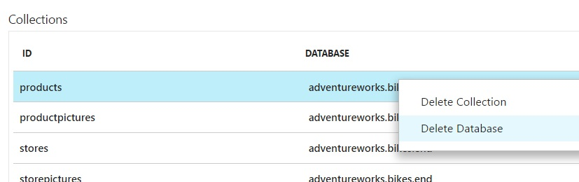
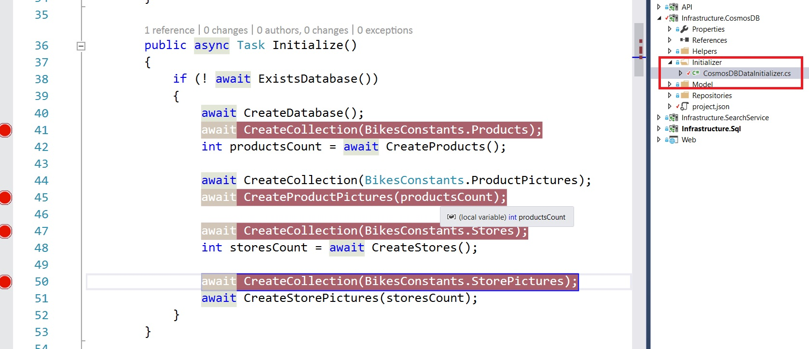

# UPDATING THE COSMOS DB DATABASE

1.	Go to the Azure portal.	Throughout this document, you will see that there are parts of de application that you will have to complete.

    > When applying changes to the source code, you will need to follow several steps to see those changes reflected on the Azure Cosmos DB database.

    > This section explains you how to do it.

1. Click on the resource group created.

1. Click on the Cosmos DB account.	

    > When the application starts, it invokes a initializer which is in charge of creating the database and all the collections attached to it.

    > However, if the database already exists, it will not do anything. So, to apply any changes you do, you will need to delete the Cosmos DB database first.

    

1.  Go to the Collections list and check if the database `adventureworks.bikes` exists.

    - Another database called adventureworks.bikes.**end** exists. Be careful not to confuse it.

1.  If it exists, right click on `adventureworks.bikes` and click on `Delete Database`.

    - **NOTE:**: DON´T delete the **adventureworks.bikes.end** database. 
    

1.  When it is successfully deleted, run the application again and it will create the database with the changes made to the code.

    > The application must create 4 collections. To be sure that the collections are created, add breakpoints in the CosmosDBDataInitializer.cs file.

    

<a href="3.Database.md">Next</a>
