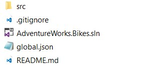

# DATABASE

1.	Open the AdventureWorks.Bikes solution.

    > The first time that you run the app it creates the database, collections and documents.

    

1.	Click on the Startup.cs class (Web).

1.	Scroll down to see the methods that initialize the services used in the app.

    > If you go to the Initialize method you can see the code used to create the database.

    

1.	Expand the Cosmos DB project.	

    

1.	Click on CosmosDBDataInitializer.cs (Infra.CosmosDB>Initializer).

1.	Find the CreateDatabase method.	

    

    > The Cosmos DB REST API supports basic CRUD operations on the resources under a database account.

    > The app creates the database the first time using the REST API. Right now the method is empty. You will have to complete it so the database is properly created.

1.	Copy and paste the code inside it.
    
    ```csharp
            string baseUri = $"{_EndpointUrl}dbs/";

            using (var _httpClient = new HttpClient())
            {
                _httpClient.DefaultRequestHeaders.Accept.Add(new MediaTypeWithQualityHeaderValue("application/json"));
                _httpClient.DefaultRequestHeaders.Add("x-ms-date", utc_date);
                _httpClient.DefaultRequestHeaders.Add("x-ms-version", "2015-08-06");

                string verb = "POST";
                string resourceType = "dbs";
                string resourceId = string.Empty;

                string authHeader = DocumentAuthorization.GenerateMasterKeyAuthorizationSignature(verb, resourceId, resourceType, _Key, "master", "1.0", utc_date);
                _httpClient.DefaultRequestHeaders.Remove("authorization");
                _httpClient.DefaultRequestHeaders.Add("authorization", authHeader);

                var content = JsonConvert.SerializeObject(new { id = _DatabaseId });
                var response = await _httpClient.PostAsync(new Uri(baseUri), new StringContent(content, Encoding.UTF8, "application/json"));
                response.EnsureSuccessStatusCode();
            }		
     ```

1. Your method should look as shown in the image.

    

1.	Run the application.

