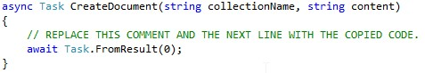
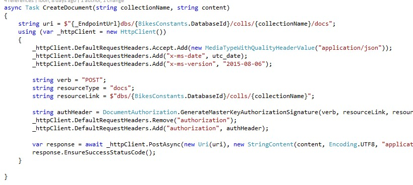

# DOCUMENTS

1.	Click on CosmosDBDataInitializer.cs (Infra.CosmosDB>Initializer).	

    > Cosmos DB does not mandate any schema and does not require secondary indexes in order to support querying over documents in a collection. All document properties are automatically indexed by default.

    > AdventureWorks manages four different documents:
    > - Products.
    > - Store.
    > - ProductPictures.
    > - StorePictures.

1. Scroll down

1. Find the CreateDocument method.	

    

    > The method is empty, so currently it is not possible to add products and stores information to the database!

    > Let’s fix that!

1. Copy and paste the code inside it.

    ```csharp
            string uri = $"{_EndpointUrl}dbs/{_DatabaseId}/colls/{collectionName}/docs";
            using (var _httpClient = new HttpClient())
            {
                _httpClient.DefaultRequestHeaders.Accept.Add(new MediaTypeWithQualityHeaderValue("application/json"));
                _httpClient.DefaultRequestHeaders.Add("x-ms-date", utc_date);
                _httpClient.DefaultRequestHeaders.Add("x-ms-version", "2015-08-06");

                string verb = "POST";
                string resourceType = "docs";
                string resourceLink = $"dbs/{_DatabaseId}/colls/{collectionName}";

                string authHeader = DocumentAuthorization.GenerateMasterKeyAuthorizationSignature(verb, resourceLink, resourceType, _Key, "master", "1.0", utc_date);
                _httpClient.DefaultRequestHeaders.Remove("authorization");
                _httpClient.DefaultRequestHeaders.Add("authorization", authHeader);

                var response = await _httpClient.PostAsync(new Uri(uri), new StringContent(content, Encoding.UTF8, "application/json"));
                response.EnsureSuccessStatusCode();
            }	
    ```

1. Your method should look as shown in the image.

    

1.  Remove the *adventureworks.bikes* Cosmos DB database following the same steps that you used in the "Updating the Cosmos DB database" topic to be sure that next time that you run the app it created the database, collections and documents.

1. Run the application	

<a href="6.Query.md">Next</a>