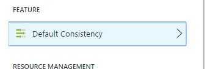

# MULTIPLE-REGION DATABASES

Azure Cosmos DB is designed to meet the needs of IoT applications consisting of millions of globally distributed devices and internet scale applications that deliver highly responsive experiences to users across the world. These database systems face the challenge of achieving low latency access to application data from multiple geographic regions with well-defined data consistency and availability guarantees.

As a globally distributed database system, Cosmos DB simplifies the global distribution of data by offering fully managed, multi-region database accounts that provide clear tradeoffs between consistency, availability and performance, all with corresponding guarantees.

1.	Open the Azure Portal.
1.	Go to the Resource group.	

     

	> We need to ensure that our store products are available all over the globe, and that any changes to these products are replicated to every region as fast as possible so customers receives the updated products independently of where they are located. We can achieve this thanks to the fact that Cosmos DB database accounts are offered with high availability, single digit ms latencies, multiple well-defined consistency levels, transparent regional failover with multi-homing APIs, and the ability to elastically scale throughput and storage across the globe. 

	> Configuring your Cosmos DB account to scale across the globe can be done in less than a minute through the Azure Portal.

1.	Click on the Cosmos DB service.	

	 

1.	Under the Settings group on sidebar...

	 

1.	Click on default Consistency.	

     

	> All you need to do is select the right consistency level among several supported well-defined consistency levels, and associate any number of Azure regions with your database account. 

	> Cosmos DB consistency levels provide clear tradeoffs between specific consistency guarantee and performance.

	 

	> Selecting the right consistency level depends on data consistency guarantee your application needs. Cosmos DB automatically replicates your data across all specified regions and guarantees the consistency that you have selected for your database account.

	> In the context of AdventureWorks and product updates we use session consistency so that any changes are kept consistent, and other users will eventually see the updated product.

	

<a href="9.Replication.md">Next</a>
 
